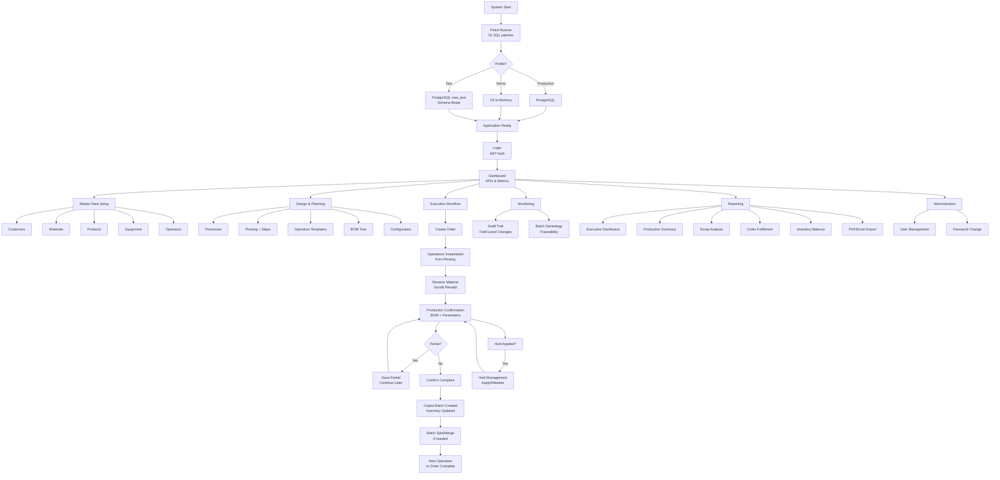

# MES Production Confirmation - Detailed Agile System Audit

**Date:** 2026-02-12 | **Version:** 1.0 | **Audit Type:** Full System

---

## A. Module Inventory

| # | Module | Business Purpose | Screen Count | APIs Used | Key Services | Status | Completion % |
|---|--------|-----------------|-------------|-----------|-------------|--------|-------------|
| 1 | **Auth** | User login, JWT token management | 1 | 4 | AuthService, JwtService | Complete | 100% |
| 2 | **Dashboard** | KPIs, recent activity, summary metrics | 1 | 2 | DashboardService | Complete | 100% |
| 3 | **Orders** | Customer order lifecycle management | 3 | 10 | OrderService | Complete | 100% |
| 4 | **Production** | Production confirmation, reversal, history | 3 | 10 | ProductionService, BomValidationService | Complete | 100% |
| 5 | **Inventory** | Material stock management, state transitions | 4 | 17 | InventoryService, ReceiveMaterialService | Complete | 100% |
| 6 | **Batches** | Batch lifecycle, genealogy, split/merge | 3 | 22 | BatchService, BatchNumberService | Complete | 100% |
| 7 | **Holds** | Hold/release on any entity | 3 | 6 | HoldService | Complete | 100% |
| 8 | **Equipment** | Equipment CRUD, maintenance, holds | 3 | 13 | EquipmentService | Complete | 95% |
| 9 | **Operations** | Operation tracking, status management | 2 | 6 | OperationService | Complete | 95% |
| 10 | **Customers** | Customer master data CRUD | 3 | 7 | CustomerService | Complete | 100% |
| 11 | **Materials** | Material master data CRUD | 3 | 7 | MaterialService | Complete | 95% |
| 12 | **Products** | Product master data CRUD | 3 | 7 | ProductService | Complete | 95% |
| 13 | **Operators** | Operator master data CRUD | 3 | 6 | OperatorService | Complete | 100% |
| 14 | **Processes** | Process definition management | 4 | 6 | ProcessService | Complete | 100% |
| 15 | **Routing** | Production routing with steps | 3 | 20+ | RoutingService | Complete | 95% |
| 16 | **Operation Templates** | Reusable operation blueprints | 3 | 5 | OperationTemplateService | Complete | 100% |
| 17 | **BOM** | Bill of Materials tree management | 3 | 18 | BomService, BomValidationService | Complete | 95% |
| 18 | **Configuration** | 6 config sub-modules (hold/delay reasons, params, batch number/size, quantity type) | 12 | 30+ | 6 config services | Complete | 100% |
| 19 | **Reports** | 7 report types + executive dashboard | 8 | 8 | ReportAnalyticsService, ChartService | Complete | 100% |
| 20 | **Users** | User management CRUD | 3 | 9 | UserService | Complete | 100% |
| 21 | **Audit** | Audit trail browsing, filtering | 1 | 8 | AuditService, FieldChangeAuditService | Complete | 100% |
| 22 | **Profile** | User profile, password change | 2 | 3 | UserService | Complete | 100% |

---

## B. Screen Inventory Table

| Screen Name | Module | Type | API Endpoints Used | Role Access | Validation Level | Test Coverage (U/I/E2E) | Status |
|-------------|--------|------|-------------------|-------------|-----------------|------------------------|--------|
| LoginComponent | Auth | Execution | POST /auth/login | Public | Email + Password required | 9/13/13 | Complete |
| DashboardComponent | Dashboard | Report | GET /dashboard/summary | Authenticated | N/A | 6/19/24 | Complete |
| OrderListComponent | Orders | Execution | GET /orders/paged | Authenticated | Search/filter validation | 15/17/14 | Complete |
| OrderDetailComponent | Orders | Execution | GET /orders/{id} | Authenticated | N/A | -/47/- | Complete |
| OrderFormComponent | Orders | Execution | POST /orders, PUT /orders/{id} | Authenticated | Customer, line items required | -/34/22 | Complete |
| ProductionLandingComponent | Production | Execution | GET /orders/available | Authenticated | N/A | -/17/- | Complete |
| ProductionConfirmComponent | Production | Execution | POST /production/confirm, GET /bom/*, GET /batches/* | Authenticated | BOM validation, parameter ranges, quantity checks | 25/67/14 | Complete |
| ProductionHistoryComponent | Production | Report | GET /production/confirmations | Authenticated | Date range filter | -/18/11 | Complete |
| InventoryListComponent | Inventory | Execution | GET /inventory/paged | Authenticated | State/type filter | 34/35/9 | Complete |
| InventoryDetailComponent | Inventory | Execution | GET /inventory/{id} | Authenticated | N/A | -/24/- | Complete |
| InventoryFormComponent | Inventory | Execution | POST /inventory, PUT /inventory/{id} | Authenticated | Material, quantity required | -/12/- | Complete |
| ReceiveMaterialComponent | Inventory | Execution | POST /inventory/receive-material | Authenticated | Material, quantity, supplier required | -/25/12 | Complete |
| BatchListComponent | Batches | Execution | GET /batches/paged | Authenticated | Status filter | 42/11/16 | Complete |
| BatchDetailComponent | Batches | Execution | GET /batches/{id}, GET /batches/{id}/genealogy | Authenticated | N/A | -/45/- | Complete |
| BatchFormComponent | Batches | Execution | POST /batches/{id}/split, POST /batches/merge | Authenticated | Quantity validation, invariant checks | -/11/18 | Complete |
| HoldListComponent | Holds | Execution | GET /holds/paged | Authenticated | Entity type filter | 32/28/5 | Complete |
| HoldDetailComponent | Holds | Execution | GET /holds/{id} | Authenticated | N/A | -/21/- | Complete |
| HoldFormComponent | Holds | Execution | POST /holds, PUT /holds/{id}/release | Authenticated | Entity type, reason required | -/9/- | Complete |
| EquipmentListComponent | Equipment | Master | GET /equipment/paged | Authenticated | Status filter | 23/28/9 | Complete |
| EquipmentDetailComponent | Equipment | Master | GET /equipment/{id} | Authenticated | N/A | -/19/- | Complete |
| EquipmentFormComponent | Equipment | Master | POST /equipment, PUT /equipment/{id} | Authenticated | Code, name, type required | -/12/- | Complete |
| OperationListComponent | Operations | Execution | GET /operations/paged | Authenticated | Status/type filter | 29/24/13 | Complete |
| OperationDetailComponent | Operations | Execution | GET /operations/{id} | Authenticated | N/A | -/22/- | Complete |
| CustomerListComponent | Customers | Master | GET /customers/paged | Authenticated | Search filter | 15/14/5 | Complete |
| CustomerDetailComponent | Customers | Master | GET /customers/{id} | Authenticated | N/A | -/14/- | Complete |
| CustomerFormComponent | Customers | Master | POST /customers, PUT /customers/{id} | Authenticated | Code, name required | -/13/- | Complete |
| MaterialListComponent | Materials | Master | GET /materials/paged | Authenticated | Type filter | 19/15/5 | Complete |
| MaterialDetailComponent | Materials | Master | GET /materials/{id} | Authenticated | N/A | -/14/- | Complete |
| MaterialFormComponent | Materials | Master | POST /materials, PUT /materials/{id} | Authenticated | Code, name, type, UOM required | -/21/- | Complete |
| ProductListComponent | Products | Master | GET /products/paged | Authenticated | Category filter | 15/12/5 | Complete |
| ProductDetailComponent | Products | Master | GET /products/{id} | Authenticated | N/A | -/10/- | Complete |
| ProductFormComponent | Products | Master | POST /products, PUT /products/{id} | Authenticated | SKU, name required | -/25/- | Complete |
| BomListComponent | BOM | Planning | GET /bom/products | Authenticated | Search filter | 29/36/11 | Complete |
| BomTreeComponent | BOM | Planning | GET /bom/{sku}/tree | Authenticated | N/A | -/46/- | Complete |
| BomNodeFormComponent | BOM | Planning | POST /bom/node, PUT /bom/node/{id} | Authenticated | Material, quantity, yield required | -/39/- | Complete |
| OperatorListComponent | Operators | Master | GET /operators/paged | Authenticated | Status filter | 11/13/10 | Complete |
| OperatorDetailComponent | Operators | Master | GET /operators/{id} | Authenticated | N/A | -/14/- | Complete |
| OperatorFormComponent | Operators | Master | POST /operators, PUT /operators/{id} | Authenticated | Code, name required | -/18/- | Complete |
| ProcessListComponent | Processes | Planning | GET /processes/paged | Authenticated | Status filter | 27/21/26 | Complete |
| ProcessDetailComponent | Processes | Planning | GET /processes/{id} | Authenticated | N/A | -/22/- | Complete |
| ProcessFormComponent | Processes | Planning | POST /processes, PUT /processes/{id} | Authenticated | Name required | -/24/- | Complete |
| QualityPendingComponent | Processes | Execution | GET /batches/pending-approval | Authenticated | N/A | -/3/- | Complete |
| RoutingListComponent | Routing | Planning | GET /routing/paged | Authenticated | Status filter | 35/40/14 | Complete |
| RoutingDetailComponent | Routing | Planning | GET /routing/{id} | Authenticated | N/A | -/25/- | Complete |
| RoutingFormComponent | Routing | Planning | POST /routing, PUT /routing/{id} | Authenticated | Name, process required | -/53/22 | Complete |
| OpTemplateListComponent | Templates | Planning | GET /operation-templates | Authenticated | Search filter | 12/4/19 | Complete |
| OpTemplateDetailComponent | Templates | Planning | GET /operation-templates/{id} | Authenticated | N/A | -/19/- | Complete |
| HoldReasonsListComponent | Config | Config | GET /config/hold-reasons/paged | Authenticated | Search filter | -/16/- | Complete |
| HoldReasonsFormComponent | Config | Config | POST/PUT /config/hold-reasons | Authenticated | Code, description required | -/24/- | Complete |
| DelayReasonsListComponent | Config | Config | GET /config/delay-reasons/paged | Authenticated | Search filter | -/16/- | Complete |
| DelayReasonsFormComponent | Config | Config | POST/PUT /config/delay-reasons | Authenticated | Code, description required | -/16/- | Complete |
| ProcessParamsListComponent | Config | Config | GET /config/process-parameters/paged | Authenticated | Process filter | -/15/- | Complete |
| ProcessParamsFormComponent | Config | Config | POST/PUT /config/process-parameters | Authenticated | Name, type, min/max required | -/14/- | Complete |
| QuantityTypeListComponent | Config | Config | GET /config/quantity-type/paged | Authenticated | Search filter | -/16/- | Complete |
| QuantityTypeFormComponent | Config | Config | POST/PUT /config/quantity-type | Authenticated | Code, description required | -/20/- | Complete |
| BatchNumberListComponent | Config | Config | GET /batch-number-config/paged | Authenticated | Type filter | -/18/- | Complete |
| BatchNumberFormComponent | Config | Config | POST/PUT /batch-number-config | Authenticated | Prefix, format required | -/25/- | Complete |
| BatchSizeListComponent | Config | Config | GET /batch-size-config/paged | Authenticated | Type filter | -/18/- | Complete |
| BatchSizeFormComponent | Config | Config | POST/PUT /batch-size-config | Authenticated | Min, max, standard required | -/21/- | Complete |
| UserListComponent | Users | Admin | GET /users/paged | Authenticated | Role filter | 19/13/14 | Complete |
| UserDetailComponent | Users | Admin | GET /users/{id} | Authenticated | N/A | -/13/- | Complete |
| UserFormComponent | Users | Admin | POST /users, PUT /users/{id} | Authenticated | Username, email, role required | -/13/- | Complete |
| AuditListComponent | Audit | Admin | GET /audit/paged | Authenticated | Entity type, action, date filters | 17/25/29 | Complete |
| ReportsLandingComponent | Reports | Report | N/A | Authenticated | N/A | -/4/- | Complete |
| ExecutiveDashboardComponent | Reports | Report | GET /analytics/executive-dashboard | Authenticated | Date range | -/13/- | Complete |
| ProductionSummaryComponent | Reports | Report | GET /reports/production-summary | Authenticated | Date range | -/8/- | Complete |
| ScrapAnalysisComponent | Reports | Report | GET /analytics/scrap-analysis | Authenticated | Date range | -/7/- | Complete |
| OrderFulfillmentComponent | Reports | Report | GET /reports/order-fulfillment | Authenticated | Date range | -/6/- | Complete |
| InventoryBalanceComponent | Reports | Report | GET /reports/inventory-balance | Authenticated | Type filter | -/11/- | Complete |
| OperationsReportComponent | Reports | Report | GET /analytics/operations | Authenticated | Date range | -/7/24 | Complete |
| ProfileComponent | Profile | Admin | GET /auth/me | Authenticated | N/A | -/9/- | Complete |
| ChangePasswordComponent | Profile | Admin | POST /users/change-password | Authenticated | Current + new + confirm required | -/21/7 | Complete |
| MaterialSelectionModal | Shared | Execution | GET /batches/available | Authenticated | Quantity <= available | -/21/1 | Complete |
| ApplyHoldModal | Shared | Execution | POST /holds | Authenticated | Reason required | -/23/1 | Complete |

---

## C. Services Documentation

### Backend Services (42 Total)

| # | Service | Responsibility | API Routes | DB Tables | Error Handling | Test Coverage |
|---|---------|---------------|------------|-----------|---------------|--------------|
| 1 | **AuthService** | JWT login, token refresh, user lookup | /auth/* | users | Custom exceptions | 7 tests |
| 2 | **OrderService** | Order CRUD, line item management, status transitions | /orders/* | orders, order_line_items | Validation + not found | 21 tests |
| 3 | **ProductionService** | Confirm production, manage consumption, reversal | /production/* | production_confirmation, consumed_materials, produced_outputs | BOM validation, hold checks | 25 tests |
| 4 | **BatchService** | Batch lifecycle, split/merge, genealogy, approval | /batches/* | batches, batch_relations | Invariant validation | 42 tests |
| 5 | **InventoryService** | Stock CRUD, state transitions (block/scrap/reserve) | /inventory/* | inventory | State machine validation | 34 tests |
| 6 | **HoldService** | Apply/release holds on any entity | /holds/* | holds, hold_reasons | Entity existence check | 32 tests |
| 7 | **EquipmentService** | Equipment CRUD, maintenance/hold status | /equipment/* | equipment | Status transition validation | 23 tests |
| 8 | **BomService** | BOM tree CRUD, versioning, hierarchy | /bom/* | bill_of_materials | Circular reference check | 29 tests |
| 9 | **BomValidationService** | BOM requirements, suggested consumption, validation | /bom/validate, /bom/operation/*/suggested-consumption | bill_of_materials, batches, inventory | Insufficient stock warning | 10 tests |
| 10 | **CustomerService** | Customer master CRUD | /customers/* | customers | Duplicate code check | 15 tests |
| 11 | **MaterialService** | Material master CRUD | /materials/* | materials | Duplicate code check | 19 tests |
| 12 | **ProductService** | Product master CRUD | /products/* | products | Duplicate SKU check | 15 tests |
| 13 | **OperationService** | Operation status management | /operations/* | operations | Status transition validation | 29 tests |
| 14 | **OperationTemplateService** | Reusable operation blueprint CRUD | /operation-templates/* | operation_templates | Not found exception | 12 tests |
| 15 | **OperatorService** | Operator master CRUD | /operators/* | operators | Duplicate code check | 11 tests |
| 16 | **RoutingService** | Routing CRUD, step management, activation | /routing/* | routings, routing_steps | Lock validation, active check | 35 tests |
| 17 | **ProcessService** | Process definition CRUD | /processes/* | processes | Status validation | 27 tests |
| 18 | **AuditService** | Audit trail queries, entity history, date ranges | /audit/* | audit_trail | Page validation | 17 tests |
| 19 | **FieldChangeAuditService** | Field-level diff and audit logging | (internal) | audit_trail | Type-safe comparison | 19 tests |
| 20 | **DashboardService** | Aggregate metrics for dashboard | /dashboard/* | Multiple (aggregated) | Fallback defaults | 6 tests |
| 21 | **BatchNumberService** | Configurable batch number generation | (internal) | batch_number_config, batch_number_sequence | Fallback pattern | 20 tests |
| 22 | **BatchNumberConfigService** | Batch number config CRUD | /batch-number-config/* | batch_number_config | Duplicate check | 12 tests |
| 23 | **BatchSizeService** | Batch size config management | /batch-size-config/* | batch_size_config | Not found fallback | 12 tests |
| 24 | **ProcessParameterService** | Validate process parameters against config | (internal) | process_parameters_config | Min/max range validation | 16 tests |
| 25 | **ProcessParametersConfigService** | Parameter config CRUD | /config/process-parameters/* | process_parameters_config | Duplicate check | 11 tests |
| 26 | **QuantityTypeConfigService** | Quantity type config CRUD | /config/quantity-type/* | quantity_type_config | Duplicate code check | 12 tests |
| 27 | **HoldReasonService** | Hold reason config CRUD | /config/hold-reasons/* | hold_reasons | Duplicate code check | 13 tests |
| 28 | **DelayReasonService** | Delay reason config CRUD | /config/delay-reasons/* | delay_reasons | Duplicate code check | 12 tests |
| 29 | **InventoryFormService** | Inventory form options | (internal) | inventory_form_config | Fallback defaults | 27 tests |
| 30 | **InventoryMovementService** | Movement logging for inventory changes | /inventory-movements/* | inventory_movements | Auto-creation on state change | 15 tests |
| 31 | **EquipmentCategoryService** | Equipment classification | (internal) | equipment | Category lookup | 18 tests |
| 32 | **EquipmentUsageService** | Track equipment usage per operation | /equipment-usage/* | operation_equipment_usage | Duration validation | 14 tests |
| 33 | **ReceiveMaterialService** | Goods receipt (batch + inventory creation) | POST /inventory/receive-material | batches, inventory | Material existence check | 24 tests |
| 34 | **BatchAllocationService** | Batch-to-order allocation | /batch-allocation/* | batch_order_allocation | Quantity availability check | 17 tests |
| 35 | **UnitConversionService** | Unit of measure conversion | (internal) | unit_of_measure, unit_conversion | Conversion factor validation | 21 tests |
| 36 | **UserService** | User CRUD, password management | /users/* | users | Duplicate email check | 19 tests |
| 37 | **OperationInstantiationService** | Create operations from routing templates | (internal) | operations, routing_steps | Template validation | 30 tests |
| 38 | **ReportAnalyticsService** | Analytics queries for reports | /analytics/* | Multiple (aggregated) | Date range validation | 24 tests |
| 39 | **ChartService** | Chart data formatting | (internal) | N/A | Data shape validation | 7 tests |
| 40 | **ExcelExportService** | Excel file generation | /reports/export/* | Multiple | I/O exception handling | 7 tests |
| 41 | **PdfReportService** | PDF report generation | /reports/export/* | Multiple | I/O exception handling | 6 tests |
| 42 | **ImageProcessingService** | Image processing utilities | (internal) | N/A | Format validation | 8 tests |

---

## D. Data Layer Overview

### Core Entities (11)

| Entity | Table | Purpose | Key Relationships |
|--------|-------|---------|------------------|
| Order | orders | Customer order | Has many OrderLineItems; FK to Customer |
| OrderLineItem | order_line_items | Products in order | FK to Order; Has many Operations |
| Operation | operations | Production step | FK to Process, OrderLineItem, RoutingStep |
| ProductionConfirmation | production_confirmation | Confirmation record | FK to Operation; Has ConsumedMaterials, ProducedOutputs |
| Batch | batches | Trackable material unit | Has many Inventory, BatchRelations |
| Inventory | inventory | Material stock record | FK to Batch; State machine (AVAILABLE/BLOCKED/etc.) |
| Equipment | equipment | Machine/tool | Has EquipmentUsage records |
| HoldRecord | holds | Hold/release record | Polymorphic FK (any entity type) |
| ConsumedMaterial | consumed_materials | Input consumption | FK to Confirmation, Inventory, Batch |
| ProducedOutput | produced_outputs | Output production | FK to Confirmation, Batch |
| BatchRelation | batch_relations | Parent-child genealogy | FK to Batch (parent + child) |

### Master Data Tables (8)

| Entity | Table | Purpose |
|--------|-------|---------|
| Customer | customers | Customer master |
| Material | materials | Material master (RM/IM/FG/WIP) |
| Product | products | Product master (SKU) |
| Operator | operators | Personnel master |
| Process | processes | Process definitions |
| OperationTemplate | operation_templates | Reusable operation blueprints |
| Routing | routings | Production routing |
| RoutingStep | routing_steps | Steps within routing |

### Configuration Tables (10)

| Entity | Table | Purpose |
|--------|-------|---------|
| BatchNumberConfig | batch_number_config | Batch number generation rules |
| BatchSizeConfig | batch_size_config | Min/max/standard batch sizes |
| ProcessParametersConfig | process_parameters_config | Parameter min/max/default per process |
| QuantityTypeConfig | quantity_type_config | Quantity type rules |
| HoldReason | hold_reasons | Configurable hold reasons |
| DelayReason | delay_reasons | Configurable delay reasons |
| BillOfMaterial | bill_of_materials | Hierarchical BOM tree |
| UnitOfMeasure | units_of_measure | UOM reference |
| UnitConversion | unit_conversion | Conversion factors |
| InventoryFormConfig | inventory_form_config | Inventory form options |

### Audit & System Tables (5)

| Entity | Table | Purpose |
|--------|-------|---------|
| AuditTrail | audit_trail | All entity change history (JSON) |
| DatabasePatch | database_patches | Applied SQL patch tracker |
| User | users | Authentication & authorization |
| InventoryMovement | inventory_movements | Inventory state change log |
| BatchQuantityAdjustment | batch_quantity_adjustments | Batch quantity change log |

### Multi-Tenant Handling
- **Not applicable** - Single-tenant design
- Tenant isolation would require schema-per-tenant or row-level security for production

---

## E. Business Workflow Documentation

### Lifecycle Sequence

#### 1. System Initialization
| Attribute | Value |
|-----------|-------|
| **Entry Trigger** | Application startup (Spring Boot) |
| **Screens** | None (automatic) |
| **Services** | PatchService, PatchRunner, TestPatchRunner |
| **Entities** | DatabasePatch |
| **Validation** | Patch idempotency (IF NOT EXISTS) |
| **Test Coverage** | PatchServiceTest (8), PatchRunnerTest (5) |
| **Gaps** | None |

#### 2. Master Data Setup
| Attribute | Value |
|-----------|-------|
| **Entry Trigger** | Admin navigates to /manage/* |
| **Screens** | CustomerList/Form, MaterialList/Form, ProductList/Form, OperatorList/Form, EquipmentList/Form |
| **Services** | CustomerService, MaterialService, ProductService, OperatorService, EquipmentService |
| **Entities** | Customer, Material, Product, Operator, Equipment |
| **Validation** | Unique codes, required fields, soft delete |
| **Test Coverage** | Full CRUD tests per entity |
| **Gaps** | GAP-021 (Equipment category), GAP-022 (Extended fields) |

#### 3. Configuration Setup
| Attribute | Value |
|-----------|-------|
| **Entry Trigger** | Admin navigates to /manage/config/* |
| **Screens** | 12 config screens (6 list + 6 form) |
| **Services** | HoldReasonService, DelayReasonService, ProcessParametersConfigService, BatchNumberConfigService, QuantityTypeConfigService, BatchSizeService |
| **Entities** | HoldReason, DelayReason, ProcessParametersConfig, BatchNumberConfig, QuantityTypeConfig, BatchSizeConfig |
| **Validation** | Unique codes, range validation, required fields |
| **Test Coverage** | 41 backend + 158 frontend + 34 E2E tests |
| **Gaps** | None |

#### 4. Design & Planning
| Attribute | Value |
|-----------|-------|
| **Entry Trigger** | Admin defines production processes and BOM |
| **Screens** | ProcessList/Form, RoutingList/Form, OpTemplateList, BomList/Tree/NodeForm |
| **Services** | ProcessService, RoutingService, OperationTemplateService, BomService |
| **Entities** | Process, Routing, RoutingStep, OperationTemplate, BillOfMaterial |
| **Validation** | Routing activation rules, BOM hierarchy integrity, step sequencing |
| **Test Coverage** | 35 routing + 29 BOM + 27 process backend tests |
| **Gaps** | GAP-017 (Routing pagination), GAP-018 (BOM pagination) |

#### 5. Execution
| Attribute | Value |
|-----------|-------|
| **Entry Trigger** | Order creation or material receipt |
| **Screens** | OrderList/Form, ReceiveMaterial, ProductionConfirm, InventoryList, BatchList, HoldList |
| **Services** | OrderService, ReceiveMaterialService, ProductionService, InventoryService, BatchService, HoldService, OperationInstantiationService |
| **Entities** | Order, OrderLineItem, Operation, ProductionConfirmation, ConsumedMaterial, ProducedOutput, Batch, Inventory, HoldRecord |
| **Validation** | BOM consumption, process parameters, batch invariants, hold checks, quantity validation |
| **Test Coverage** | 25+42+34+32 backend + 102+67+71+58 frontend + 102+43+21+5 E2E tests |
| **Gaps** | GAP-016 (Operations pagination) |

#### 6. Monitoring
| Attribute | Value |
|-----------|-------|
| **Entry Trigger** | Dashboard access, audit trail queries |
| **Screens** | Dashboard, AuditList |
| **Services** | DashboardService, AuditService, FieldChangeAuditService |
| **Entities** | AuditTrail (aggregated queries) |
| **Validation** | Date range, entity type filters |
| **Test Coverage** | 6+17 backend + 19+25 frontend + 24+29 E2E tests |
| **Gaps** | None |

#### 7. Reporting
| Attribute | Value |
|-----------|-------|
| **Entry Trigger** | User navigates to /reports |
| **Screens** | ReportsLanding, ExecutiveDashboard, ProductionSummary, ScrapAnalysis, OrderFulfillment, InventoryBalance, OperationsReport |
| **Services** | ReportAnalyticsService, ChartService, ExcelExportService, PdfReportService |
| **Entities** | Aggregated queries across all tables |
| **Validation** | Date range validation |
| **Test Coverage** | 24 backend + 64 frontend + 24 E2E tests |
| **Gaps** | None |

#### 8. Administration
| Attribute | Value |
|-----------|-------|
| **Entry Trigger** | Admin navigates to /manage/users |
| **Screens** | UserList/Form, Profile, ChangePassword |
| **Services** | UserService, AuthService |
| **Entities** | User |
| **Validation** | Email uniqueness, password strength, role assignment |
| **Test Coverage** | 19 backend + 39+30 frontend + 14+18 E2E tests |
| **Gaps** | No RBAC beyond admin role |

### High-Level System Flow



---

## F. E2E Coverage Mapping

| # | Business Flow | Covered? | Test File | Criticality | Data Dependency | Regression? |
|---|--------------|----------|-----------|-------------|----------------|------------|
| 1 | User Login/Logout | Yes | 01-auth.test.js | Critical | User credentials | Yes |
| 2 | Dashboard Metrics | Yes | 02-dashboard.test.js, 38-dashboard-features.test.js | High | Seeded data | Yes |
| 3 | Order List & Filters | Yes | 03-orders.test.js | High | Seeded orders | Yes |
| 4 | Order CRUD | Yes | 32-order-crud.test.js, 11-crud.test.js | Critical | Customers, Products | Yes |
| 5 | Production Confirmation | Yes | 04-production.test.js, 33-production-complete.test.js | Critical | Orders, Materials, BOM | Yes |
| 6 | Partial Confirmation | Yes | 24-partial-confirmation.test.js | High | Active operations | Yes |
| 7 | Material Receipt | Yes | 34-receive-material.test.js | Critical | Materials | Yes |
| 8 | Inventory Management | Yes | 05-inventory.test.js | High | Batches, Materials | Yes |
| 9 | Batch List & Genealogy | Yes | 06-batches.test.js, 35-batch-operations.test.js | Critical | Production data | Yes |
| 10 | Batch Split/Merge | Yes | 35-batch-operations.test.js | High | Available batches | Yes |
| 11 | Hold Apply/Release | Yes | 07-holds.test.js | High | Any entity | Yes |
| 12 | Equipment Management | Yes | 08-equipment.test.js | Medium | Equipment master | Yes |
| 13 | Quality Inspection | Yes | 09-quality.test.js | High | Pending batches | Yes |
| 14 | Pagination (all lists) | Yes | 10-pagination.test.js | Medium | Seeded data | Yes |
| 15 | Master Data CRUD | Yes | 11-crud.test.js, 12-entity-crud.test.js | High | None | Yes |
| 16 | BOM CRUD | Yes | 13-bom-crud.test.js | High | Products, Materials | Yes |
| 17 | Config CRUD | Yes | 14-config-crud.test.js | Medium | None | Yes |
| 18 | Audit Trail | Yes | 15-audit-history.test.js | High | Any entity changes | Yes |
| 19 | Routing Design | Yes | 22-routing.test.js, 36-routing-crud.test.js | High | Processes, Templates | Yes |
| 20 | Operation Templates | Yes | 37-operation-templates.test.js | Medium | None | Yes |
| 21 | Full Workflow (E2E) | Yes | 30-full-workflow-setup.test.js, 40-e2e-workflow-verification.test.js, 41-production-flow-e2e.test.js | Critical | Full setup | Yes |
| 22 | Form Validations | Yes | 39-form-validations.test.js | Medium | None | Yes |
| 23 | Reports | Yes | 48-reports.test.js | Medium | Production data | Yes |
| 24 | Mobile Responsive | Yes | 49-mobile-responsive.test.js, 50-responsive-breakpoints.test.js | Medium | Any page | Yes |
| 25 | Auth Security | Yes | 51-auth-security.test.js | Critical | None | Yes |
| 26 | API Error Handling | Yes | 52-api-error-handling.test.js | High | None | Yes |
| 27 | Page Validation | Yes | 53-page-level-validation.test.js | Medium | None | Yes |
| 28 | User Management | Yes | 20-users.test.js | Medium | None | Yes |
| 29 | Password Change | Yes | 43-change-password.test.js | Medium | User account | Yes |

---

## G. Test Pyramid Overview

| Layer | Test Count | % of Total | Framework | Automation |
|-------|-----------|-----------|-----------|-----------|
| **Backend Unit Tests** | 1,337 | 37% | JUnit 5 + Mockito | `./gradlew test` |
| **Frontend Component Tests** | 1,524 | 43% | Karma + Jasmine | `npx ng test` |
| **E2E Tests** | 719 | 20% | Playwright | `node run-all-tests.js` |
| **Manual Tests** | 0 (documented) | - | N/A | N/A |
| **TOTAL** | **3,580** | **100%** | 3 frameworks | Local runners |

### Automation Maturity Score: **7/10**

| Criterion | Score | Notes |
|-----------|-------|-------|
| Test automation coverage | 9/10 | All 3 layers automated |
| CI/CD integration | 2/10 | No pipeline configured |
| Code coverage reporting | 3/10 | No JaCoCo/Istanbul |
| Test data management | 7/10 | Demo mode + patch system |
| Regression suite | 8/10 | run-tests.bat orchestrates all |
| Performance testing | 1/10 | Not implemented |
| Security testing | 5/10 | Basic auth E2E only |

---

## H. CI/CD Integration

| Attribute | Status |
|-----------|--------|
| **CI/CD Platform** | **Not configured** |
| **Trigger Conditions** | N/A - Manual execution only |
| **Test Execution Stage** | Manual: `run-tests.bat` |
| **Deployment Gating** | None - No automated quality gates |
| **Reporting Visibility** | Console output only |
| **Artifact Storage** | Local (`e2e/output/screenshots/`) |

### Current Test Execution Model

```
Manual Trigger
  ├── run-tests.bat --backend    → ./gradlew test (PostgreSQL mes_test)
  ├── run-tests.bat --frontend   → npx ng test --browsers=ChromeHeadless
  └── run-tests.bat --e2e        → node e2e/run-all-tests.js (Playwright)
```

### Recommended CI/CD Pipeline (Not Yet Implemented)

```
Push to main
  ├── Stage 1: Build
  │   ├── ./gradlew build
  │   └── npm run build
  ├── Stage 2: Test
  │   ├── ./gradlew test (backend)
  │   ├── npx ng test (frontend)
  │   └── node run-all-tests.js (E2E)
  ├── Stage 3: Quality Gate
  │   ├── JaCoCo coverage > 70%
  │   ├── Istanbul coverage > 70%
  │   └── All E2E pass
  └── Stage 4: Deploy (manual approval)
```

---

## I. Open Gaps & Action Plan

| # | Gap Description | Severity | Area | Suggested Action | Owner |
|---|----------------|----------|------|-----------------|-------|
| 1 | Operations list uses client-side pagination (GAP-016) | HIGH | Backend + Frontend | Add server-side /operations/paged endpoint + update component | TBD |
| 2 | Routing list uses client-side pagination (GAP-017) | HIGH | Backend + Frontend | Add server-side /routing/paged endpoint + update component | TBD |
| 3 | BOM products list uses client-side pagination (GAP-018) | MEDIUM | Backend + Frontend | Add server-side /bom/products/paged endpoint + update component | TBD |
| 4 | Equipment category field missing (GAP-021) | MEDIUM | Data Model | Add category field to Equipment entity + SQL patch | TBD |
| 5 | Material/Product extended fields missing (GAP-022) | LOW | Data Model | Add cost, threshold, weight fields + SQL patch | TBD |
| 6 | No CI/CD pipeline configured | HIGH | DevOps | Set up GitHub Actions or Jenkins pipeline | TBD |
| 7 | No code coverage metrics (JaCoCo/Istanbul) | MEDIUM | Testing | Integrate coverage tools into build | TBD |
| 8 | No RBAC beyond admin role | MEDIUM | Security | Implement role-based access (VIEWER, OPERATOR, SUPERVISOR, ADMIN) | TBD |
| 9 | No Swagger/OpenAPI documentation | LOW | API | Add springdoc-openapi dependency | TBD |
| 10 | No Docker containerization | MEDIUM | DevOps | Create Dockerfile + docker-compose.yml | TBD |
| 11 | No performance/load testing | LOW | Testing | Add JMeter or k6 scripts for key workflows | TBD |
| 12 | No application monitoring (APM) | MEDIUM | Operations | Add Spring Boot Actuator + Prometheus/Grafana | TBD |
| 13 | No centralized logging | LOW | Operations | Add ELK stack or CloudWatch integration | TBD |
| 14 | Custom SQL patch system vs Flyway/Liquibase | LOW | Data | Evaluate migration to standard tool | TBD |
| 15 | No database backup strategy | MEDIUM | Operations | Configure pg_dump schedule | TBD |
