# MES Production Confirmation - POC Demo Document

**Document Version:** 2.0
**Delivery Date:** 09-02-2026
**Prepared By:** Sumeet Gupta
**Client:** BLUEMINGO TECH PRIVATE LIMITED

---

## Table of Contents

1. [Executive Summary](#executive-summary)
2. [Application Overview](#application-overview)
3. [Screen 1: Login](#screen-1-login)
4. [Screen 2: Dashboard & Orders](#screen-2-dashboard--orders)
5. [Screen 3: Production Confirmation](#screen-3-production-confirmation)
6. [Screen 4: Batch Traceability](#screen-4-batch-traceability)
7. [Business Logic & State Machines](#business-logic--state-machines)
8. [Demo Scenarios](#demo-scenarios)
9. [Technical Summary](#technical-summary)

---

## Executive Summary

This POC delivers a functional Manufacturing Execution System (MES) application demonstrating end-to-end production workflows from customer orders through material consumption, production confirmation, and full batch traceability.

| Deliverable | Description | Status |
|-------------|-------------|--------|
| **Core Production Engine** | Multi-level BOMs, Batch Parent-Child (Split/Merge), Configurable Batch Numbers | Complete |
| **Execution UI** | 4 main screens: Login, Order Dashboard, Production Confirmation, Traceability | Complete |
| **Business Logic** | BOM consumption validation, yield/scrap tracking, equipment/operator assignment | Complete |
| **Data Foundation** | Pre-seeded PostgreSQL database with realistic manufacturing demo data | Complete |
| **Audit Trail** | Field-level change tracking with user attribution and timestamps | Complete |

**Demo Access:**
- URL: `http://localhost:4200`
- Email: `admin@mes.com`
- Password: `admin123`

---

## Application Overview

### Navigation Structure

The application uses hash-based routing (`/#/route`). After login, all pages share a common layout with a top header navigation bar and breadcrumb trail.

```
Application Layout
+------------------------------------------------------------------+
|  HEADER: Logo | Dashboard | Orders | Production | Batches | User  |
+------------------------------------------------------------------+
|  BREADCRUMB: Home > Current Section > Current Page                |
+------------------------------------------------------------------+
|                                                                    |
|  PAGE CONTENT (varies by route)                                    |
|                                                                    |
+------------------------------------------------------------------+
```

### Header Navigation Bar

The blue header bar (`#1976d2`) is present on all authenticated pages and provides:

| Element | Location | Description |
|---------|----------|-------------|
| **MES Production** logo | Left | Clicking navigates to Dashboard |
| **Dashboard** link | Center nav | Shows production metrics and quick actions |
| **Orders** link | Center nav | Lists customer orders and their operations |
| **Production** link | Center nav | Production confirmation landing page |
| **Batches** link | Center nav | Batch traceability and genealogy |
| **User avatar + name** | Right | Shows logged-in user with dropdown |
| **Logout** button | User dropdown | Clears JWT token and redirects to Login |

The currently active page is highlighted with a white underline in the header.

### Breadcrumb Bar

Below the header, a light gray breadcrumb bar shows the navigation path:
- Always starts with a Home icon linking to Dashboard
- Intermediate items are clickable links
- The last item (current page) is bold, non-clickable text
- Example: `Home > Orders > Order #123`

### Authentication Flow

All pages except Login are protected by an AuthGuard. If a user tries to access any page without a valid JWT token, they are automatically redirected to the Login page.

```
User visits any URL → AuthGuard checks JWT token
  ├─ Token valid → Allow access, show MainLayout + page content
  └─ Token missing/expired → Redirect to /#/login
```

### Pagination (All List Pages)

All list pages (Orders, Batches) use server-side pagination with:
- **Page size selector:** 10, 20 (default), 50, or 100 items per page
- **Page navigation:** First, Previous, page numbers (up to 5 visible), Next, Last
- **Item counter:** "Showing X - Y of Z items"
- Page resets to 1 when search or filter changes

---

## Screen 1: Login

**Route:** `/#/login`

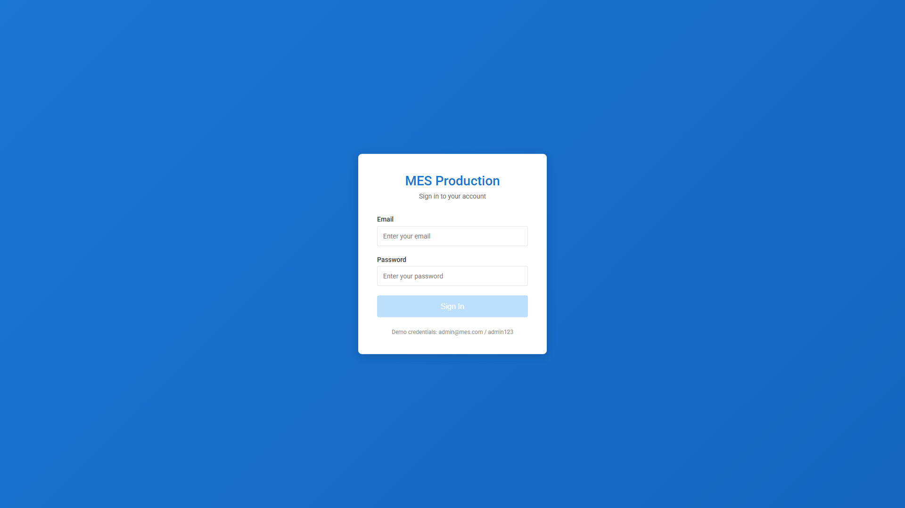

### Page Layout

The Login page has a full-screen blue gradient background with a centered white card (400px max width).

| Panel | Description |
|-------|-------------|
| **Login Card** | White card with rounded corners and shadow, centered on screen |
| **Header** | "MES Production" title in blue, "Sign in to your account" subtitle |
| **Form** | Email and password fields with validation |
| **Demo hint** | Small text at bottom: "Demo credentials: admin@mes.com / admin123" |

### Input Fields

| Field | Type | Placeholder | Validation Rules | Error Messages |
|-------|------|-------------|-----------------|----------------|
| **Email** | email | "Enter your email" | Required; Must be valid email format | "Email is required" / "Please enter a valid email" |
| **Password** | password | "Enter your password" | Required; Minimum 6 characters | "Password is required" / "Password must be at least 6 characters" |

Validation errors appear in red below each field only after the field has been touched (clicked into and left).

### Buttons

| Button | Style | Behavior |
|--------|-------|----------|
| **Sign In** | Full-width blue button (`#1976d2`) | Submits credentials to backend via `POST /api/auth/login` |

**Button States:**
- **Disabled** (lighter blue) when: form has validation errors OR login request is in progress
- **Loading** state: Shows a spinning circle animation instead of "Sign In" text while waiting for API response

### Login Flow

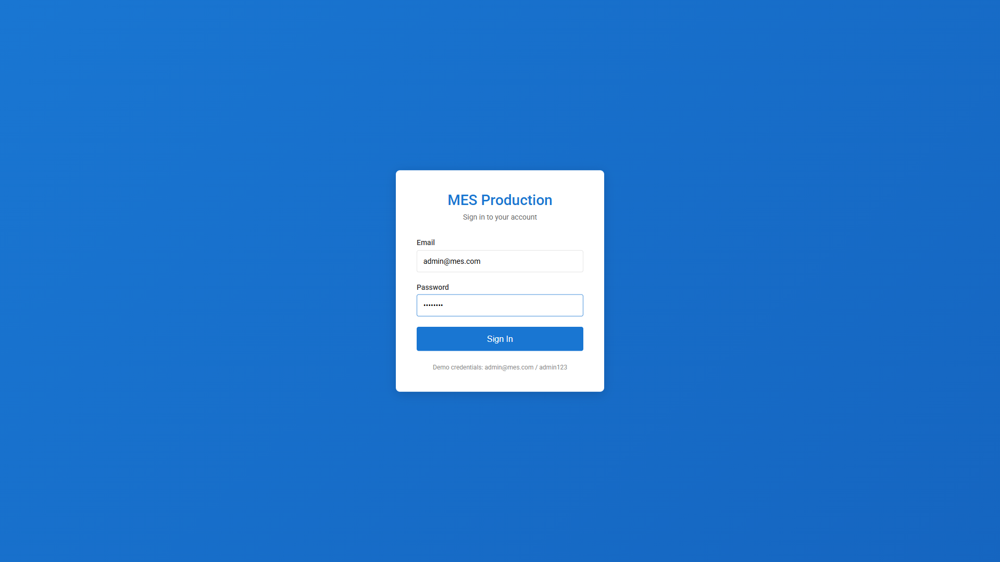

```
1. User enters email and password
2. Clicks "Sign In" button
3. System sends POST /api/auth/login with credentials
4. On SUCCESS:
   ├─ JWT access token stored in browser localStorage
   ├─ User info (name, email, role) stored in localStorage
   └─ Redirect to /#/dashboard
5. On FAILURE:
   └─ Red error alert appears above button: "Invalid email or password"
```

### Error Handling

| Scenario | Display |
|----------|---------|
| Wrong credentials | Red alert box: "Invalid email or password" |
| Server unreachable | Red alert box: API error message or default text |
| Already logged in | Automatically redirected to Dashboard (skips login page) |

---

## Screen 2: Dashboard & Orders

### 2A. Dashboard

**Route:** `/#/dashboard`


The Dashboard is the main landing page after login. It provides a real-time overview of production status with quick access to key workflows. The page title "Production Dashboard" is shown with a "Last Updated" timestamp.

#### Panel 1: Operations Status Summary

A horizontal row of color-coded status cards showing the count of operations in each state:

| Status Card | Color | Meaning |
|-------------|-------|---------|
| **NOT_STARTED** | Gray (`#9e9e9e`) | Operations waiting for preceding steps to complete |
| **READY** | Green (`#4caf50`) | Operations available for production confirmation |
| **IN_PROGRESS** | Blue (`#1976d2`) | Operations currently being executed |
| **CONFIRMED** | Dark Green (`#388e3c`) | Completed operations |
| **ON_HOLD** | Red (`#f44336`) | Operations temporarily suspended |
| **BLOCKED** | Dark Red (`#d32f2f`) | Operations blocked by holds or issues |

Each card is clickable and navigates to the Orders list.

#### Panel 2: Alerts & Attention Needed

Appears only if there are batches awaiting quality approval. Shows a blue-bordered alert card:
- **Count:** Number of batches in QUALITY_PENDING status
- **Label:** "Batches Pending Approval"
- **Click action:** Navigates to Batches list pre-filtered by QUALITY_PENDING status

#### Panel 3: Currently Running Operations

Shows up to 5 operations with IN_PROGRESS status in a card grid:
- **Operation Type** (bold header)
- **Status Badge:** "In Progress" with a pulsing dot
- **Details:** Operation name, Equipment name, Operator name
- **Click action:** Navigates to the parent order's detail page

#### Panel 4: Key Metrics

A 4-column grid of metric cards:

| Metric Card | Value | Details |
|-------------|-------|---------|
| **Orders** | Total order count | Badge shows "X in progress", footer shows "X ready to start" |
| **Today's Production** | Confirmation count for today | Shows number of production confirmations recorded today |
| **Active Batches** | Count of AVAILABLE + QUALITY_PENDING + PRODUCED batches | Footer: "X created recently" |

Clicking "Orders" navigates to the Orders list. Clicking "Active Batches" navigates to the Batches list.

#### Panel 5: Analytics Charts

Two horizontal bar charts rendered using ECharts:

| Chart | X-Axis | Bars |
|-------|--------|------|
| **Order Status** | Status values | Count per status (color-coded: gray/orange/green/blue/dark-green/red) |
| **Batch Status** | Status values | Count per status (color-coded: orange/green/blue/gray/red/brown) |

#### Panel 6: Orders Ready for Production

A table showing up to 5 orders that have READY operations:

| Column | Description |
|--------|-------------|
| **Order #** | Order number (blue, bold) |
| **Product** | First line item's product name |
| **Customer** | Customer name |
| **Status** | Color-coded status badge |

Clicking any row navigates to the order detail page. A "View All" link in the header goes to the full Orders list.

#### Panel 7: Recent Confirmations

A timeline of recent production confirmations:
- **Operation name** (bold)
- **Product SKU** (subtitle)
- **Quantity badge** (green background showing produced quantity)
- **Timestamp** (relative time)

#### Panel 8: Recent Batches

A table showing up to 5 recently created batches:

| Column | Description |
|--------|-------------|
| **Batch #** | Batch number (blue, bold) |
| **Material** | Material name or ID |
| **Quantity** | Amount with unit |
| **Created** | Creation date |
| **Status** | Color-coded status badge |

Clicking any row navigates to the batch detail page.

#### Panel 9: Quick Actions

Three large action buttons at the bottom:

| Button | Style | Icon | Destination |
|--------|-------|------|-------------|
| **Confirm Production** | Primary (blue background, white text) | Factory | `/#/production` |
| **View Orders** | Secondary (white background, dark text) | List | `/#/orders` |
| **Batch Traceability** | Secondary (white background, dark text) | Cubes | `/#/batches` |

All buttons have hover lift animation.

---

### 2B. Orders List

**Route:** `/#/orders`

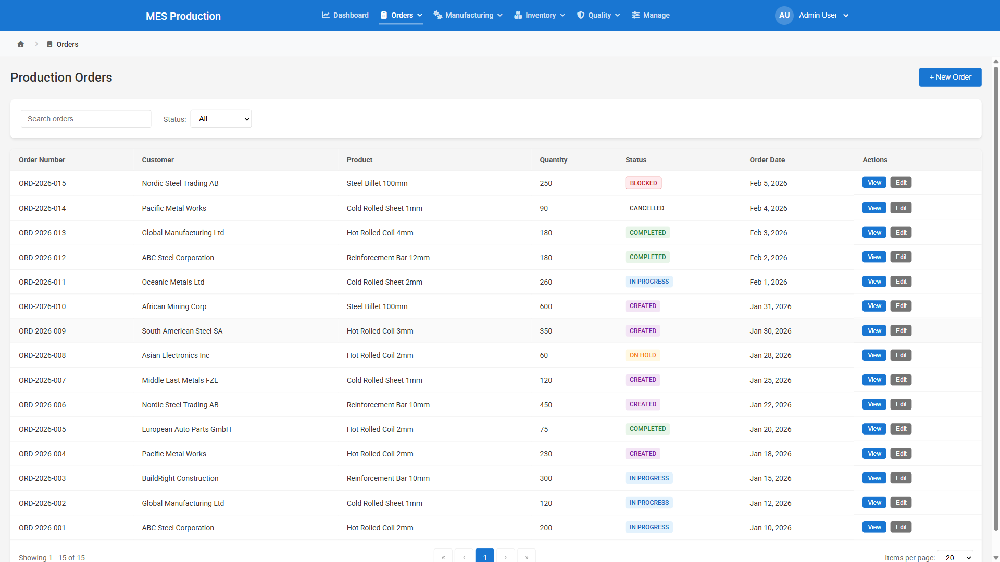

#### Page Layout

| Panel | Description |
|-------|-------------|
| **Page Header** | Title "Production Orders" with a "+ New Order" button (top-right) |
| **Filter Card** | Search input + Status dropdown in a horizontal row |
| **Data Table** | Paginated table of orders |
| **Pagination Controls** | Page navigation + page size selector |

#### Filter Controls

| Control | Type | Description |
|---------|------|-------------|
| **Search** | Text input (250px) | Placeholder: "Search orders..." Filters by order number, customer name, product |
| **Status Filter** | Dropdown | Options: All, CREATED, IN_PROGRESS, COMPLETED, CANCELLED |

Changing either filter resets pagination to page 1 and reloads data from the server.

#### Table Columns

| Column | Data | Description |
|--------|------|-------------|
| **Order Number** | `order.orderNumber` | Auto-generated identifier (e.g., ORD-2026-001) |
| **Customer** | `order.customerName` | Customer who placed the order |
| **Product** | First line item product name | Primary product in the order |
| **Quantity** | Sum of all line item quantities | Total ordered quantity across all products |
| **Status** | Color-coded badge | CREATED (gray), IN_PROGRESS (blue), COMPLETED (green), CANCELLED (red) |
| **Order Date** | Formatted date | Date the order was created |
| **Actions** | Two buttons | View (blue) and Edit (gray) |

#### Action Buttons

| Button | Style | Action |
|--------|-------|--------|
| **+ New Order** | Primary (blue) in header | Navigates to `/#/orders/new` to create a new order |
| **View** | Small blue button per row | Navigates to `/#/orders/{orderId}` for read-only detail view |
| **Edit** | Small gray button per row | Navigates to `/#/orders/{orderId}/edit` to modify order |

#### Data Loading

- **API Endpoint:** `GET /api/orders/paged?page=0&size=20&sortBy=orderDate&sortDirection=DESC`
- **Default sort:** Order date, newest first
- Loading spinner shows "Loading orders..." during fetch

---

### 2C. Order Detail

**Route:** `/#/orders/:id`


#### Page Header

| Element | Description |
|---------|-------------|
| **Back Button** | Arrow-left icon, navigates back to `/#/orders` |
| **Title** | Order number (e.g., "ORD-2026-001") |
| **Subtitle** | Customer name with building icon |
| **Status Badge** | Current order status (color-coded) |
| **Edit Order Button** | Blue button, navigates to `/#/orders/{id}/edit` |

#### Panel 1: Order Summary Metrics

A 4-column grid showing key order statistics:

| Metric | Description |
|--------|-------------|
| **Order Date** | Date the order was placed (formatted) |
| **Line Items** | Count of products in this order |
| **Total Operations** | Sum of all operations across all line items. Sublabel: "X ready to start" |
| **Progress** | Percentage badge + "X/Y operations completed" |

#### Panel 2: Progress Bar

A horizontal progress bar showing overall order completion:
- **Green gradient fill** proportional to completed operations
- **Progress Legend below:** Completed (green check), In Progress (spinner), Ready (play), Pending (clock) with counts

#### Panel 3: Process Flow Visualization

A collapsible interactive chart (ECharts graph) showing the manufacturing process flow:

| Node Type | Shape | Color Logic |
|-----------|-------|-------------|
| **Process** | Purple gradient box | Always purple (design-time entity) |
| **Operation** | Rounded rectangle | Color depends on status (see below) |

**Operation Node Colors:**

| Status | Background | Border |
|--------|-----------|--------|
| CONFIRMED | Light green (`#dcfce7`) | Green (`#22c55e`) |
| IN_PROGRESS | Light blue (`#dbeafe`) | Blue (`#3b82f6`) |
| READY | Light yellow (`#fef3c7`) | Amber (`#f59e0b`) |
| ON_HOLD | Light orange (`#ffedd5`) | Orange (`#f97316`) |
| BLOCKED | Light red (`#fee2e2`) | Red (`#ef4444`) |
| NOT_STARTED | Light gray (`#f1f5f9`) | Gray (`#94a3b8`) |

The chart is interactive: hover shows tooltips, zoom/pan is enabled.

#### Panel 4: Line Items & Operations

For each line item (product) in the order:

**Line Item Header:**
- Product name + SKU
- Quantity + unit
- Delivery date (if set)

**Operations Timeline** (vertical step layout for each operation):

| Element | Description |
|---------|-------------|
| **Step Circle** | Icon changes by status: check (confirmed), spinner (in-progress), play (ready), pause (on-hold), ban (blocked), circle (not started) |
| **Connecting Line** | Vertical line between steps, colored by status |
| **Operation Info** | Operation name (bold), operation code, status badge |
| **Operation Details** | Operation type, sequence number |
| **Action Button** | "Start Production" (if READY) or "Continue Production" (if IN_PROGRESS) |

#### Key Buttons

| Button | Appears When | Action |
|--------|-------------|--------|
| **Start Production** | Operation status = READY | Navigates to `/#/production/confirm/{operationId}` |
| **Continue Production** | Operation status = IN_PROGRESS | Navigates to `/#/production/confirm/{operationId}` |
| **Edit Order** | Always (in header) | Navigates to `/#/orders/{id}/edit` |
| **Back** | Always (in header) | Navigates to `/#/orders` |

---

### 2D. Order Form (Create / Edit)

**Route:** `/#/orders/new` (create) or `/#/orders/:id/edit` (edit)

#### Page Header
- **Create mode:** "New Order"
- **Edit mode:** "Edit Order: ORD-2026-001"

#### Order Information Section

| Field | Type | Validation | Description |
|-------|------|------------|-------------|
| **Customer** | Dropdown (required) | Must select a customer | Loads active customers from API. Display: "CUST-001 - Customer Name" |
| **Order Date** | Date picker (required) | Required | Defaults to today's date |
| **Order Number** | Text input | Optional | "Leave empty to auto-generate". Read-only in edit mode |
| **Status** | Dropdown | Edit mode only | Options: CREATED, IN_PROGRESS, COMPLETED, ON_HOLD, CANCELLED |

When a customer is selected from the dropdown, the customer name is auto-populated from master data.

#### Line Items Section

Each line item card has:

| Field | Type | Validation | Description |
|-------|------|------------|-------------|
| **Product** | Dropdown (required) | Must select a product | Loads active products from API. Display: "SKU - Product Name" |
| **Quantity** | Number (required) | Min: 0.01 | Amount to order |
| **Unit** | Text (read-only) | Auto-populated | Set from product's base unit when product is selected |
| **Delivery Date** | Date picker | Optional | When customer needs delivery |

| Button | Action |
|--------|--------|
| **Add Line Item** | Adds a blank line item row. Only available for CREATED orders |
| **Remove (X)** | Removes line item. Only if more than 1 line item exists |

**Edit mode constraint:** Line items can only be modified for orders with CREATED status. Once an order is IN_PROGRESS or beyond, a warning message appears: "Line items can only be modified for orders with CREATED status."

#### Form Actions

| Button | Style | Action |
|--------|-------|--------|
| **Cancel** | Gray secondary | Discards changes, navigates to `/#/orders` |
| **Create Order** / **Update Order** | Blue primary | Validates form and submits. Shows "Saving..." while in progress |

---

## Screen 3: Production Confirmation

**Route:** `/#/production/confirm/:operationId`

This is the core screen of the POC. It captures all production data for a single manufacturing operation through a multi-section collapsible form.

### Empty Form


### With Operation Selected


### Complete Form Overview

The form is organized into 8 collapsible sections. Each section header is clickable to expand/collapse, with a chevron icon indicating the state.

```
+------------------------------------------------------------------+
|  BACK TO ORDER                                      Page Header    |
+------------------------------------------------------------------+
|                                                                    |
|  [v] Section 1: Operation Details          (read-only info)        |
|  [v] Section 2: Production Time            (start/end/duration)    |
|  [v] Section 3: Production Quantities      (produced/scrap/yield)  |
|  [v] Section 4: Material Consumption       (input materials/BOM)   |
|  [v] Section 5: Equipment & Operators      (checkboxes)            |
|  [v] Section 6: Delay Tracking             (duration/reason)       |
|  [v] Section 7: Process Parameters         (dynamic fields)        |
|  [v] Section 8: Notes                      (free text)             |
|                                                                    |
|  [ ] Save as Partial Confirmation                                  |
|                                                                    |
|  [Cancel]                    [Confirm Production]                  |
+------------------------------------------------------------------+
```

---

### Section 1: Operation Details (Read-Only)

Displays the operation context loaded from the backend:

| Field | Description |
|-------|-------------|
| **Operation Name** | Name of the manufacturing operation (e.g., "Melting - Furnace 1") |
| **Operation Code** | Unique code (e.g., "OP-MELT-001") |
| **Operation Type** | Category (e.g., FURNACE, CASTER, ROLLING) |
| **Status** | Current operation status as a color-coded badge |
| **Product Name & SKU** | The product being manufactured |
| **Order Quantity** | Target quantity from the order |
| **Process Name** | Parent process/stage name |
| **Batch Number Preview** | Shows the next batch number that will be assigned (loaded asynchronously, non-editable) |

This section is informational only - no user input required.

---

### Section 2: Production Time

A two-column layout for capturing when production occurred:

| Field | Type | Validation | Error Message |
|-------|------|------------|---------------|
| **Start Time** | datetime-local (required) | Required; Cannot be in the future | "Start time cannot be in the future" |
| **End Time** | datetime-local (required) | Required; Must be after Start Time | "End time must be after start time" |
| **Duration** | Calculated display (read-only) | Auto-computed | Shows formatted duration (e.g., "2h 30m") |

Both fields default to the current date/time. The duration is automatically calculated as the difference between end and start times.

---

### Section 3: Production Quantities

A two-column layout for output quantities:

| Field | Type | Validation | Error Message |
|-------|------|------------|---------------|
| **Quantity Produced** | Number (required) | Required; Min: 1 | "Required" |
| **Quantity Scrapped** | Number | Min: 0; Default: 0 | (none) |

**Calculated Displays:**
- **Total Production:** Produced + Scrapped
- **Yield Percentage:** (Produced / Total) x 100, with 2 decimal places

**Yield Indicator Bar:**
A colored progress bar indicates yield quality:

| Yield Range | Color | Meaning |
|-------------|-------|---------|
| >= 95% | Green | Good yield |
| 80% - 95% | Yellow | Warning - yield below target |
| < 80% | Red | Critical - high scrap rate |

---

### Section 4: Material Consumption

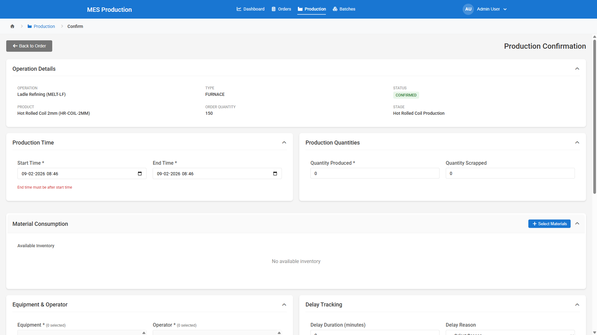

This is the most complex section. It handles selecting input materials (inventory batches) for consumption during production.

#### Sub-Section 4a: BOM Suggested Consumption

If a Bill of Materials (BOM) is configured for the product, the system loads and displays suggested material consumption:

| Display | Description |
|---------|-------------|
| **Target Quantity** | The quantity the BOM is calculated for |
| **Suggested Materials Table** | Lists each material with: Material name, Required Qty (with yield loss applied), Available Qty, Yield Ratio, Stock Status |
| **Stock Status Badge** | Green "Sufficient" if available >= required; Red "Insufficient" otherwise |

| Button | Action |
|--------|--------|
| **Apply Suggestions** | Auto-fills the selected materials list with BOM-recommended batches and quantities. Disabled if any material has insufficient stock |

**BOM Logic:** For each material in the BOM, the system:
1. Calculates required quantity considering yield loss ratio (e.g., 1.05 = 5% loss factor)
2. Finds available inventory batches
3. Suggests how much to consume from each batch
4. Pre-fills the "Quantity Produced" field with the target quantity

#### Sub-Section 4b: Available Inventory Table

Lists all inventory items with state = AVAILABLE:

| Column | Description |
|--------|-------------|
| **Batch #** | Batch number identifier |
| **Material ID** | Material code |
| **Available Qty** | Quantity available for consumption |
| **State** | Status badge (should show AVAILABLE) |
| **Action** | "Add" button to select this material |

Clicking "Add" moves the item to the Selected Materials list below.

#### Sub-Section 4c: Select Materials Button & Modal

| Button | Location | Action |
|--------|----------|--------|
| **Select Materials** | Material Consumption section header | Opens the Material Selection Modal for advanced search and bulk selection |

**Material Selection Modal** - A full-screen overlay dialog for selecting materials:

```
+------------------------------------------------------------------+
|  Select Materials for Consumption                           [X]    |
+------------------------------------------------------------------+
|  Search: [___________________]   Type: [All Types v]  [Clear]     |
|                                                                    |
|  [Select All Visible]  [Clear Selection]     3 items selected     |
+------------------------------------------------------------------+
|  [ ] | Batch #    | Material | Available | Unit | State | Qty     |
|  [x] | B-RM-001   | RM-SCRAP | 500       | T    | AVAIL | [100]  |
|  [x] | B-RM-002   | RM-ORE   | 300       | T    | AVAIL | [50]   |
|  [ ] | B-IM-003   | IM-SLAB  | 200       | T    | AVAIL | [___]  |
+------------------------------------------------------------------+
|  3 materials selected, 150 total quantity to consume              |
|                                    [Cancel]  [Confirm Selection]  |
+------------------------------------------------------------------+
```

**Modal Controls:**

| Control | Description |
|---------|-------------|
| **Search Input** | Searches by batch number, material ID, or material name (case-insensitive) |
| **Material Type Filter** | Dropdown to filter by type prefix (RM, IM, FG, WIP) extracted from material IDs |
| **Clear Filters** | Resets search and type filter |
| **Select All Visible** | Selects all items matching current filters |
| **Clear Selection** | Removes all selections |
| **Checkbox per row** | Toggle individual item selection |
| **Qty to Consume** | Editable number input per row (disabled until item is selected). Constrained: 0 <= value <= available quantity |
| **Cancel** | Discards changes, closes modal |
| **Confirm Selection** | Applies selections to the form and closes modal |

Clicking the backdrop (outside the modal) also closes it.

#### Sub-Section 4d: Selected Materials Table

After materials are selected (via Add, Apply Suggestions, or Modal), they appear here:

| Column | Description |
|--------|-------------|
| **Batch #** | Selected batch number |
| **Material ID** | Material code |
| **Available** | Maximum quantity available |
| **Qty to Consume** | Editable number input (constrained 0 to available) |
| **Action** | "Remove" button to deselect |

Changing any quantity or adding/removing materials triggers real-time BOM validation.

#### Sub-Section 4e: BOM Requirements Comparison

If BOM requirements are loaded, shows a comparison table:

| Column | Description |
|--------|-------------|
| **Material** | Required material name |
| **Required Qty** | BOM-specified quantity |
| **Selected Qty** | Sum of all selected quantities for this material |
| **Status** | Badge: MET (green, selected >= required), PARTIAL (orange, 0 < selected < required), MISSING (red, selected = 0) |

Rows are highlighted with background colors matching the status.

#### Sub-Section 4f: BOM Validation Warnings

After each material change, the system calls the BOM validation API and displays:
- **Warnings** (yellow alert): Advisory messages about consumption patterns
- **Errors** (red alert): Issues that should be resolved before confirming

---

### Section 5: Equipment & Operators

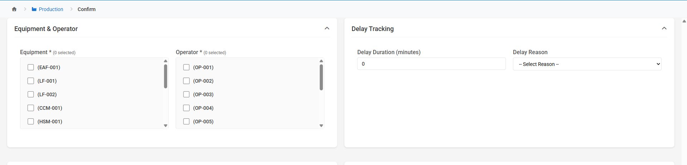

A two-column layout with checkbox groups:

**Equipment (Left Column):**
- **Header:** "Equipment * (N selected)"
- **Display:** Scrollable checkbox list (max height 200px) of all available equipment
- **Each item:** Checkbox + Equipment name and code
- **Validation:** At least one equipment must be selected (checked on submit)
- **Error:** "Please select at least one equipment."
- **Data Source:** `GET /api/master/equipment` (only AVAILABLE status)

**Operators (Right Column):**
- **Header:** "Operator * (N selected)"
- **Display:** Scrollable checkbox list (max height 200px) of all active operators
- **Each item:** Checkbox + Operator name and code
- **Validation:** At least one operator must be selected (checked on submit)
- **Error:** "Please select at least one operator."
- **Data Source:** `GET /api/master/operators` (only ACTIVE status)

---

### Section 6: Delay Tracking

A two-column layout:

| Field | Type | Validation | Description |
|-------|------|------------|-------------|
| **Delay Duration (minutes)** | Number | Min: 0; Default: 0 | Total delay time in minutes |
| **Delay Reason** | Dropdown | Required only if delay > 0 | Options loaded from API (delay reason codes and descriptions) |

If delay duration is greater than 0 but no reason is selected, the form shows: "Delay reason is required when delay duration is entered."

---

### Section 7: Process Parameters

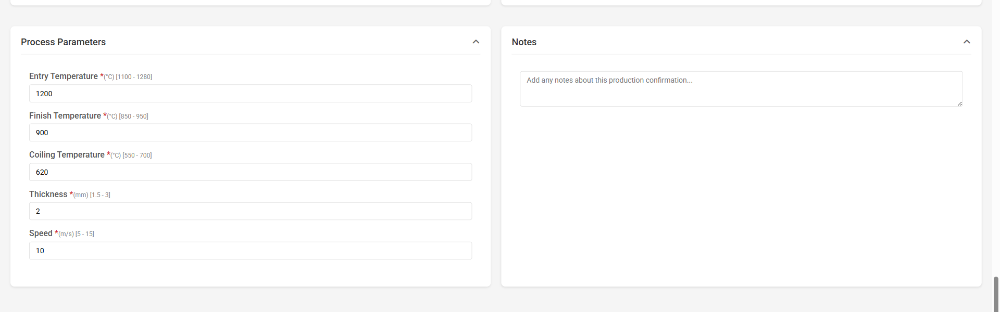

Dynamic parameter fields loaded based on the operation type and product SKU. Each parameter has:

| Attribute | Description |
|-----------|-------------|
| **Label** | Parameter name + required indicator (*) + unit + [min-max range] |
| **Input** | Number field with decimal support |
| **Default Value** | Pre-filled from configuration (shown as placeholder) |
| **Min/Max Validation** | Backend-configured limits enforced in real-time |

**Error Messages per parameter:**
- "Parameter name is required" (if required and empty)
- "Parameter name must be at least X units" (below minimum)
- "Parameter name must not exceed X units" (above maximum)

**Example parameters for a FURNACE operation:**
- Temperature (C): required, min 1200, max 1800
- Pressure (bar): required, min 1.0, max 5.0
- Holding Time (min): optional, min 0, max 120

---

### Section 8: Notes

| Field | Type | Validation | Description |
|-------|------|------------|-------------|
| **Notes** | Textarea (3 rows) | Optional | Free-text production notes. Placeholder: "Add any notes about this production confirmation..." |

---

### Partial Confirmation Checkbox

| Control | Description |
|---------|-------------|
| **Save as Partial Confirmation** | Checkbox below all sections. When checked, the produced quantity does not need to equal the target quantity. The operation remains IN_PROGRESS instead of moving to CONFIRMED |

---

### Form Action Buttons

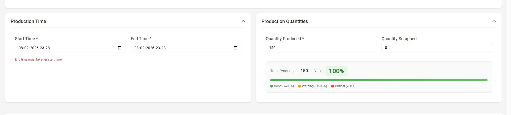

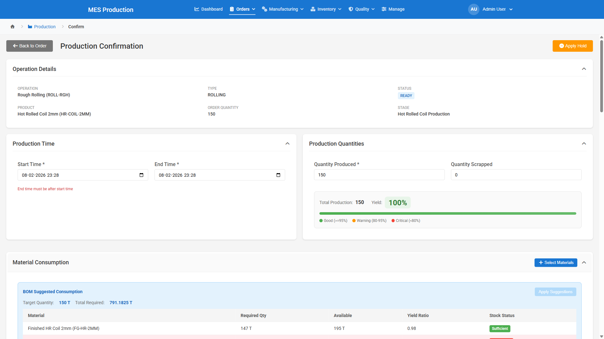

| Button | Style | Action |
|--------|-------|--------|
| **Cancel** | Gray secondary | Clears form and navigates back |
| **Confirm Production** | Blue primary | Validates and submits the full confirmation. Text changes to "Save Partial Confirmation" if checkbox is checked |

**Button disabled when:** Form has validation errors OR submission is in progress.

---

### Production Confirmation - Complete Submit Flow

When the user clicks "Confirm Production", the following validation and processing occurs:

```
STEP 1: FRONTEND VALIDATION
  ├─ Check all required form fields
  ├─ Check time range (end > start)
  ├─ Check quantity validations (produced >= 1, scrap >= 0)
  ├─ Check at least 1 equipment selected
  ├─ Check at least 1 operator selected
  ├─ Check delay reason if delay > 0
  └─ Check process parameter min/max limits

STEP 2: BUILD REQUEST PAYLOAD
  ├─ operationId
  ├─ producedQty, scrapQty
  ├─ startTime, endTime (ISO 8601)
  ├─ equipmentIds[] (selected equipment)
  ├─ operatorIds[] (selected operators)
  ├─ materialsConsumed[] { batchId, inventoryId, quantity }
  ├─ processParameters { "paramName": value }
  ├─ delayMinutes, delayReason
  ├─ notes
  └─ saveAsPartial (boolean)

STEP 3: SUBMIT TO BACKEND (POST /api/production/confirm)

STEP 4: BACKEND PROCESSING
  ├─ Validate all inputs server-side
  ├─ Create ProductionConfirmation record
  ├─ For each input material:
  │   ├─ Create ConsumedMaterial record
  │   ├─ Update inventory state → CONSUMED
  │   └─ Record consumed quantity
  ├─ Generate output batch number (configurable format)
  ├─ Create output Batch (status = QUALITY_PENDING)
  ├─ Create output Inventory (state = PRODUCED)
  ├─ Create BatchRelation records (parent → child genealogy)
  ├─ Update Operation status:
  │   ├─ If produced = target → CONFIRMED
  │   └─ If produced < target (partial) → IN_PROGRESS
  ├─ If operation CONFIRMED and has next step:
  │   └─ Next operation → READY
  ├─ If ALL operations CONFIRMED:
  │   └─ Order status → COMPLETED
  └─ Log audit trail with timestamps and user attribution

STEP 5: DISPLAY SUCCESS STATE
```

### Success State

After successful confirmation, the form is replaced with a success display:

| Element | Description |
|---------|-------------|
| **Success Icon** | Green circle with checkmark (or orange clock for partial) |
| **Heading** | "Production Confirmed Successfully!" or "Partial Confirmation Saved" |
| **Confirmation ID** | Unique ID of the new confirmation record |
| **Quantity Produced** | Amount confirmed |
| **Output Batches** | Batch number(s) generated, with "View Batch" link(s) |
| **Materials Consumed** | Count of materials consumed |
| **Operation Status** | New status badge after confirmation |

**Partial Confirmation Extra Info:**
- Progress bar showing confirmed vs target quantity
- Remaining quantity display
- "Continue Confirmation" button to resume

**Action Buttons in Success State:**

| Button | Action |
|--------|--------|
| **Back to Order** | Returns to the parent order detail page |
| **Continue Confirmation** | (Partial only) Resets form for another partial confirmation |
| **View Batch** | Navigates to the output batch detail page |

---

### Validation Rules Summary

| Field | Rule | Error Message |
|-------|------|---------------|
| Start Time | Required, not in future | "Start time cannot be in the future" |
| End Time | Required, must be after start | "End time must be after start time" |
| Produced Qty | Required, >= 1 | "Required" |
| Scrap Qty | >= 0 | (none, defaults to 0) |
| Equipment | At least 1 selected | "Please select at least one equipment." |
| Operators | At least 1 selected | "Please select at least one operator." |
| Delay Reason | Required if delay > 0 | "Please select a delay reason when delay duration is greater than 0." |
| Material Qty | 0 <= qty <= available | Clamped automatically |
| Process Params | Per-param min/max | "Must be at least X" / "Must not exceed X" |

---

## Screen 4: Batch Traceability

### 4A. Batch List

**Route:** `/#/batches`

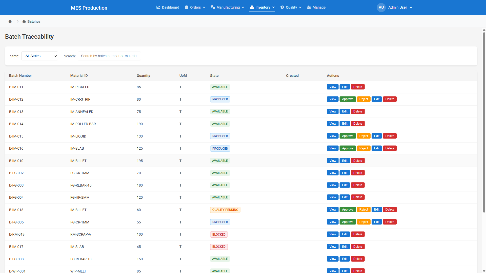

#### Page Layout

| Panel | Description |
|-------|-------------|
| **Page Header** | Title "Batch Traceability" |
| **Filter Card** | Status filter dropdown + Search input |
| **Data Table** | Paginated table of batches |
| **Pagination Controls** | Page navigation + page size selector |

Note: There is no "Create Batch" button - batches are created automatically via Production Confirmation for proper traceability.

#### Filter Controls

| Control | Type | Options |
|---------|------|---------|
| **State Filter** | Dropdown | All States, Quality Pending, Available, Consumed, On Hold, Blocked, Scrapped |
| **Search** | Text input | Filters by batch number or material name |

#### Table Columns

| Column | Description |
|--------|-------------|
| **Batch Number** | Unique batch identifier |
| **Material ID** | Material code |
| **Quantity** | Current quantity |
| **UoM** | Unit of measure |
| **State** | Color-coded status badge |
| **Created** | Creation date (formatted) |
| **Actions** | "View" button |

#### Status Badge Colors

| Status | Background | Text |
|--------|-----------|------|
| QUALITY_PENDING | Yellow (`#fff3cd`) | Dark yellow (`#856404`) |
| AVAILABLE | Green (`#d4edda`) | Dark green (`#155724`) |
| CONSUMED | Gray (`#e9ecef`) | Dark gray (`#555`) |
| ON_HOLD | Orange (`#ffe0b2`) | Dark orange (`#e65100`) |
| BLOCKED | Red (`#f8d7da`) | Dark red (`#721c24`) |
| SCRAPPED | Dark gray (`#e0e0e0`) | Charcoal (`#424242`) |

#### Button

| Button | Action |
|--------|--------|
| **View** (per row) | Navigates to `/#/batches/{batchId}` |

The Batch List also accepts URL query parameters (e.g., `?status=QUALITY_PENDING`) to pre-filter, used when navigating from the Dashboard's "Batches Pending Approval" alert.

---

### 4B. Batch Detail

**Route:** `/#/batches/:id`

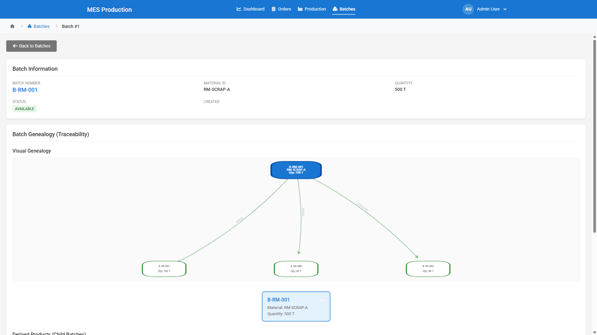

#### Page Header

| Element | Description |
|---------|-------------|
| **Back Button** | Arrow icon, navigates to `/#/batches` |
| **Success Alert** | Green banner for successful operations (allocation, approval, etc.) |
| **Error Alert** | Red banner for failed operations |

#### Panel 1: Batch Information

A card with a 3-column info grid:

| Field | Description |
|-------|-------------|
| **Batch Number** | Large blue text - the batch identifier |
| **Material ID** | Material code |
| **Quantity + UoM** | Current quantity with unit |
| **Status** | Color-coded status badge |
| **Created** | Creation date |
| **Expiry Date** | If applicable |

#### Panel 2: Traceability Information

Shows batch creation source context:

| Field | Description |
|-------|-------------|
| **Created Via** | Color-coded badge showing how the batch was created |

**Created Via Badge Colors:**

| Source | Color | Icon | Meaning |
|--------|-------|------|---------|
| PRODUCTION | Blue | Factory | Created by production confirmation |
| SPLIT | Orange | Split | Created by splitting a parent batch |
| MERGE | Purple | Merge | Created by merging multiple batches |
| MANUAL | Indigo | Hand | Manually created |
| RECEIPT | Green | Truck | Received from external supplier |
| SYSTEM | Gray | Gear | System-generated |

Additional fields:
- **Source Operation** (clickable link to the production confirmation that created this batch)
- **Created On** date
- **Supplier Information** (for received materials): Supplier ID, Supplier Batch Number

#### Panel 3: Quality Approval Status

Shows if batch has quality approval history:

| Status | Icon | Color |
|--------|------|-------|
| QUALITY_PENDING | Hourglass | Yellow |
| APPROVED | Checkmark | Green |
| REJECTED | X mark | Red |

Displays: Approved/Rejected By, Date, and Rejection Reason (if rejected).

#### Panel 4: Batch Genealogy

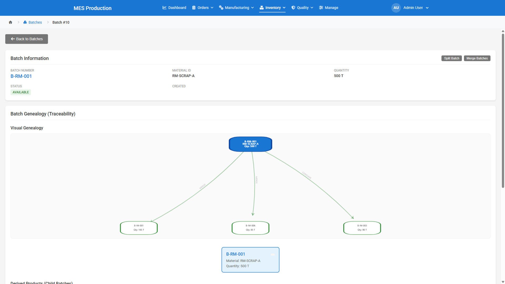

The genealogy panel provides full material traceability with two display modes:

**Visual Chart (ECharts):**
An interactive graph showing:
- **Parent batches** (top row, blue borders) - materials consumed to create this batch
- **Current batch** (center, bold blue, larger) - the batch being viewed
- **Child batches** (bottom row, green borders) - batches produced from this batch
- Arrows indicate material flow direction
- Edge labels show relation type (SPLIT, MERGE, NORMAL)
- Clicking any parent/child node navigates to that batch's detail page

**Tree Structure Display:**

```
PARENT BATCHES (Backward Traceability)
"What materials went INTO this batch?"

  B-RM-SCRAP-001 ──┐
  B-RM-ORE-001 ────┼──> THIS BATCH
  B-RM-ALLOY-001 ──┘

CHILD BATCHES (Forward Traceability)
"What was produced FROM this batch?"

                    ┌──> B-IM-STRIP-001 ──> B-FG-COIL-001
  THIS BATCH ───────┼──> B-IM-STRIP-002 ──> B-FG-COIL-002
                    └──> B-IM-STRIP-003 ──> B-FG-COIL-003
```

Each parent/child card shows: Batch number, Status badge, Material ID, Quantity consumed/produced. Clicking navigates to that batch.

If no relationships exist: "This batch has no parent or child relationships. Relationships are created when materials are consumed during production confirmation."

#### Panel 5: Order Allocations

For AVAILABLE batches, shows allocation to customer orders:

**Allocation Summary:**
- Total Quantity, Allocated amount (orange), Available amount (green)
- "Fully Allocated" badge if all quantity is allocated

**Active Allocations Table:**

| Column | Description |
|--------|-------------|
| **Order** | Order number |
| **Product** | Product SKU |
| **Quantity** | Allocated amount |
| **Date** | Allocation date |
| **Actions** | "Release" button (with confirmation dialog) |

| Button | Appears When | Action |
|--------|-------------|--------|
| **+ Allocate to Order** | Batch is AVAILABLE and not fully allocated | Opens Allocation Modal |
| **Release** | Per active allocation row | Shows confirmation, then releases allocation |

**Allocation Modal:**

| Field | Type | Description |
|-------|------|-------------|
| **Batch Info** | Display | Shows batch number, material, available quantity |
| **Order Line** | Dropdown (required) | Lists available order lines. Format: "Order ORD-001 - PROD-SKU (Product Name) - 100 KG" |
| **Quantity** | Number (required) | Min: 0.01, Max: available quantity, Step: 0.01 |
| **Cancel** | Button | Closes modal without saving |
| **Allocate** | Button (primary) | Creates allocation record, refreshes page |

---

## Business Logic & State Machines

### Order Status Flow

```
CREATED ──> IN_PROGRESS ──> COMPLETED
   │
   └──> CANCELLED
   │
   └──> ON_HOLD ──> (back to previous state)
```

| Transition | Trigger |
|-----------|---------|
| CREATED → IN_PROGRESS | First operation confirmed or started |
| IN_PROGRESS → COMPLETED | All operations reach CONFIRMED status |
| Any → CANCELLED | Manual cancellation via Edit |
| Any → ON_HOLD | Hold applied to order |

### Operation Status Flow

```
NOT_STARTED ──> READY ──> IN_PROGRESS ──> CONFIRMED
                  │
                  └──> ON_HOLD ──> READY (hold released)
                  │
                  └──> BLOCKED (hold applied)
```

| Transition | Trigger |
|-----------|---------|
| NOT_STARTED → READY | Previous operation in sequence is CONFIRMED (or first operation) |
| READY → IN_PROGRESS | Partial production confirmation (produced < target) |
| READY/IN_PROGRESS → CONFIRMED | Full production confirmation (produced = target) |
| READY → ON_HOLD | Hold applied |
| ON_HOLD → READY | Hold released |

### Batch Status Flow

```
NEW BATCH CREATED:
  └─ From Production Confirmation → QUALITY_PENDING
  └─ From Material Receipt → QUALITY_PENDING

QUALITY DECISION:
  └─ Approve → AVAILABLE
  └─ Reject → BLOCKED

AVAILABLE BATCH:
  └─ Used in production → CONSUMED
  └─ Split → SPLIT (original becomes SPLIT, children are AVAILABLE)
  └─ Merged with others → MERGED (originals become MERGED, new batch is AVAILABLE)
  └─ Put on hold → ON_HOLD

ON_HOLD BATCH:
  └─ Release hold → AVAILABLE

BLOCKED BATCH:
  └─ Scrap decision → SCRAPPED
```

### Inventory State Flow

```
PRODUCED ──> AVAILABLE ──> CONSUMED
                 │
                 ├──> BLOCKED ──> SCRAPPED
                 │
                 └──> ON_HOLD ──> AVAILABLE (hold released)
```

### Multi-Level BOM Logic

The system supports multi-step manufacturing processes where the output of one operation becomes the input for the next:

```
Example: Producing HR Coil from Raw Materials

STEP 1: MELTING (consumes raw materials)
  Input:  B-RM-SCRAP-001 (Steel Scrap, 500T)
          B-RM-ORE-001 (Iron Ore, 200T)
  Output: B-WIP-LS-001 (Liquid Steel, 650T)

STEP 2: CASTING (consumes WIP from Step 1)
  Input:  B-WIP-LS-001 (Liquid Steel, 650T)
  Output: B-IM-SLAB-001 (Steel Slab, 620T)

STEP 3: ROLLING (consumes IM from Step 2)
  Input:  B-IM-SLAB-001 (Steel Slab, 620T)
  Output: B-FG-COIL-001 (HR Coil, 600T)

Complete Genealogy Chain:
  B-RM-SCRAP-001 ─┐
  B-RM-ORE-001 ───┼→ B-WIP-LS-001 → B-IM-SLAB-001 → B-FG-COIL-001

Traceability:
  Forward:  "Where did this raw material end up?" → Follow child batches
  Backward: "What went into this finished good?" → Follow parent batches
```

### Split Operation

```
BEFORE:
  B-IM-SLAB-001 (Qty: 100T, Status: AVAILABLE)

SPLIT into 60T + 40T:

AFTER:
  B-IM-SLAB-001     (Qty: 0T, Status: SPLIT)
    ├→ B-IM-SLAB-001-A (Qty: 60T, Status: AVAILABLE)
    └→ B-IM-SLAB-001-B (Qty: 40T, Status: AVAILABLE)

Genealogy: B-IM-SLAB-001 is PARENT of both child batches
```

### Merge Operation

```
BEFORE:
  B-IM-SLAB-001 (Qty: 30T, Status: AVAILABLE)
  B-IM-SLAB-002 (Qty: 40T, Status: AVAILABLE)
  B-IM-SLAB-003 (Qty: 30T, Status: AVAILABLE)

MERGE all three:

AFTER:
  B-IM-SLAB-001 (Status: MERGED)
  B-IM-SLAB-002 (Status: MERGED)
  B-IM-SLAB-003 (Status: MERGED)
    └→ B-IM-SLAB-MERGED-001 (Qty: 100T, Status: AVAILABLE)

Genealogy: All three original batches are PARENTS of merged batch
```

---

## Demo Scenarios

### Scenario 1: Complete Production Confirmation

**Goal:** Demonstrate the full production workflow from order to confirmed output.

1. **Login** as admin@mes.com / admin123
2. Navigate to **Orders** from the header
3. Find an order with IN_PROGRESS status, click **View**
4. In the Order Detail, find a **READY** operation, click **"Start Production"**
5. The Production Confirmation form opens with the operation pre-loaded
6. In **Material Consumption**, click "Apply Suggestions" (if BOM suggestions are shown) or manually add materials
7. Enter **Start/End Times** (defaults to current time)
8. Enter **Produced Quantity** and optionally **Scrap Quantity**
9. In **Equipment & Operators**, check at least one equipment and one operator
10. Enter **Process Parameters** (temperature, pressure, etc.) within the valid ranges
11. Click **"Confirm Production"**
12. **Verify success state shows:**
    - New batch number generated
    - Confirmation ID assigned
    - Operation status updated
13. Click **"View Batch"** to see the newly created batch
14. In Batch Detail, verify **genealogy** shows parent batches (input materials)

### Scenario 2: Batch Traceability

**Goal:** Demonstrate full material traceability through the production chain.

1. Navigate to **Batches** from the header
2. Click on a finished goods batch (e.g., B-FG-COIL-001)
3. In the Batch Detail, view the **Genealogy** section
4. **Backward trace:** Click on parent batches to see what materials went into this batch
5. Continue clicking parents until you reach raw materials (RM batches)
6. **Forward trace:** Go back to a raw material batch, click child batches to see what was produced
7. Navigate the complete chain: RM → WIP → IM → FG

### Scenario 3: Partial Confirmation

**Goal:** Demonstrate confirming part of an operation's target quantity.

1. Navigate to a READY operation via Orders
2. Click "Start Production"
3. Check the **"Save as Partial Confirmation"** checkbox
4. Enter a quantity **less than** the target (e.g., target is 500T, enter 200T)
5. Fill remaining fields and click **"Save Partial Confirmation"**
6. Verify the operation moves to **IN_PROGRESS** (not CONFIRMED)
7. Click **"Continue Confirmation"** to confirm more quantity later

### Scenario 4: Order Lifecycle

**Goal:** Demonstrate order creation and the complete lifecycle.

1. Navigate to **Orders**, click **"+ New Order"**
2. Select a customer, enter order date
3. Add line items: select products, enter quantities
4. Click **"Create Order"** - order created with CREATED status
5. View the order - see operations in NOT_STARTED state
6. The first operation is automatically set to READY
7. After confirming operations, watch the progress bar advance
8. When all operations are CONFIRMED, order becomes COMPLETED

---

## Technical Summary

### Technology Stack

| Layer | Technology |
|-------|-----------|
| **Frontend** | Angular 17 (Module-based architecture) |
| **Backend** | Spring Boot 3.2, Java 17 |
| **Database** | PostgreSQL 14+ |
| **Authentication** | JWT (JSON Web Tokens) with JJWT 0.12.3 |
| **Charts** | ECharts (Apache) |
| **Build** | Gradle 8.5 (backend), npm/Angular CLI (frontend) |

### Demo Data Summary

| Entity | Count | Description |
|--------|-------|-------------|
| Orders | 8 | Various statuses (CREATED, IN_PROGRESS, COMPLETED) |
| Products | 6 | Steel products (coils, slabs, billets) |
| Materials | 24 | Raw materials, intermediates, finished goods |
| Equipment | 12 | Furnaces, casters, rolling mills |
| Operators | 8 | Production staff |
| Batches | 27 | Various statuses with genealogy relationships |
| Processes | 3 | Melting, Casting, Rolling |

### Key API Endpoints

| Endpoint | Method | Description |
|----------|--------|-------------|
| `/api/auth/login` | POST | Authenticate and receive JWT token |
| `/api/orders/paged` | GET | Paginated orders with filter/sort |
| `/api/orders/{id}` | GET | Order detail with line items and operations |
| `/api/orders` | POST | Create new order |
| `/api/production/confirm` | POST | Submit production confirmation |
| `/api/batches/paged` | GET | Paginated batches with filter/sort |
| `/api/batches/{id}/genealogy` | GET | Batch genealogy (parents + children) |
| `/api/bom/operation/{id}/suggested-consumption` | GET | BOM-based material suggestions |
| `/api/bom/validate` | POST | Validate material consumption against BOM |
| `/api/dashboard/stats` | GET | Dashboard summary statistics |

### Color Reference

| Usage | Color | Hex |
|-------|-------|-----|
| Primary / Links | Blue | `#1976d2` |
| Success / Confirmed | Green | `#4caf50` / `#388e3c` |
| Warning / Pending | Orange/Yellow | `#ff9800` |
| Error / Blocked | Red | `#f44336` / `#d32f2f` |
| Neutral / Not Started | Gray | `#9e9e9e` |
| Info / Alerts | Light Blue | `#2196f3` |

---

*End of Document*
