# MES Production Confirmation - POC Demo Document

**Document Version:** 1.0
**Delivery Date:** February 2026
**Prepared By:** Sumeet Gupta
**Client:** BLUEMINGO TECH PRIVATE LIMITED
**Scope:** Production Confirmation POC as defined in MES-POC-Specification.md

---

## Executive Summary

This document provides a comprehensive demonstration of the MES Production Confirmation Proof of Concept (POC). The system delivers a functional, full-stack application (Angular 17 / Spring Boot 3.2) demonstrating core industrial workflows including:

- **Production confirmation** with material consumption
- **Batch traceability** (forward and backward genealogy)
- **Inventory state management**
- **Hold management** across multiple entity types
- **Equipment and operator** resource tracking
- **Quality status management** with batch approval

**Credentials for Demo:**
- **URL:** `http://localhost:4200`
- **Email:** `admin@mes.com`
- **Password:** `admin123`

---

## Table of Contents

1. [System Login](#1-system-login)
2. [Production Dashboard](#2-production-dashboard)
3. [Orders Management](#3-orders-management)
4. [Production Confirmation](#4-production-confirmation)
5. [Inventory Management](#5-inventory-management)
6. [Batch Management & Traceability](#6-batch-management--traceability)
7. [Hold Management](#7-hold-management)
8. [Equipment Management](#8-equipment-management)
9. [Quality Management](#9-quality-management)
10. [Demo Scenarios](#10-demo-scenarios)
11. [POC Scope Compliance](#11-poc-scope-compliance)

---

## 1. System Login

### 1.1 Login Screen

**Route:** `/#/login`

The login screen provides secure JWT-based authentication for the MES system.


*Figure 1.1: Login Page - Clean authentication interface*


*Figure 1.2: Login Page with credentials entered*

**Screen Elements:**

| Element | Description |
|---------|-------------|
| **Email Field** | Enter user email (admin@mes.com) |
| **Password Field** | Enter password (admin123) |
| **Login Button** | Authenticates user and issues JWT token |
| **Error Display** | Shows validation errors for invalid credentials |

**Security Features:**
- JWT token-based authentication
- Token stored in browser session storage
- Automatic redirect to dashboard after login
- Protected routes require valid token

**Successful Login Flow:**
1. User enters credentials
2. System validates against database
3. JWT token issued with 24-hour expiry
4. User redirected to Production Dashboard

---

## 2. Production Dashboard

### 2.1 Dashboard Overview

**Route:** `/#/dashboard`

The dashboard provides a real-time overview of production status, displaying key metrics, alerts, and quick access to common actions.


*Figure 2.1: Dashboard Overview - Complete view of production status*


*Figure 2.2: Dashboard Metrics Section - Key performance indicators*


*Figure 2.3: Dashboard Charts Section - Visual distribution of orders, batches, and inventory*

### 2.2 Dashboard Panels Explained

#### 2.2.1 Inventory Flow Pipeline

**Purpose:** Visualizes material flow through production stages.

| Stage | Code | Description | Relevance |
|-------|------|-------------|-----------|
| **Raw Material** | RM | Steel scrap, iron ore, alloys | Input materials for production |
| **Work In Progress** | WIP | Material currently being processed | Active production tracking |
| **Intermediate** | IM | Liquid steel, slabs, billets | Semi-finished products |
| **Finished Goods** | FG | HR coils, CR sheets, rebars | Completed products |

**Click Action:** Navigates to Inventory list filtered by type.

#### 2.2.2 Operations Status Summary

**Purpose:** Shows operation statuses across all orders.

| Status | Color | Description |
|--------|-------|-------------|
| **READY** | Green | Operations available for production confirmation |
| **IN_PROGRESS** | Blue | Operations currently being executed |
| **CONFIRMED** | Gray | Completed operations |
| **NOT_STARTED** | Light Gray | Operations waiting for predecessor |
| **ON_HOLD** | Orange | Operations blocked by holds |
| **BLOCKED** | Red | Operations blocked by quality/material issues |

**Click Action:** Navigates to Orders list filtered by selected status.

#### 2.2.3 Needs Attention Section

**Purpose:** Highlights items requiring immediate action.

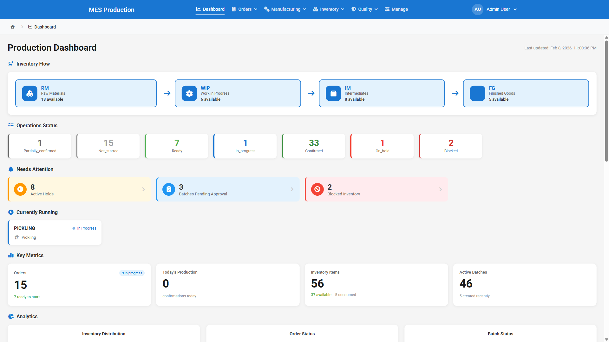
*Figure 2.4: Needs Attention Panel - Critical items requiring action*

| Alert | Condition | Action Required |
|-------|-----------|-----------------|
| **Active Holds** | Count > 0 | Review and resolve holds |
| **Batches Pending Approval** | Quality pending | Approve/reject batches |
| **Quality Inspections** | Pending inspections | Complete quality checks |
| **Blocked Inventory** | State = BLOCKED | Investigate quality issues |

**Business Value:** This panel ensures nothing falls through the cracks. Production supervisors can quickly identify and prioritize issues that block production flow.

#### 2.2.4 Key Metrics Cards

| Metric | Description | Business Value |
|--------|-------------|----------------|
| **Total Orders** | All orders in system | Order volume tracking |
| **Orders In Progress** | Actively being produced | Production workload |
| **Today's Production** | Confirmations today | Daily output monitoring |
| **Active Batches** | Available batches | Material availability |

#### 2.2.5 Charts Section

| Chart | Data Shown | Purpose |
|-------|------------|---------|
| **Inventory Distribution** | Pie chart by type (RM/IM/FG/WIP) | Stock composition analysis |
| **Order Status** | Pie chart by status | Order pipeline visibility |
| **Batch Status** | Pie chart by status | Material status distribution |

#### 2.2.6 Quick Actions

**Purpose:** One-click access to common operations.

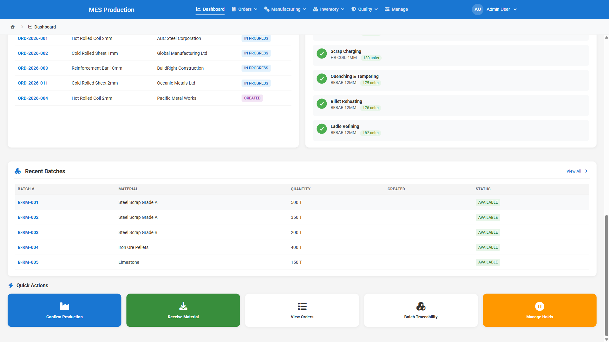
*Figure 2.5: Quick Actions Panel - Direct access to key workflows*

| Action | Route | Description |
|--------|-------|-------------|
| **Confirm Production** | `/production/confirm` | Start production confirmation |
| **Receive Material** | `/inventory/receive` | Record raw material receipt |
| **View Orders** | `/orders` | Browse orders list |
| **Batch Traceability** | `/batches` | View batch genealogy |
| **Manage Holds** | `/holds` | Review active holds |

**Business Value:** Reduces navigation time by providing shortcuts to the most frequently used functions. Operators can quickly access production confirmation without navigating through menus.

---

## 3. Orders Management

### 3.1 Orders List

**Route:** `/#/orders`

The Orders page displays all customer orders with filtering, sorting, and pagination capabilities.


*Figure 3.1: Orders List - All customer orders with status filtering*

**Filtering by Status:**

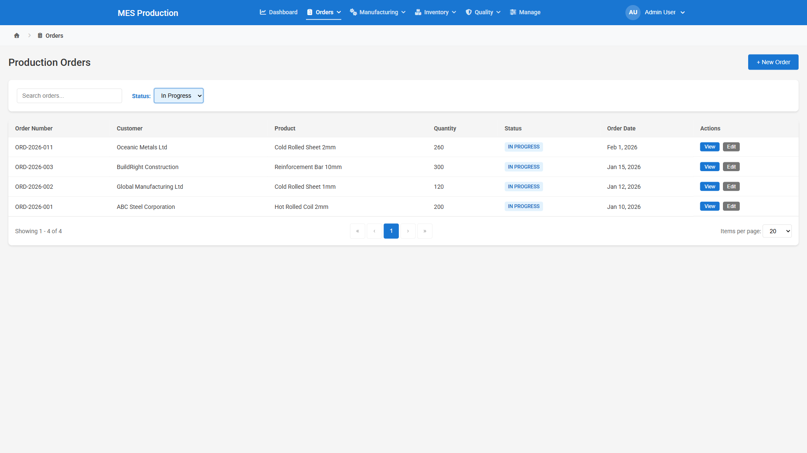
*Figure 3.2: Orders filtered by IN_PROGRESS status*

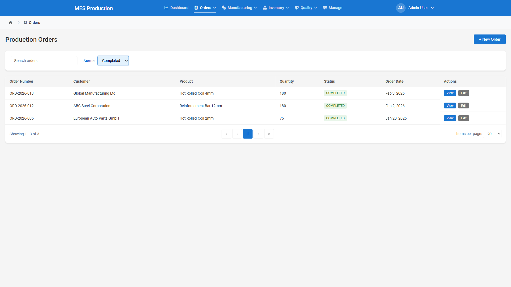
*Figure 3.3: Orders filtered by COMPLETED status*


*Figure 3.4: Orders filtered by ON_HOLD status*

#### 3.1.1 Filter Options

| Filter | Options | Purpose |
|--------|---------|---------|
| **Status** | All, Created, In Progress, Completed, On Hold, Blocked, Cancelled | Filter by order status |
| **Search** | Text input | Search by order number, customer name |

#### 3.1.2 Orders Table Columns

| Column | Description | Sortable |
|--------|-------------|----------|
| **Order Number** | Unique identifier (ORD-YYYY-NNN) | Yes |
| **Customer** | Customer name | Yes |
| **Order Date** | Date order was created | Yes |
| **Status** | Current order status (color-coded) | Yes |
| **Actions** | View details button | No |

#### 3.1.3 Order Status Flow

```
CREATED → IN_PROGRESS → COMPLETED
    ↓         ↓
    └──→ ON_HOLD ←──┘
           ↓
        BLOCKED
           ↓
       CANCELLED
```

### 3.2 Order Detail View

**Route:** `/#/orders/:orderId`

The Order Detail page shows comprehensive order information with line items and operation status.


*Figure 3.2: Order Detail (IN_PROGRESS) - Active production order showing progress and operations*


*Figure 3.3: Order Detail - Operations timeline with step numbers and status indicators*


*Figure 3.4: Order Detail (COMPLETED) - Fully completed order showing 100% progress*

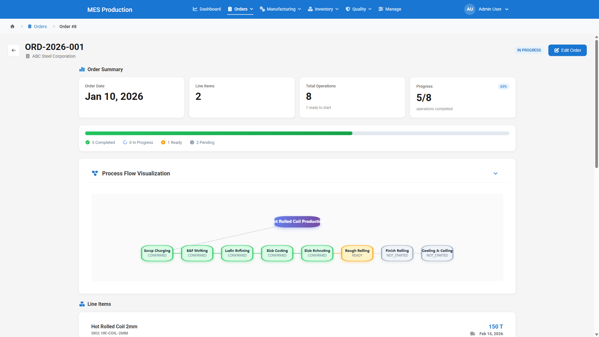
*Figure 3.5: Order Detail (ON_HOLD) - Order blocked by hold record*

**Process Flow Visualization:**


*Figure 3.6: Process Flow Chart - Visual representation of production stages and operation statuses*

**Line Items Section:**

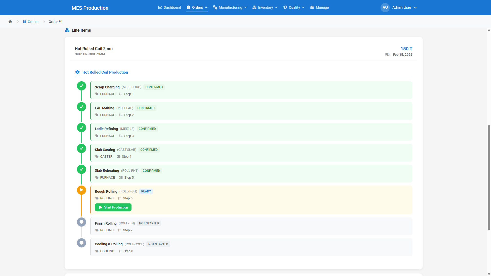
*Figure 3.7: Line Items Detail - Product information with operations timeline*

#### 3.2.1 Order Summary Section

| Metric | Description |
|--------|-------------|
| **Order Date** | When order was placed |
| **Line Items** | Number of products in order |
| **Total Operations** | Count of all operations across line items |
| **Progress** | Percentage of completed operations |

#### 3.2.2 Progress Bar

**Visual representation showing:**
- ✓ Completed operations (green)
- ⟳ In Progress operations (blue)
- ► Ready operations (amber)
- ○ Pending operations (gray)

#### 3.2.3 Process Flow Visualization

**Interactive ECharts graph showing:**
- Process nodes (grouped by process name)
- Operation nodes with status colors
- Sequential flow connections between operations
- Hover tooltips with operation details

**Status Color Legend:**
| Status | Background | Border |
|--------|------------|--------|
| CONFIRMED | Light green | Green |
| IN_PROGRESS | Light blue | Blue |
| READY | Light amber | Amber |
| ON_HOLD | Light orange | Orange |
| BLOCKED | Light red | Red |
| NOT_STARTED | Light gray | Gray |

#### 3.2.4 Line Items Section

Each line item card shows:

| Field | Description |
|-------|-------------|
| **Product Name** | Product being produced |
| **SKU** | Product identifier |
| **Quantity** | Ordered quantity with unit |
| **Delivery Date** | Expected delivery date |

**Operations Timeline:**
- Step numbers with status icons
- Operation name and code
- Status badge
- Operation type and sequence
- "Start Production" button for READY operations

---

## 4. Production Confirmation

### 4.1 Production Confirmation Form

**Route:** `/#/production/confirm` or `/#/production/confirm/:operationId`

The Production Confirmation page enables capturing production data for operations.


*Figure 4.1: Production Confirmation Form - Initial state with order/operation selection*

### 4.2 Production Confirmation Flow

The following screenshots demonstrate the step-by-step production confirmation workflow:

**Step 1: Select Order**


*Figure 4.2: Order Selection - Choose from orders with READY operations*

**Step 2: Select Operation**


*Figure 4.3: Operation Selection - Choose the specific operation to confirm*

**Step 3: Select Input Materials**


*Figure 4.4: Material Consumption - Select batches and quantities to consume*

**Step 4: Enter Process Parameters**


*Figure 4.5: Process Parameters - Enter operation-specific values (temperature, speed, etc.)*

**Step 5: Assign Resources**


*Figure 4.6: Resource Assignment - Select equipment and operators for the operation*

**Step 6: Review Output**


*Figure 4.7: Output Preview - Review auto-generated batch number and quantities*

### 4.3 Form Sections Explained

#### 4.3.1 Order/Operation Selection Section

**Purpose:** Select the order and operation to confirm.

| Field | Description | Validation |
|-------|-------------|------------|
| **Order Select** | Dropdown of orders with READY operations | Required |
| **Operation Select** | Dropdown of READY operations for selected order | Required |

**Order Display Format:** `ORD-2026-001 | ABC Steel Corporation | HR-COIL-2MM`

#### 4.1.2 Material Consumption Section

**Purpose:** Select input materials to consume.

**Available Materials Table:**

| Column | Description |
|--------|-------------|
| **Batch Number** | Source batch identifier |
| **Material** | Material name |
| **Type** | RM/IM/WIP |
| **Available Qty** | Quantity available for consumption |
| **Select Qty** | Quantity to consume (input field) |

**Validation Rules:**
- Select quantity ≤ Available quantity
- At least one material must be selected
- Only AVAILABLE or RESERVED inventory shown

#### 4.1.3 Process Parameters Section

**Purpose:** Capture production parameters specific to operation type.

**Dynamic Parameters Based on Operation Type:**

| Operation Type | Parameters |
|----------------|------------|
| **FURNACE** | Temperature (°C), Holding Time (min), Power Input (MW) |
| **CASTER** | Casting Speed (m/min), Mold Temperature (°C), Slab Width (mm) |
| **ROLLING** | Entry Temp (°C), Finish Temp (°C), Coiling Temp (°C), Thickness (mm), Speed (m/s) |
| **PICKLING** | Acid Concentration (%), Line Speed (m/min) |
| **COOLING** | Quench Temperature (°C), Tempering Temperature (°C) |

**Validation:**
- Required parameters must be filled
- Values must be within configured min/max range
- Warning shown if value within 10% of limits

#### 4.1.4 Equipment & Operator Section

**Purpose:** Assign production resources.

| Field | Description |
|-------|-------------|
| **Equipment** | Multi-select dropdown of available equipment |
| **Operators** | Multi-select dropdown of active operators |

**Equipment Status Filtering:** Only AVAILABLE equipment shown.

#### 4.1.5 Production Output Section

**Purpose:** Record production quantities and timing.

| Field | Description | Validation |
|-------|-------------|------------|
| **Produced Quantity** | Good output quantity | Required, > 0 |
| **Scrap Quantity** | Waste/rejected quantity | Optional, ≥ 0 |
| **Start Time** | Production start timestamp | Required |
| **End Time** | Production end timestamp | Required, ≥ Start Time |

#### 4.1.6 Output Batch Preview

**Purpose:** Shows the auto-generated batch number before confirmation.

| Field | Description |
|-------|-------------|
| **Batch Number Preview** | Auto-generated based on configuration |
| **Output Material** | Material being produced |
| **Batch Status** | QUALITY_PENDING (default) |

#### 4.1.7 Confirmation Actions

| Button | Action | Result |
|--------|--------|--------|
| **Confirm Production** | Submit the confirmation | Creates batch, consumes materials, updates operation status |
| **Cancel** | Discard changes | Returns to previous page |

### 4.2 What Happens on Confirmation

When production is confirmed, the system automatically:

1. **Creates Production Confirmation Record**
   - Stores all entered data
   - Links to operation, equipment, operators

2. **Consumes Input Materials**
   - Updates inventory state to CONSUMED
   - Records consumed quantities
   - Creates ConsumedMaterial records

3. **Generates Output Batch**
   - Creates batch with auto-generated number
   - Status = QUALITY_PENDING
   - Links to source materials via BatchRelation

4. **Creates Output Inventory**
   - State = PRODUCED
   - Links to output batch
   - Type based on material configuration

5. **Updates Operation Status**
   - If complete: CONFIRMED
   - If partial: PARTIALLY_CONFIRMED

6. **Advances Next Operation**
   - Next operation in sequence → READY

7. **Logs Audit Trail**
   - All changes recorded with timestamps
   - User attribution for compliance

---

## 5. Inventory Management

### 5.1 Inventory List

**Route:** `/#/inventory`

The Inventory page shows all material inventory with state-based filtering.


*Figure 5.1: Inventory List - Complete view of all inventory items*

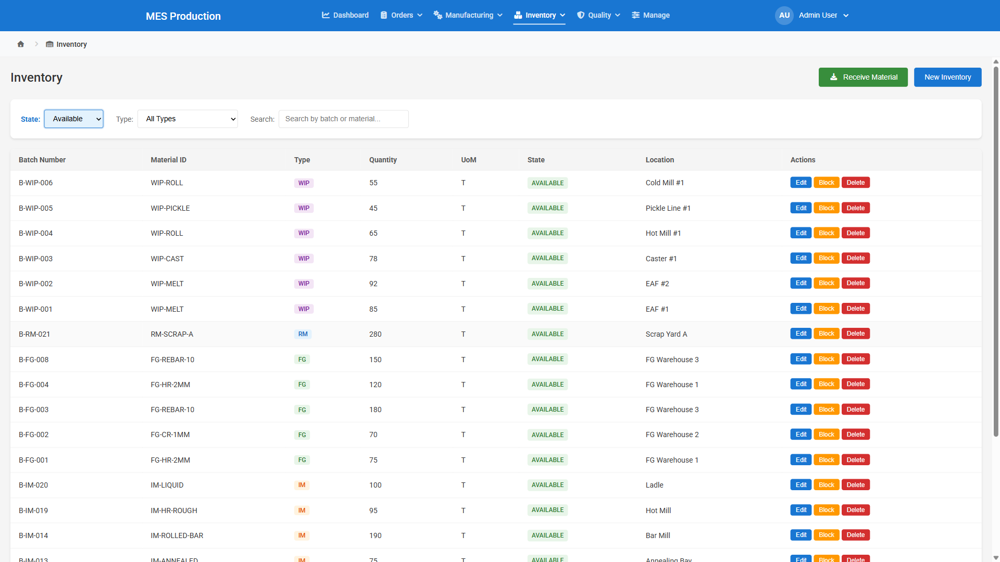
*Figure 5.2: Inventory List - Filtered to show only AVAILABLE inventory*

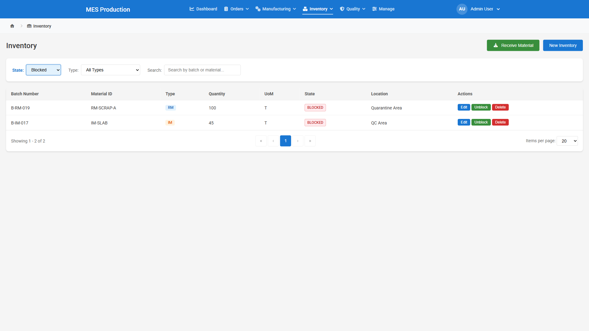
*Figure 5.3: Inventory List - Filtered to show only BLOCKED inventory*

**Filtering by Material Type:**

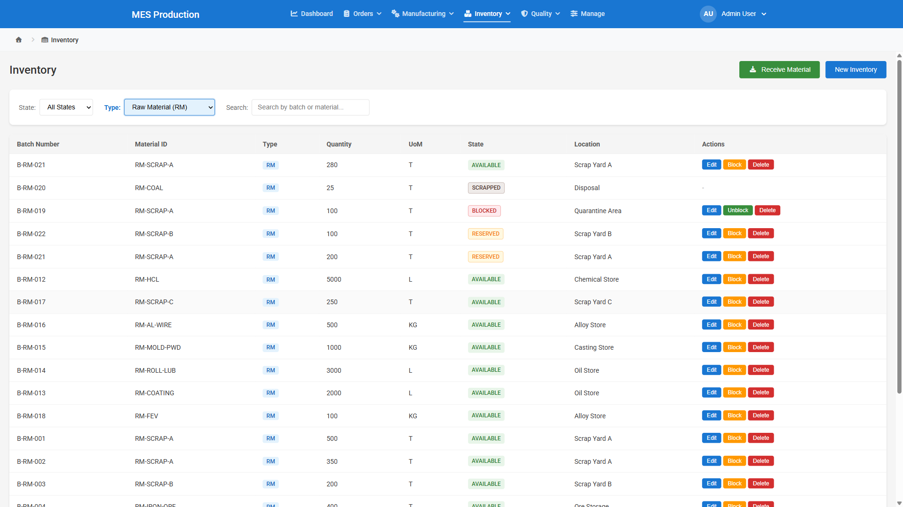
*Figure 5.4: Inventory filtered by Raw Material (RM) type*

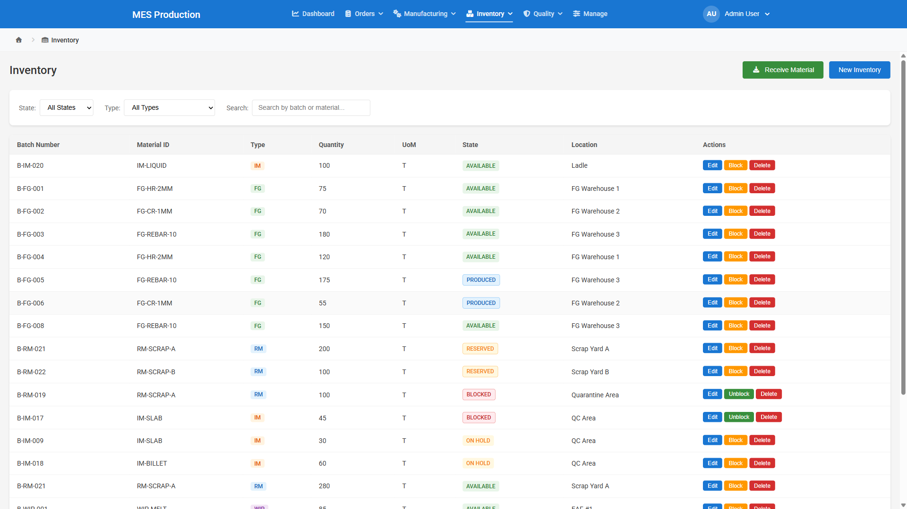
*Figure 5.5: Inventory filtered by Finished Goods (FG) type*

#### 5.1.1 Filter Options

| Filter | Options | Purpose |
|--------|---------|---------|
| **State** | All, Available, Consumed, On Hold, Blocked, Scrapped | Filter by inventory state |
| **Type** | All, RM, IM, FG, WIP | Filter by material type |
| **Search** | Text input | Search by batch number, material ID |

#### 5.1.2 Inventory Table

| Column | Description |
|--------|-------------|
| **Batch Number** | Associated batch identifier |
| **Material ID** | Material code |
| **Type** | Material type badge (color-coded) |
| **Quantity** | Current quantity |
| **UoM** | Unit of measure |
| **State** | Current state (color-coded badge) |
| **Location** | Storage location |
| **Actions** | Edit, Block, Unblock, Delete |

#### 5.1.3 Type Badge Colors

| Type | Background | Text |
|------|------------|------|
| RM | Light blue | Blue |
| IM | Light orange | Orange |
| FG | Light green | Green |
| WIP | Light purple | Purple |

#### 5.1.4 Inventory State Transitions

```
                    ┌──────────────┐
                    │   PRODUCED   │ (Output from production)
                    └──────┬───────┘
                           │
                           ▼
┌──────────────┐    ┌──────────────┐    ┌──────────────┐
│   RESERVED   │◀───│  AVAILABLE   │───▶│   CONSUMED   │
│(Held for order)│   └──────┬───────┘    │  (Terminal)  │
└──────────────┘           │            └──────────────┘
                           │
              ┌────────────┼────────────┐
              ▼            ▼            ▼
       ┌──────────┐  ┌──────────┐  ┌──────────┐
       │  BLOCKED │  │ SCRAPPED │  │ ON_HOLD  │
       │ (Quality)│  │(Terminal)│  │  (Hold)  │
       └──────────┘  └──────────┘  └──────────┘
```

#### 5.1.5 Inventory Actions

| Action | Available When | Result |
|--------|----------------|--------|
| **Block** | State = AVAILABLE | State → BLOCKED |
| **Unblock** | State = BLOCKED | State → AVAILABLE |
| **Scrap** | State = AVAILABLE, BLOCKED | State → SCRAPPED (terminal) |
| **Reserve** | State = AVAILABLE | State → RESERVED |
| **Release** | State = RESERVED | State → AVAILABLE |

### 5.2 Receive Material

**Route:** `/#/inventory/receive`

**Purpose:** Record raw material goods receipt into inventory.

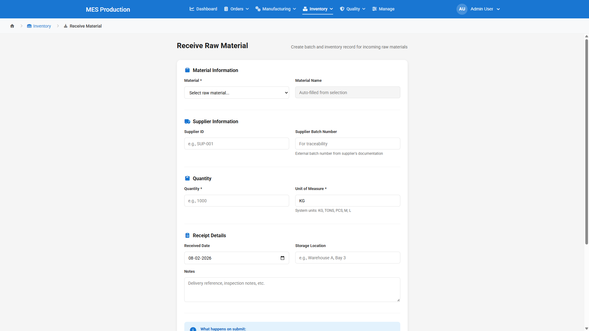
*Figure 5.6: Receive Material Form - Goods receipt entry for raw materials*


*Figure 5.7: Receive Material Form - Completed form ready for submission*

| Field | Description | Validation |
|-------|-------------|------------|
| **Material** | Select from RM materials | Required |
| **Quantity** | Received quantity | Required, > 0 |
| **Unit** | Unit of measure | Auto-filled from material |
| **Supplier Batch** | Supplier's batch number | Optional |
| **Location** | Storage location | Required |

**Result:**
- Creates new Batch (status = QUALITY_PENDING)
- Creates Inventory record (state = AVAILABLE)
- Batch must be approved before use in production

---

## 6. Batch Management & Traceability

### 6.1 Batch List

**Route:** `/#/batches`

The Batches page shows all material batches with status filtering.


*Figure 6.1: Batch List - All batches with status filtering*

**Filtering by Status:**

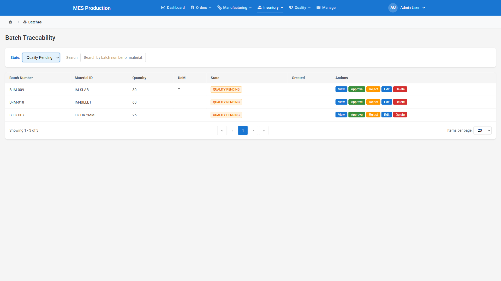
*Figure 6.2: Batches filtered by QUALITY_PENDING status - Awaiting quality approval*

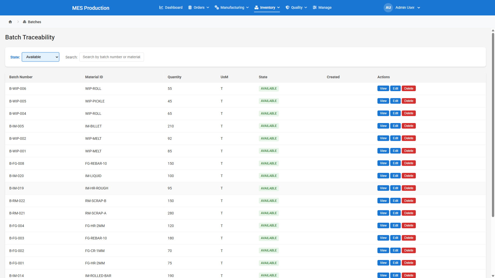
*Figure 6.3: Batches filtered by AVAILABLE status - Ready for production use*

#### 6.1.1 Filter Options

| Filter | Options | Purpose |
|--------|---------|---------|
| **Status** | All, Available, Quality Pending, Consumed, Blocked, Produced | Filter by batch status |
| **Search** | Text input | Search by batch number, material |

#### 6.1.2 Batch Table

| Column | Description |
|--------|-------------|
| **Batch Number** | Unique identifier (auto-generated) |
| **Material** | Material name |
| **Quantity** | Current quantity with unit |
| **Created** | Creation timestamp |
| **Status** | Current status (color-coded) |
| **Actions** | View details, Approve (if pending) |

#### 6.1.3 Batch Status Flow

```
                              ┌── CONSUMED (terminal)
                              │
QUALITY_PENDING ──→ AVAILABLE ┼── PRODUCED
       ↓                ↓     │
    BLOCKED ←─────── ON_HOLD  └── SPLIT/MERGED
       ↓
    SCRAPPED (terminal)
```

### 6.2 Batch Detail & Genealogy

**Route:** `/#/batches/:batchId`

**Purpose:** View batch details and complete traceability chain.


*Figure 6.4: Batch Detail - Complete batch information with genealogy (parent/child relationships)*

**Parent Relationships (Backward Traceability):**

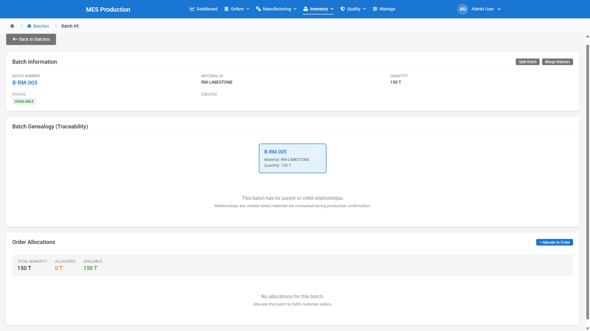
*Figure 6.5: Genealogy showing parent batches - "What went INTO this batch?"*

**Child Relationships (Forward Traceability):**


*Figure 6.6: Genealogy showing child batches - "What was produced FROM this batch?"*

### 6.2.1 Traceability Use Cases

| Use Case | Direction | Question Answered |
|----------|-----------|-------------------|
| **Quality Recall** | Backward | "Which raw materials were used in this defective product?" |
| **Contamination Investigation** | Forward | "What products were made from this contaminated batch?" |
| **Lot Tracking** | Both | "Show complete chain of custody for this batch" |
| **Audit Compliance** | Both | "Prove provenance for regulatory inspection" |

#### 6.2.2 Batch Information Section

| Field | Description |
|-------|-------------|
| **Batch Number** | Unique identifier |
| **Material** | Material name and code |
| **Quantity** | Current quantity |
| **Unit** | Unit of measure |
| **Status** | Current status |
| **Created Via** | PRODUCTION, RECEIPT, SPLIT, MERGE |
| **Created Date** | Timestamp |

#### 6.2.2 Genealogy Visualization

**Forward Traceability (What was produced FROM this batch):**
```
This Batch → Child Batch 1 → Grandchild Batch
           → Child Batch 2
```

**Backward Traceability (What went INTO this batch):**
```
Parent Batch 1 → This Batch
Parent Batch 2 ↗
```

#### 6.2.3 Genealogy Table

| Column | Description |
|--------|-------------|
| **Batch Number** | Parent/child batch identifier |
| **Relation Type** | TRANSFORM, SPLIT, MERGE |
| **Quantity** | Quantity consumed/produced |
| **Operation** | Operation that created relation |
| **Date** | When relation was created |

#### 6.2.4 Production Information

If batch was produced in production:

| Field | Description |
|-------|-------------|
| **Operation** | Operation name |
| **Process** | Process name |
| **Production Date** | Confirmation timestamp |
| **Equipment** | Equipment used |
| **Operator** | Operators involved |

### 6.3 Batch Actions

| Action | Available When | Result |
|--------|----------------|--------|
| **Approve** | Status = QUALITY_PENDING | Status → AVAILABLE |
| **Reject** | Status = QUALITY_PENDING | Status → BLOCKED |
| **Split** | Status = AVAILABLE | Creates child batches |
| **Adjust Qty** | Status ≠ CONSUMED, SCRAPPED | Updates quantity with reason |

### 6.4 Split Batch

**Purpose:** Divide a batch into smaller portions.

| Field | Description |
|-------|-------------|
| **Source Batch** | Batch being split |
| **Portions** | Array of {quantity, suffix} |

**Rules:**
- Sum of portions ≤ source quantity
- Each portion creates a new batch
- Original batch quantity reduced
- Genealogy: relationType = SPLIT

### 6.5 Merge Batches

**Purpose:** Combine multiple batches into one.

**Rules:**
- All batches must be AVAILABLE
- All batches must have same material
- Minimum 2 batches required
- Creates new merged batch
- Source batches marked as MERGED
- Genealogy: relationType = MERGE

---

## 7. Hold Management

### 7.1 Holds List

**Route:** `/#/holds`

The Holds page shows all hold records with status filtering.

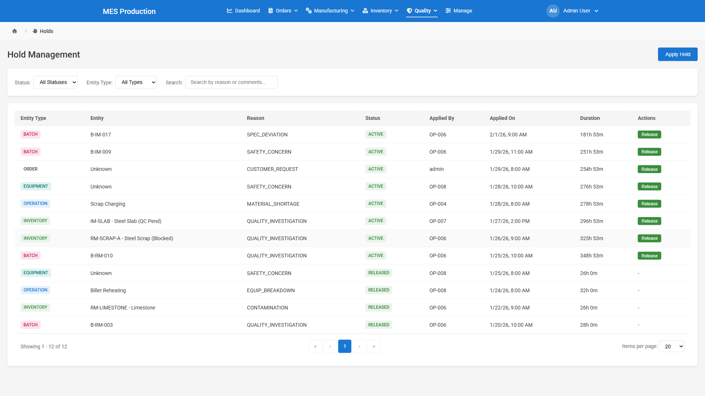
*Figure 7.1: Holds List - All hold records*

**Apply Hold Modal:**

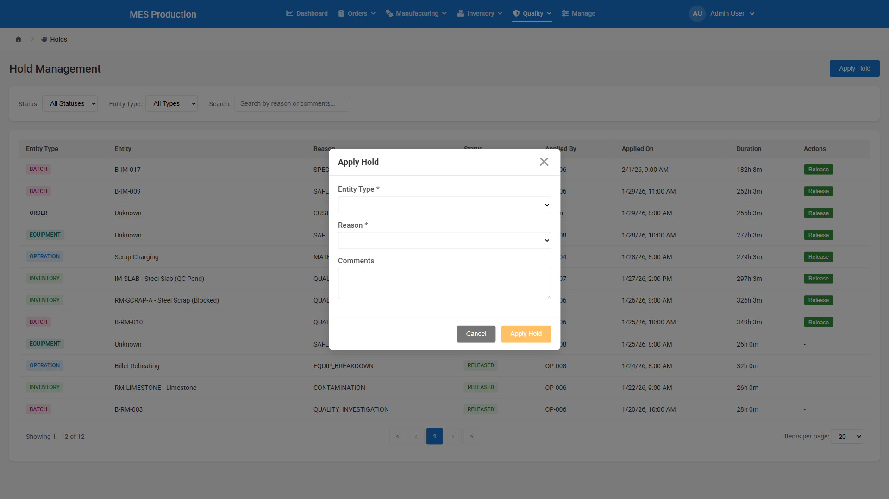
*Figure 7.2: Apply Hold Modal - Select entity type, reason, and add comments*

**Filtering by Status:**

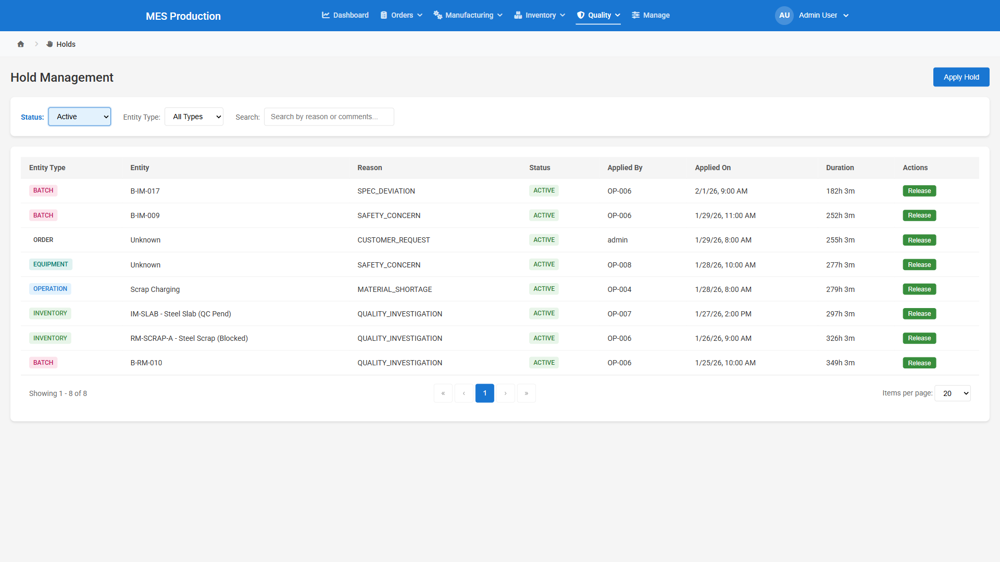
*Figure 7.3: Holds filtered by ACTIVE status - Currently blocking entities*

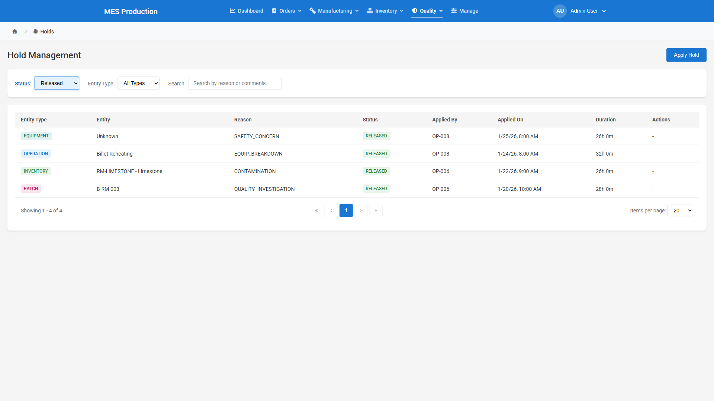
*Figure 7.4: Holds filtered by RELEASED status - Historical hold records*

#### 7.1.1 Filter Options

| Filter | Options | Purpose |
|--------|---------|---------|
| **Status** | All, Active, Released | Filter by hold status |
| **Entity Type** | All, Operation, Batch, Inventory, Order, Equipment | Filter by entity type |
| **Search** | Text input | Search by reason, entity |

#### 7.1.2 Holds Table

| Column | Description |
|--------|-------------|
| **Entity Type** | Type of entity on hold |
| **Entity** | Entity identifier |
| **Reason** | Hold reason |
| **Applied Date** | When hold was applied |
| **Applied By** | User who applied hold |
| **Status** | ACTIVE or RELEASED |
| **Actions** | Release (if active) |

#### 7.1.3 Entity Types That Can Be Held

| Entity Type | Effect When Held |
|-------------|------------------|
| **OPERATION** | Cannot be confirmed |
| **BATCH** | Cannot be consumed |
| **INVENTORY** | Cannot be used in production |
| **ORDER** | No operations can be confirmed |
| **ORDER_LINE** | Line item operations blocked |
| **EQUIPMENT** | Cannot be assigned to production |

### 7.2 Apply Hold

**Purpose:** Block an entity from being used.

| Field | Description | Validation |
|-------|-------------|------------|
| **Entity Type** | Select type to hold | Required |
| **Entity** | Select specific entity | Required |
| **Reason** | Select hold reason | Required |
| **Comments** | Additional notes | Optional |

**Available Hold Reasons:**
- Equipment Breakdown
- Quality Investigation
- Material Shortage
- Operator Unavailability
- Safety Concern
- Regulatory Hold
- Customer Request
- Contamination Suspected
- Specification Deviation
- Other

### 7.3 Release Hold

**Purpose:** Remove hold and restore entity to previous state.

| Field | Description |
|-------|-------------|
| **Resolution Comments** | Required explanation of resolution |

**Result:**
- Hold status → RELEASED
- Entity returns to previous status
- Audit trail records release

---

## 8. Equipment Management

### 8.1 Equipment List

**Route:** `/#/equipment`

The Equipment page shows all production equipment with status tracking.

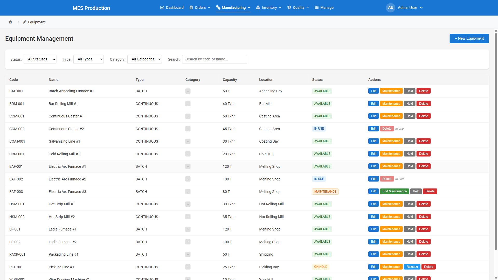
*Figure 8.1: Equipment List - All production equipment*

**Filtering by Status:**


*Figure 8.2: Equipment filtered by MAINTENANCE status - Under scheduled maintenance*

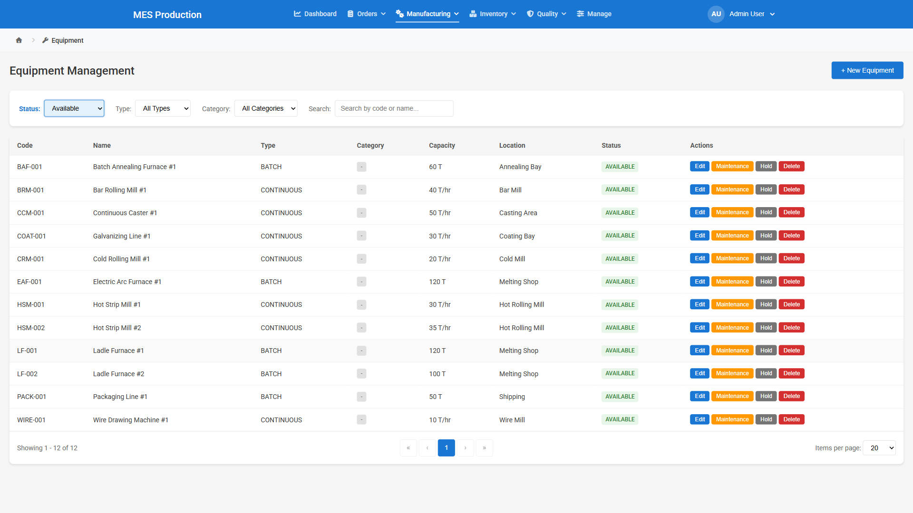
*Figure 8.3: Equipment filtered by AVAILABLE status - Ready for production use*

#### 8.1.1 Filter Options

| Filter | Options | Purpose |
|--------|---------|---------|
| **Status** | All, Available, In Use, Maintenance, On Hold | Filter by equipment status |
| **Category** | All, Melting, Casting, Rolling, etc. | Filter by equipment category |
| **Search** | Text input | Search by code, name |

#### 8.1.2 Equipment Table

| Column | Description |
|--------|-------------|
| **Equipment Code** | Unique identifier (EAF-001, etc.) |
| **Name** | Equipment name |
| **Type** | BATCH or CONTINUOUS |
| **Category** | MELTING, CASTING, ROLLING, etc. |
| **Capacity** | Production capacity with unit |
| **Location** | Physical location |
| **Status** | Current status (color-coded) |
| **Actions** | Maintenance, Hold |

#### 8.1.3 Equipment Status Flow

```
AVAILABLE ←─→ IN_USE
    ↓           ↓
MAINTENANCE ←───┘
    ↓
ON_HOLD ──→ UNAVAILABLE
```

#### 8.1.4 Equipment Actions

| Action | Available When | Result |
|--------|----------------|--------|
| **Start Maintenance** | Status = AVAILABLE | Status → MAINTENANCE |
| **End Maintenance** | Status = MAINTENANCE | Status → AVAILABLE |
| **Put On Hold** | Status ≠ IN_USE | Status → ON_HOLD |
| **Release Hold** | Status = ON_HOLD | Status → AVAILABLE |

### 8.2 Equipment Status Summary

**Dashboard shows equipment utilization:**

| Status | Count | Meaning |
|--------|-------|---------|
| **AVAILABLE** | X | Ready for production |
| **IN_USE** | X | Currently in production |
| **MAINTENANCE** | X | Under scheduled maintenance |
| **ON_HOLD** | X | Blocked by hold record |

---

## 9. Quality Management

### 9.1 Quality Pending Queue

**Route:** `/#/quality`

The Quality page shows all batches requiring quality approval.


*Figure 9.1: Quality Pending Queue - Batches awaiting quality approval/rejection*

### 9.1.1 Quality Workflow Overview

The Quality Status Management feature is a core POC requirement that ensures material quality is verified before use in production.

```
┌────────────────────────────────────────────────────────────────────────────┐
│                       QUALITY STATUS WORKFLOW                                │
├────────────────────────────────────────────────────────────────────────────┤
│                                                                            │
│  ┌─────────────────┐      ┌─────────────────┐                              │
│  │  Raw Material   │      │   Production    │                              │
│  │    Receipt      │      │  Confirmation   │                              │
│  └────────┬────────┘      └────────┬────────┘                              │
│           │                        │                                       │
│           └────────────┬───────────┘                                       │
│                        │                                                   │
│                        ▼                                                   │
│              ┌─────────────────┐                                           │
│              │ QUALITY_PENDING │  ← New batch created                      │
│              │    (Batch)      │                                           │
│              └────────┬────────┘                                           │
│                       │                                                    │
│           ┌───────────┴───────────┐                                        │
│           │  Quality Review       │                                        │
│           │  (/#/quality page)    │                                        │
│           └───────────┬───────────┘                                        │
│                       │                                                    │
│           ┌───────────┴───────────┐                                        │
│           │                       │                                        │
│           ▼                       ▼                                        │
│   ┌─────────────┐         ┌─────────────┐                                  │
│   │  APPROVED   │         │  REJECTED   │                                  │
│   │ (AVAILABLE) │         │  (BLOCKED)  │                                  │
│   └──────┬──────┘         └──────┬──────┘                                  │
│          │                       │                                         │
│          ▼                       ▼                                         │
│   Can be used in          Requires investigation                           │
│   production              or scrapping                                     │
│                                                                            │
└────────────────────────────────────────────────────────────────────────────┘
```

### 9.1.2 Purpose

New batches created from:
- Raw material receipt
- Production confirmation

...are created with status = QUALITY_PENDING.

Quality personnel must review and approve/reject before the batch can be used in production.

#### 9.1.2 Quality Queue Table

| Column | Description |
|--------|-------------|
| **Batch Number** | Batch to be approved |
| **Material** | Material name |
| **Quantity** | Batch quantity |
| **Created** | When batch was created |
| **Source** | PRODUCTION or RECEIPT |
| **Actions** | Approve, Reject |

#### 9.1.3 Approval Actions

| Action | Result |
|--------|--------|
| **Approve** | Status → AVAILABLE, inventory can be used |
| **Reject** | Status → BLOCKED, requires resolution |

---

## 10. Demo Scenarios

### 10.1 Scenario 1: Complete Production Confirmation

**Order:** ORD-2026-001 (ABC Steel Corporation - HR-COIL-2MM 150T)
**Status:** IN_PROGRESS

**Scenario Description:**
This order demonstrates a multi-step production process for hot rolled coils. The order has multiple operations in sequence: Melting → Casting → Rolling. Some operations are already confirmed, showing the progressive flow.

**Steps to Demo:**

1. **Login** as admin@mes.com
2. **Navigate** to Dashboard → View "Orders In Progress"
3. **Click** on ORD-2026-001 to view details
4. **Observe:**
   - Progress bar showing completion percentage
   - Process flow visualization with colored operation nodes
   - Line item with HR-COIL-2MM 150T
   - Operations timeline showing CONFIRMED, IN_PROGRESS, READY states
5. **Click** "Start Production" on a READY operation
6. **Select** input materials from available batches
7. **Enter** process parameters (temperature, pressure, etc.)
8. **Assign** equipment and operators
9. **Enter** produced quantity
10. **Click** "Confirm Production"
11. **Verify:**
    - New batch created with auto-generated number
    - Operation status updated to CONFIRMED
    - Next operation becomes READY
    - Inventory states updated

### 10.2 Scenario 2: Batch Traceability

**Batch:** B-FG-HR-001 (Finished Hot Rolled Coil)

**Scenario Description:**
This batch demonstrates complete traceability from raw materials to finished product. The genealogy shows the entire chain of custody through multiple production stages.

**Steps to Demo:**

1. **Navigate** to Batches page
2. **Search** for a finished goods batch (status = PRODUCED or AVAILABLE)
3. **Click** to view batch details
4. **Observe Genealogy Section:**
   - **Parent Batches:** What materials went into this batch
   - **Grandparent Batches:** Original raw materials
   - **Production Info:** Which operations created the batch
5. **Navigate backward** through parent batches
6. **Verify** complete chain from FG → IM → WIP → RM

### 10.3 Scenario 3: Hold Management

**Entity:** Batch B-IM-SLAB-003 (Steel Slab)

**Scenario Description:**
A quality concern requires placing a batch on hold, blocking it from production use until investigation is complete.

**Steps to Demo:**

1. **Navigate** to Holds page
2. **Click** "Apply Hold"
3. **Select:**
   - Entity Type: BATCH
   - Entity: B-IM-SLAB-003
   - Reason: Quality Investigation
   - Comments: "Surface defects observed"
4. **Confirm** hold application
5. **Verify:**
   - Batch status changes to ON_HOLD
   - Batch inventory cannot be selected for production
   - Hold record appears in Active Holds list
6. **Navigate** to Inventory → Verify batch state = ON_HOLD
7. **Return** to Holds page
8. **Click** "Release" on the hold
9. **Enter** resolution: "Surface defects within tolerance, approved for use"
10. **Verify:**
    - Batch status returns to AVAILABLE
    - Hold status = RELEASED

### 10.4 Scenario 4: Multi-Product Order

**Order:** ORD-2026-004 (Pacific Metal Works - Multi-product)
**Status:** CREATED

**Scenario Description:**
This order contains multiple line items for different products, showing how the system handles complex orders with multiple production flows.

**What to Observe:**
- Multiple line items with different products
- Each line item has its own operations sequence
- Operations can be confirmed independently
- Progress tracks across all line items

### 10.5 Scenario 5: Order On Hold

**Order:** ORD-2026-008 (Asian Electronics Inc)
**Status:** ON_HOLD

**Scenario Description:**
This order is on hold due to customer request. No operations can be confirmed until hold is released.

**What to Observe:**
- Order status shows ON_HOLD
- "Start Production" buttons are disabled
- Hold reason displayed on order detail
- Demonstrates business process controls

### 10.6 Scenario 6: Completed Order

**Order:** ORD-2026-005 (European Auto Parts GmbH)
**Status:** COMPLETED

**Scenario Description:**
This order has all operations confirmed, demonstrating the complete production lifecycle.

**What to Observe:**
- Progress bar at 100%
- All operations show CONFIRMED status
- No "Start Production" buttons visible
- Full audit trail of all confirmations

---

## 11. POC Scope Compliance

### 11.1 Scope Checklist

| POC Requirement | Status | Implementation Details |
|-----------------|--------|------------------------|
| Production confirmation and data capture | ✓ Complete | Full confirmation form with parameters, equipment, operators |
| Material consumption and inventory management | ✓ Complete | Multi-material selection, state transitions, location tracking |
| Batch creation and genealogy tracking | ✓ Complete | Auto-generation, parent-child relations, forward/backward tracing |
| Hold management across entities | ✓ Complete | 6 entity types, configurable reasons, release workflow |
| Equipment and operator tracking | ✓ Complete | Status management, production assignment, utilization tracking |
| Quality status management | ✓ Complete | QUALITY_PENDING workflow, approve/reject actions |

### 11.2 Key Workflows Implemented

| Workflow | Status | Notes |
|----------|--------|-------|
| Production Confirmation | ✓ | Complete end-to-end with all data capture |
| Batch Genealogy | ✓ | Forward and backward navigation |
| Hold Management | ✓ | Apply/release across all entity types |
| Inventory State Transitions | ✓ | All states with validation |

### 11.3 Demo Data Summary

| Entity | Count | Description |
|--------|-------|-------------|
| Customers | 12 | Various industries (steel, auto, construction) |
| Products | 8 | HR Coils, CR Sheets, Rebars, Billets |
| Materials | 28 | 15 RM, 10 IM, 4 WIP, 3 FG |
| Orders | 15 | All statuses represented |
| Equipment | 16 | Furnaces, casters, rolling mills |
| Operators | 12 | Multiple departments and shifts |

### 11.4 Out of Scope (Per POC Specification)

The following were explicitly excluded from POC scope:
- ERP integration
- Real-time machine data collection (IoT)
- Advanced scheduling and planning
- Detailed costing and financials
- Multi-plant/multi-site support

---

## Document History

| Version | Date | Author | Changes |
|---------|------|--------|---------|
| 1.0 | February 2026 | Sumeet Gupta | Initial POC demo document |

---

*End of Document*
