# Screenshot & UI Evidence

**Date:** 2026-02-12 | **Version:** 1.0

> Screenshot placeholders are provided for each screen. Replace `./screenshots/<file>.png` with actual captured screenshots from E2E test output (`e2e/output/screenshots/`) or manual captures.

---

## Module: Authentication

### Screen: Login Page

- **Purpose:** User authentication via email/password
- **Business Logic:** JWT token generation, session initialization, redirect to dashboard
- **APIs Called:** `POST /api/auth/login`
- **Validation:** Email format, password required, invalid credentials error
- **Role Access:** Public (unauthenticated)
- **Test Coverage:** 9 backend / 13 frontend / 13 E2E

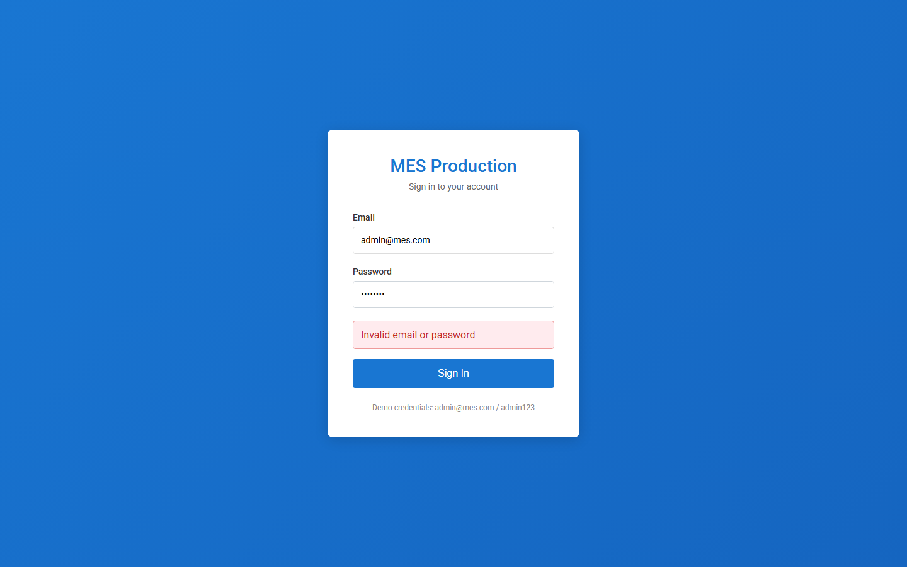

---

## Module: Dashboard

### Screen: Dashboard

- **Purpose:** Executive summary with KPIs, recent activity, inventory status
- **Business Logic:** Aggregated metrics from orders, inventory, production, holds
- **APIs Called:** `GET /api/dashboard/summary`
- **Validation:** N/A (read-only)
- **Role Access:** Authenticated
- **Test Coverage:** 6 backend / 19 frontend / 24 E2E

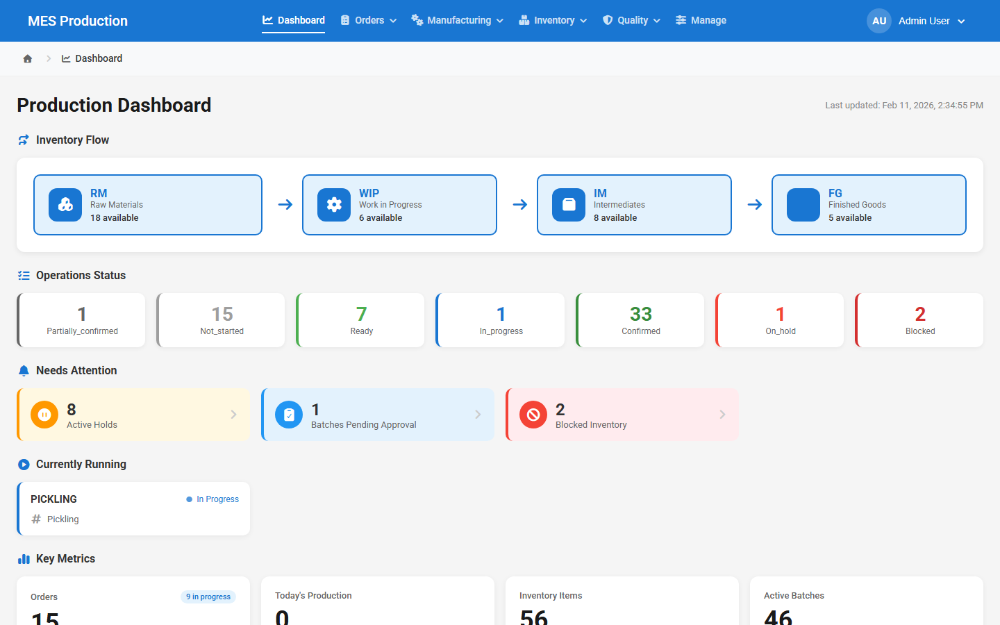

---

## Module: Orders

### Screen: Order List

- **Purpose:** Paginated list of all customer orders with status filters
- **Business Logic:** Server-side pagination, search, status filtering (CREATED/READY/IN_PROGRESS/COMPLETED/CANCELLED)
- **APIs Called:** `GET /api/orders/paged`
- **Validation:** Search input sanitization
- **Role Access:** Authenticated
- **Test Coverage:** 15 backend / 17 frontend / 14 E2E

### Screen: Order Detail

- **Purpose:** Full order view with line items, operations, and status timeline
- **Business Logic:** Display order header, line items with products, operations per line item
- **APIs Called:** `GET /api/orders/{id}`
- **Validation:** N/A (read-only)
- **Role Access:** Authenticated
- **Test Coverage:** - / 47 frontend / - E2E

### Screen: Order Form (Create/Edit)

- **Purpose:** Create new order or edit existing with line items
- **Business Logic:** Customer selection, line item management, product/quantity entry
- **APIs Called:** `POST /api/orders`, `PUT /api/orders/{id}`, `GET /api/customers/active`, `GET /api/products/active`
- **Validation:** Customer required, at least 1 line item, quantity > 0
- **Role Access:** Authenticated
- **Test Coverage:** - / 34 frontend / 22 E2E

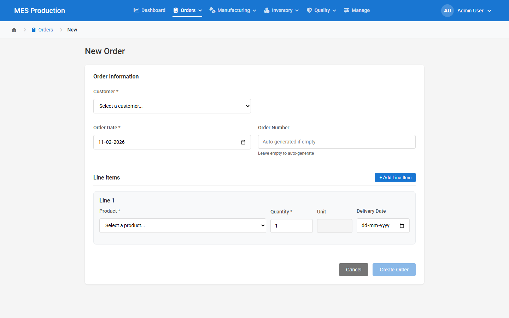

---

## Module: Production

### Screen: Production Landing

- **Purpose:** Entry point for production confirmation - select order/operation
- **Business Logic:** Display orders with READY operations, operation selection
- **APIs Called:** `GET /api/orders/available`
- **Validation:** N/A (selection only)
- **Role Access:** Authenticated
- **Test Coverage:** - / 17 frontend / - E2E

### Screen: Production Confirmation

- **Purpose:** Main production workflow - material consumption, parameter entry, batch generation
- **Business Logic:** BOM suggested consumption, process parameter validation, batch number preview, batch split preview, equipment/operator selection, hold check
- **APIs Called:** `GET /api/production/operations/{id}`, `GET /api/bom/operation/{id}/suggested-consumption`, `POST /api/bom/validate`, `GET /api/batches/preview-number`, `POST /api/production/confirm`
- **Validation:** BOM consumption validation, parameter min/max ranges, quantity > 0, equipment/operator required
- **Role Access:** Authenticated
- **Test Coverage:** 25 backend / 67 frontend / 14 E2E

### Screen: Production History

- **Purpose:** View past production confirmations with status and details
- **Business Logic:** Paginated list of confirmations, status filtering, date range
- **APIs Called:** `GET /api/production/confirmations`
- **Validation:** Date range filter
- **Role Access:** Authenticated
- **Test Coverage:** - / 18 frontend / 11 E2E

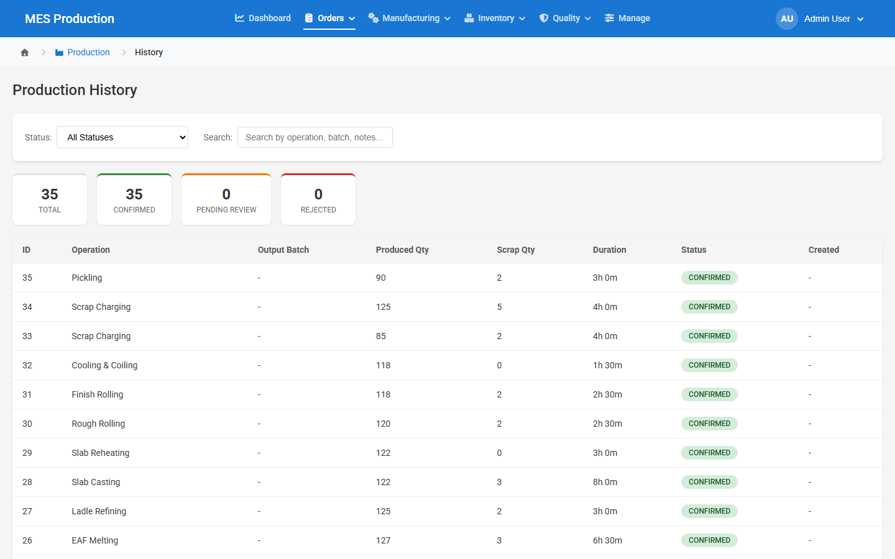

---

## Module: Inventory

### Screen: Inventory List

- **Purpose:** Paginated inventory with state/type filters and status cards
- **Business Logic:** Server-side pagination, state filtering (AVAILABLE/BLOCKED/SCRAPPED/CONSUMED), type filtering (RM/IM/FG/WIP)
- **APIs Called:** `GET /api/inventory/paged`
- **Validation:** State/type filter sanitization
- **Role Access:** Authenticated
- **Test Coverage:** 34 backend / 35 frontend / 9 E2E

### Screen: Inventory Detail

- **Purpose:** Single inventory item details with state transition actions
- **Business Logic:** Display material info, batch link, state actions (block/unblock/scrap)
- **APIs Called:** `GET /api/inventory/{id}`, `POST /api/inventory/{id}/block`, `POST /api/inventory/{id}/unblock`, `POST /api/inventory/{id}/scrap`
- **Validation:** State transition validation (server-side)
- **Role Access:** Authenticated
- **Test Coverage:** - / 24 frontend / - E2E

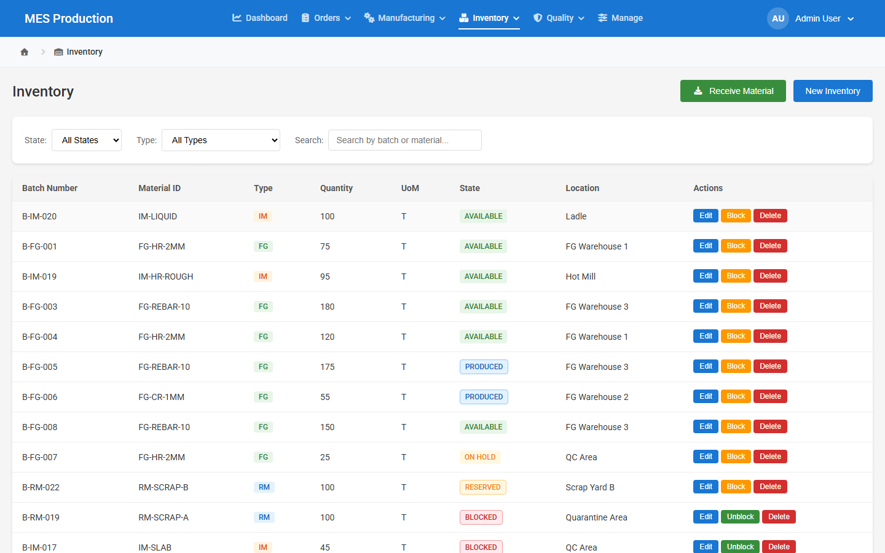

### Screen: Inventory Form (Create/Edit)

- **Purpose:** Create or edit inventory records
- **Business Logic:** Material selection, quantity entry, location assignment
- **APIs Called:** `POST /api/inventory`, `PUT /api/inventory/{id}`
- **Validation:** Material required, quantity > 0
- **Role Access:** Authenticated
- **Test Coverage:** - / 12 frontend / - E2E

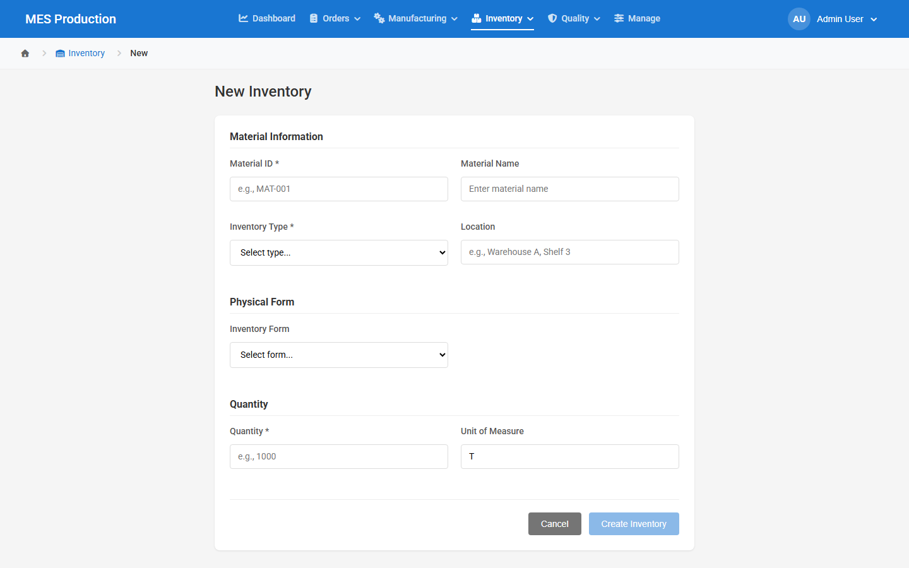

### Screen: Receive Material

- **Purpose:** Goods receipt - create new batch + inventory from incoming material
- **Business Logic:** Creates QUALITY_PENDING batch and AVAILABLE inventory
- **APIs Called:** `POST /api/inventory/receive-material`, `GET /api/materials/active`
- **Validation:** Material required, quantity > 0, supplier info
- **Role Access:** Authenticated
- **Test Coverage:** - / 25 frontend / 12 E2E

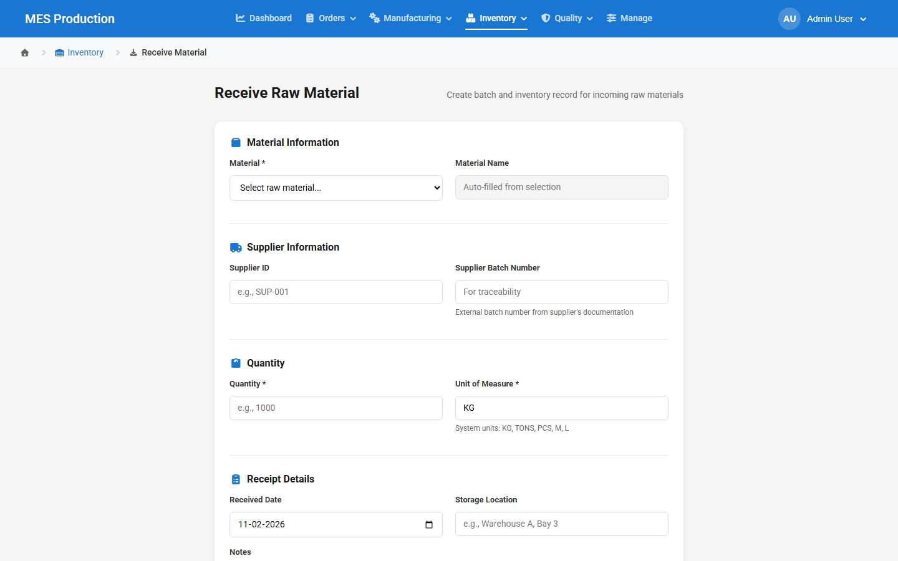

---

## Module: Batches

### Screen: Batch List

- **Purpose:** Paginated batch list with status filters
- **Business Logic:** Server-side pagination, status filtering (QUALITY_PENDING/AVAILABLE/PRODUCED/CONSUMED/BLOCKED/SCRAPPED)
- **APIs Called:** `GET /api/batches/paged`
- **Validation:** Status filter sanitization
- **Role Access:** Authenticated
- **Test Coverage:** 42 backend / 11 frontend / 16 E2E

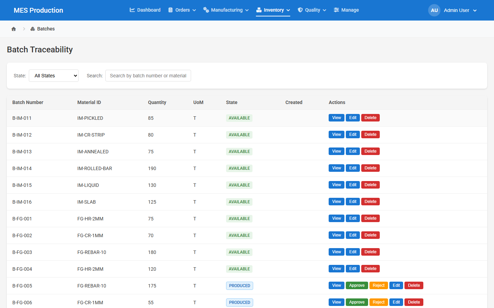

### Screen: Batch Detail

- **Purpose:** Batch details with genealogy tree, approval actions, split/merge
- **Business Logic:** Genealogy visualization (parent/child), approval workflow, quantity adjustment
- **APIs Called:** `GET /api/batches/{id}`, `GET /api/batches/{id}/genealogy`, `POST /api/batches/{id}/approve`, `POST /api/batches/{id}/reject`
- **Validation:** Approval requires QUALITY_PENDING status
- **Role Access:** Authenticated
- **Test Coverage:** - / 45 frontend / - E2E

### Screen: Batch Form (Split/Merge)

- **Purpose:** Split batch into smaller units or merge multiple batches
- **Business Logic:** Split quantity validation (sum = original), merge compatibility check
- **APIs Called:** `POST /api/batches/{id}/split`, `POST /api/batches/merge`
- **Validation:** Quantity invariant checks, material type compatibility
- **Role Access:** Authenticated
- **Test Coverage:** - / 11 frontend / 18 E2E

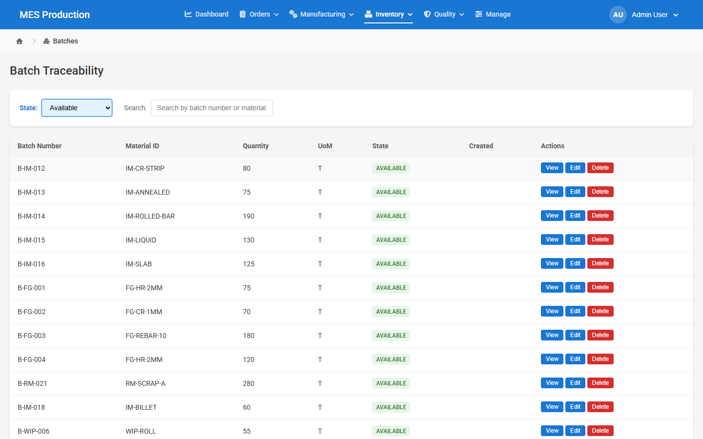

---

## Module: Holds

### Screen: Hold List

- **Purpose:** Paginated list of active/released holds with entity type filter
- **Business Logic:** Server-side pagination, entity type filtering (ORDER/OPERATION/BATCH/INVENTORY/EQUIPMENT)
- **APIs Called:** `GET /api/holds/paged`
- **Validation:** Entity type filter sanitization
- **Role Access:** Authenticated
- **Test Coverage:** 32 backend / 28 frontend / 5 E2E

### Screen: Hold Detail

- **Purpose:** Hold record details with release action
- **Business Logic:** Display hold reason, entity info, release with notes
- **APIs Called:** `GET /api/holds/{id}`, `PUT /api/holds/{id}/release`
- **Validation:** Release requires ACTIVE status
- **Role Access:** Authenticated
- **Test Coverage:** - / 21 frontend / - E2E

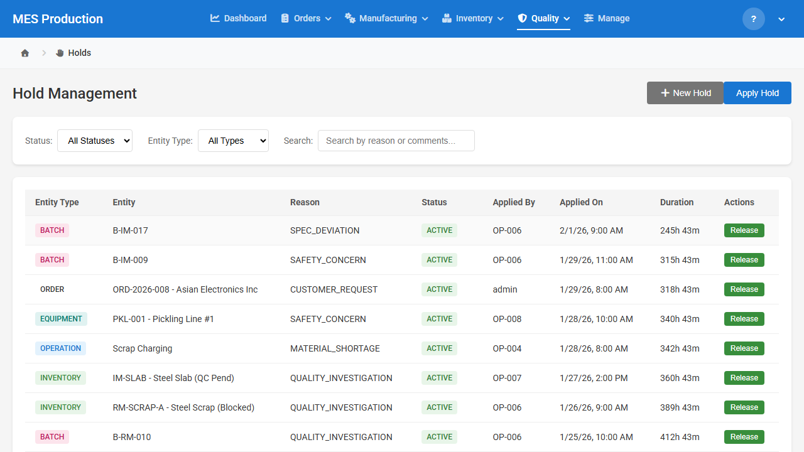

### Screen: Hold Form

- **Purpose:** Apply new hold to an entity
- **Business Logic:** Entity type/ID selection, reason selection from configured reasons
- **APIs Called:** `POST /api/holds`, `GET /api/config/hold-reasons`
- **Validation:** Entity type, entity ID, reason required
- **Role Access:** Authenticated
- **Test Coverage:** - / 9 frontend / - E2E

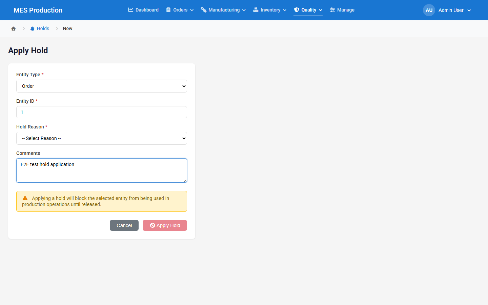

---

## Module: Equipment

### Screen: Equipment List

- **Purpose:** Paginated equipment with status summary cards
- **Business Logic:** Server-side pagination, status filtering (AVAILABLE/IN_USE/MAINTENANCE/ON_HOLD)
- **APIs Called:** `GET /api/equipment/paged`
- **Validation:** Status filter sanitization
- **Role Access:** Authenticated
- **Test Coverage:** 23 backend / 28 frontend / 9 E2E

### Screen: Equipment Detail

- **Purpose:** Equipment details with maintenance/hold actions
- **Business Logic:** Status transitions (start/end maintenance, hold/release)
- **APIs Called:** `GET /api/equipment/{id}`, `POST /api/equipment/{id}/maintenance/start`, `POST /api/equipment/{id}/maintenance/end`
- **Validation:** Status transition rules (server-side)
- **Role Access:** Authenticated
- **Test Coverage:** - / 19 frontend / - E2E

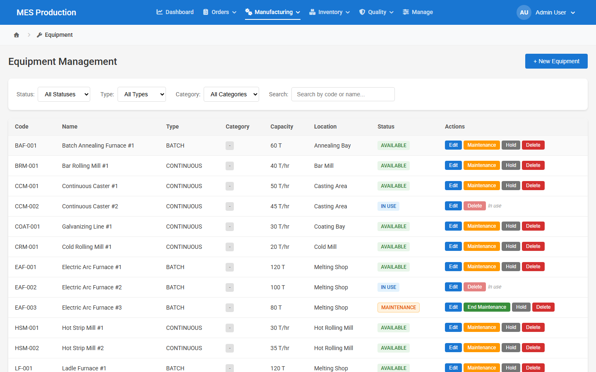

### Screen: Equipment Form (Create/Edit)

- **Purpose:** Create or edit equipment records
- **Business Logic:** Equipment code, name, type, location entry
- **APIs Called:** `POST /api/equipment`, `PUT /api/equipment/{id}`
- **Validation:** Code and name required, unique code
- **Role Access:** Authenticated
- **Test Coverage:** - / 12 frontend / - E2E

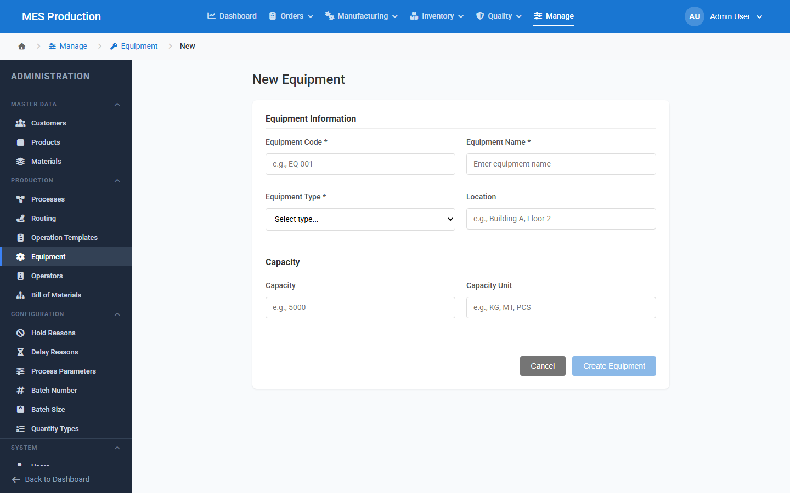

---

## Module: Operations

### Screen: Operation List

- **Purpose:** Paginated operations with status/type filters
- **Business Logic:** Server-side pagination, status/type filtering
- **APIs Called:** `GET /api/operations/paged`
- **Validation:** Filter sanitization
- **Role Access:** Authenticated
- **Test Coverage:** 29 backend / 24 frontend / 13 E2E

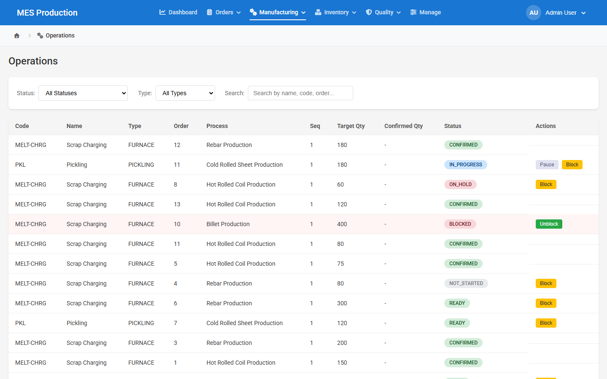

### Screen: Operation Detail

- **Purpose:** Operation details with status, linked order, process info
- **Business Logic:** Display operation metadata, confirm/reject actions
- **APIs Called:** `GET /api/operations/{id}`
- **Validation:** N/A (read-only)
- **Role Access:** Authenticated
- **Test Coverage:** - / 22 frontend / - E2E

---

## Module: Customers (Admin)

### Screen: Customer List

- **Purpose:** Paginated customer master data
- **Business Logic:** Server-side pagination, search, ACTIVE/INACTIVE filter
- **APIs Called:** `GET /api/customers/paged`
- **Validation:** Search sanitization
- **Role Access:** Authenticated (Admin layout)
- **Test Coverage:** 15 backend / 14 frontend / 5 E2E

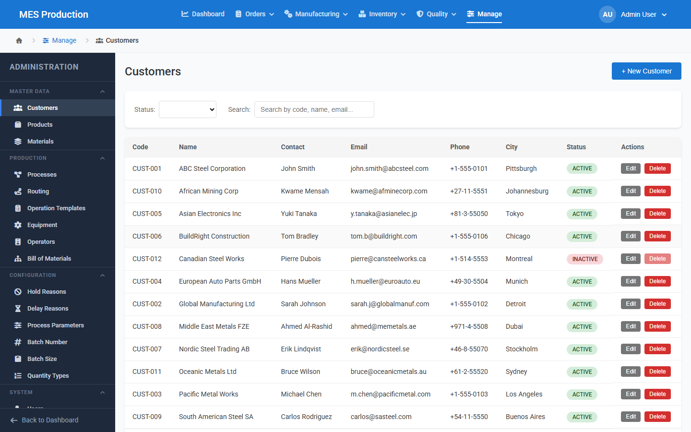

### Screen: Customer Detail

- **Purpose:** Customer record details
- **Business Logic:** Display customer info, edit/delete actions
- **APIs Called:** `GET /api/customers/{id}`
- **Validation:** N/A (read-only)
- **Role Access:** Authenticated (Admin layout)
- **Test Coverage:** - / 14 frontend / - E2E

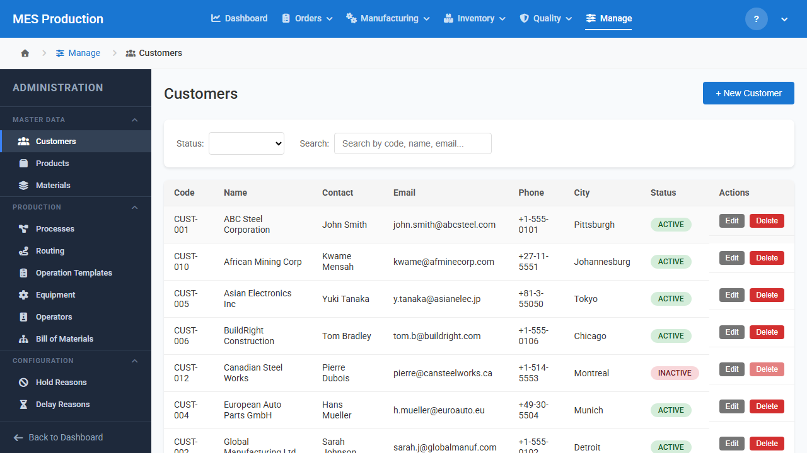

### Screen: Customer Form (Create/Edit)

- **Purpose:** Create or edit customer records
- **Business Logic:** Customer code, name, contact, address entry
- **APIs Called:** `POST /api/customers`, `PUT /api/customers/{id}`
- **Validation:** Code and name required, unique code
- **Role Access:** Authenticated (Admin layout)
- **Test Coverage:** - / 13 frontend / - E2E

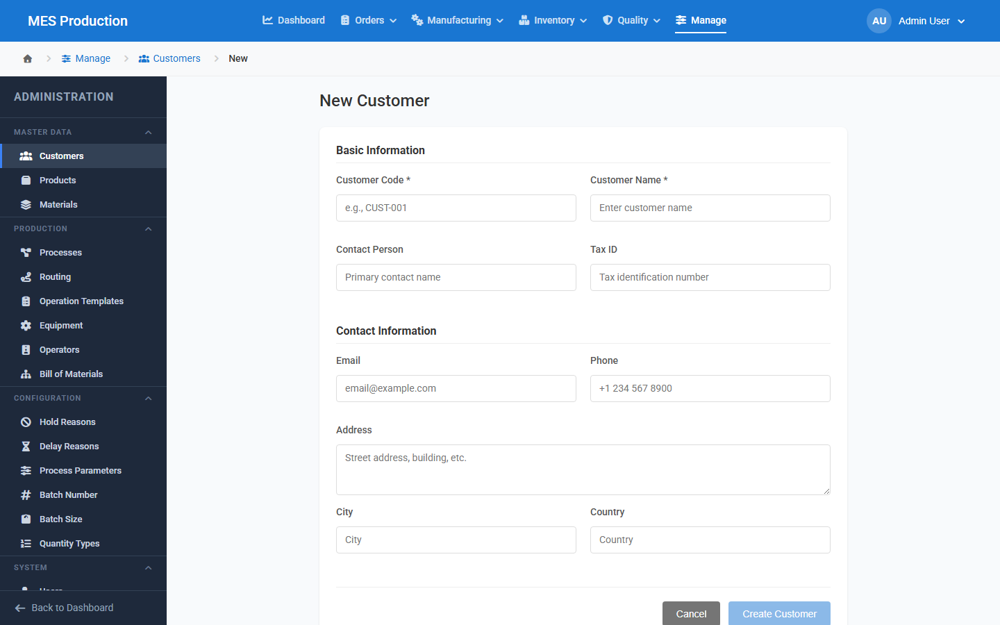

---

## Module: Materials (Admin)

### Screen: Material List

- **Purpose:** Paginated material master data with type filter
- **Business Logic:** Server-side pagination, type filtering (RM/IM/FG/WIP)
- **APIs Called:** `GET /api/materials/paged`
- **Validation:** Type filter sanitization
- **Role Access:** Authenticated (Admin layout)
- **Test Coverage:** 19 backend / 15 frontend / 5 E2E

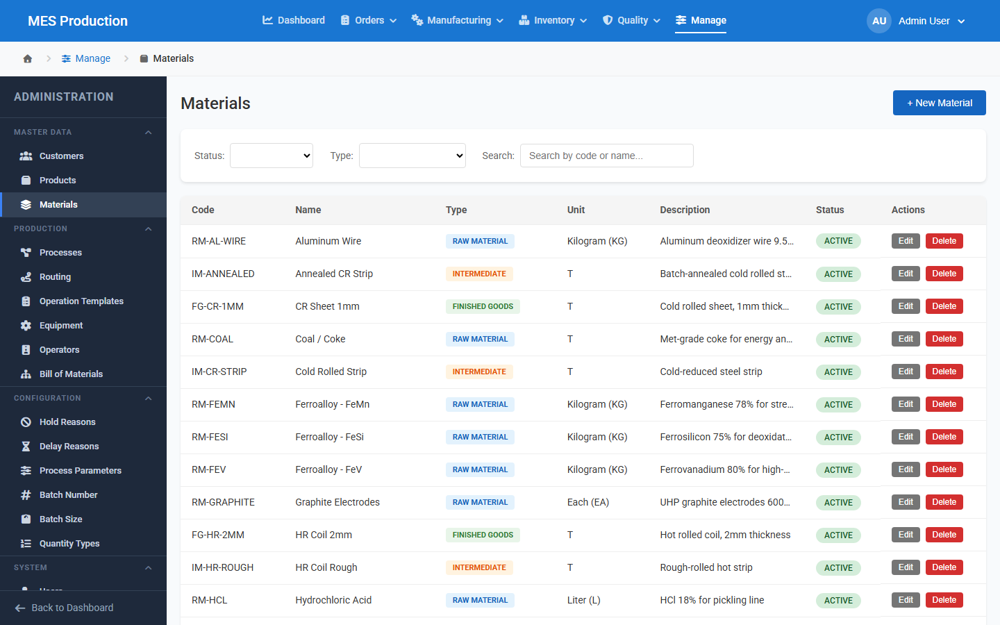

### Screen: Material Detail

- **Purpose:** Material record details
- **Business Logic:** Display material info, type badge, UOM
- **APIs Called:** `GET /api/materials/{id}`
- **Validation:** N/A (read-only)
- **Role Access:** Authenticated (Admin layout)
- **Test Coverage:** - / 14 frontend / - E2E

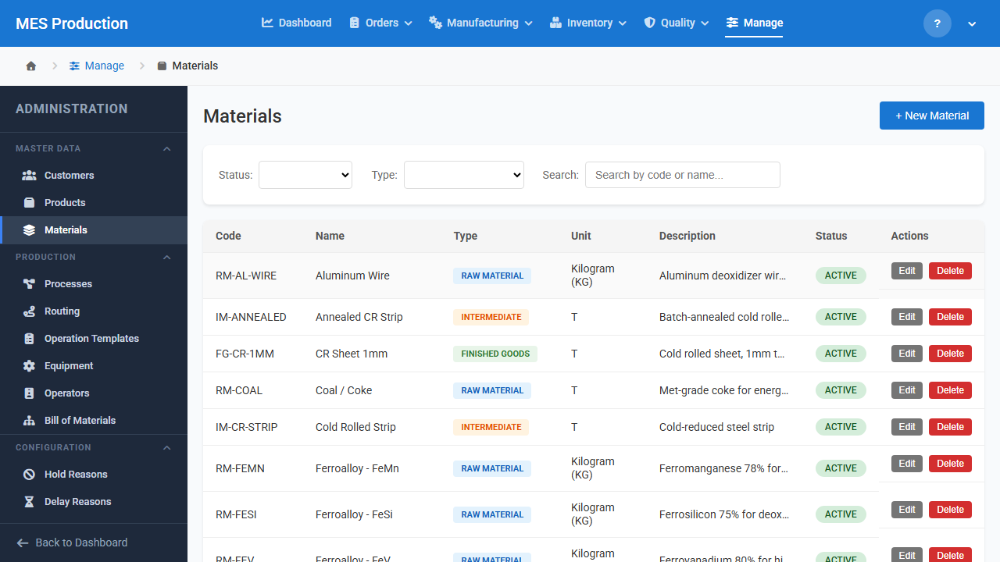

### Screen: Material Form (Create/Edit)

- **Purpose:** Create or edit material records
- **Business Logic:** Material code, name, type (RM/IM/FG/WIP), UOM entry
- **APIs Called:** `POST /api/materials`, `PUT /api/materials/{id}`
- **Validation:** Code, name, type, UOM required; unique code
- **Role Access:** Authenticated (Admin layout)
- **Test Coverage:** - / 21 frontend / - E2E

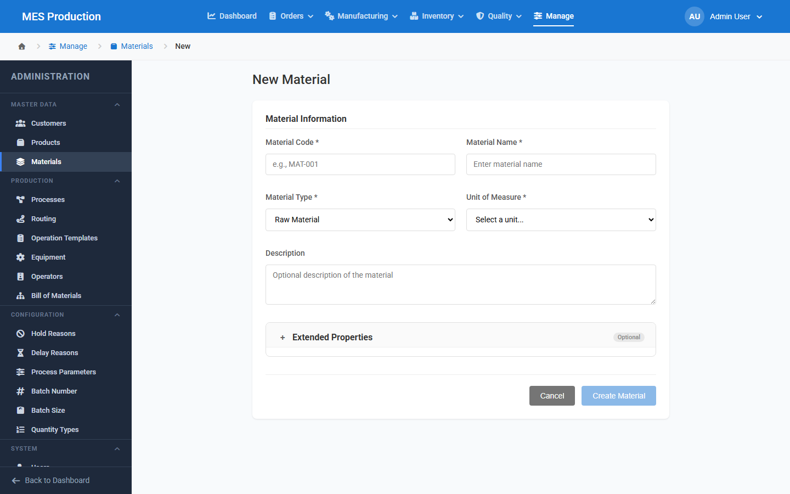

---

## Module: Products (Admin)

### Screen: Product List

- **Purpose:** Paginated product master data with category filter
- **Business Logic:** Server-side pagination, category filtering
- **APIs Called:** `GET /api/products/paged`
- **Validation:** Filter sanitization
- **Role Access:** Authenticated (Admin layout)
- **Test Coverage:** 15 backend / 12 frontend / 5 E2E

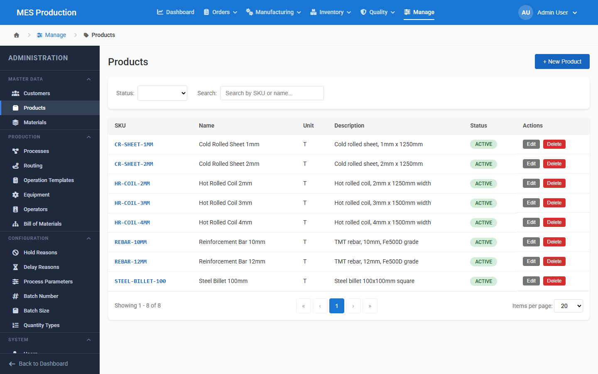

### Screen: Product Detail

- **Purpose:** Product record details
- **Business Logic:** Display product info, SKU, category
- **APIs Called:** `GET /api/products/{id}`
- **Validation:** N/A (read-only)
- **Role Access:** Authenticated (Admin layout)
- **Test Coverage:** - / 10 frontend / - E2E

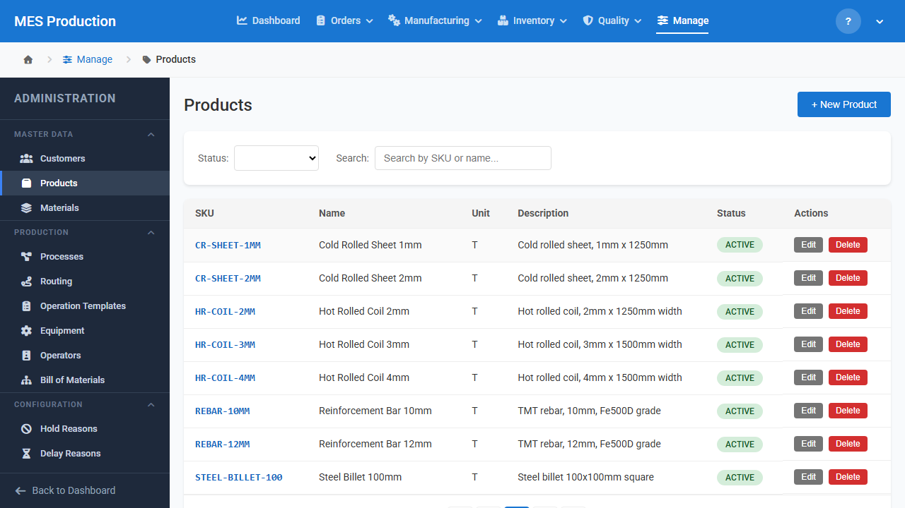

### Screen: Product Form (Create/Edit)

- **Purpose:** Create or edit product records
- **Business Logic:** Product SKU, name, category entry
- **APIs Called:** `POST /api/products`, `PUT /api/products/{id}`
- **Validation:** SKU and name required, unique SKU
- **Role Access:** Authenticated (Admin layout)
- **Test Coverage:** - / 25 frontend / - E2E

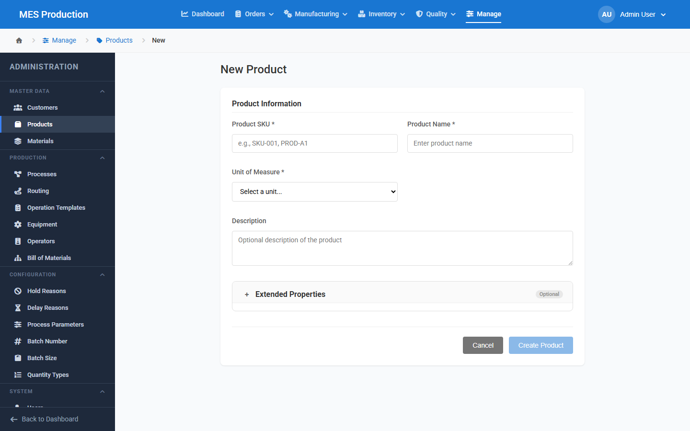

---

## Module: BOM (Admin)

### Screen: BOM Product List

- **Purpose:** List products that have BOM definitions
- **Business Logic:** Product list with BOM tree links, version info
- **APIs Called:** `GET /api/bom/products`
- **Validation:** N/A (read-only)
- **Role Access:** Authenticated (Admin layout)
- **Test Coverage:** 29 backend / 36 frontend / 11 E2E

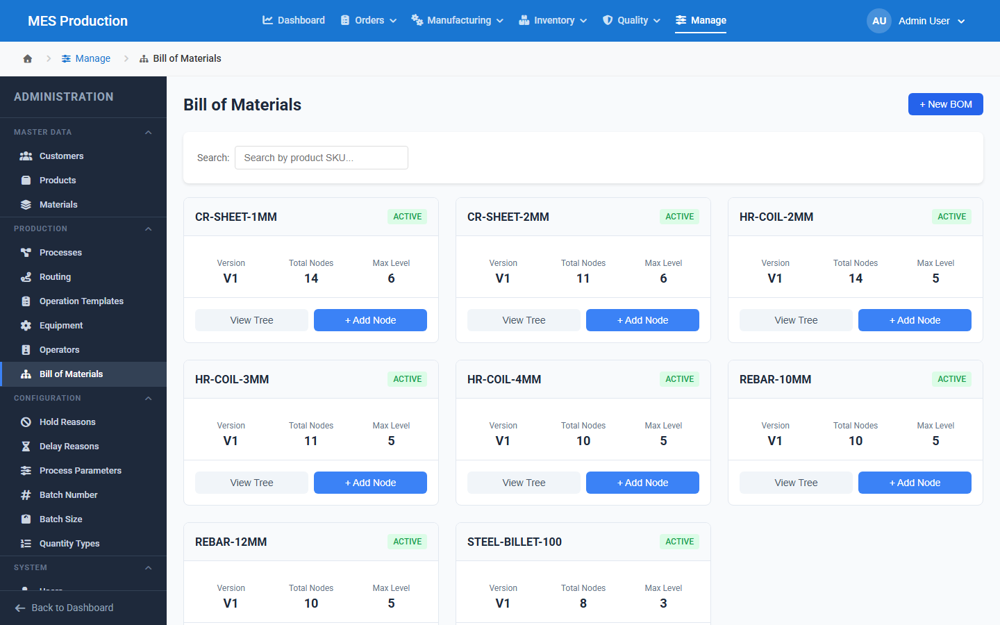

### Screen: BOM Tree View

- **Purpose:** Hierarchical tree visualization of BOM structure
- **Business Logic:** Expandable tree nodes, material quantities, yield percentages
- **APIs Called:** `GET /api/bom/{sku}/tree`, `GET /api/bom/{sku}/tree/version/{v}`
- **Validation:** N/A (read-only)
- **Role Access:** Authenticated (Admin layout)
- **Test Coverage:** - / 46 frontend / - E2E

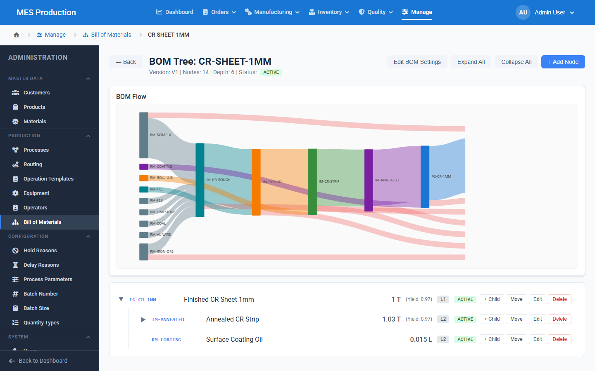

### Screen: BOM Node Form (Create/Edit)

- **Purpose:** Create or edit individual BOM nodes
- **Business Logic:** Material selection, quantity, yield factor, parent assignment
- **APIs Called:** `POST /api/bom/node`, `PUT /api/bom/node/{id}`
- **Validation:** Material, quantity, yield required; circular reference check
- **Role Access:** Authenticated (Admin layout)
- **Test Coverage:** - / 39 frontend / - E2E

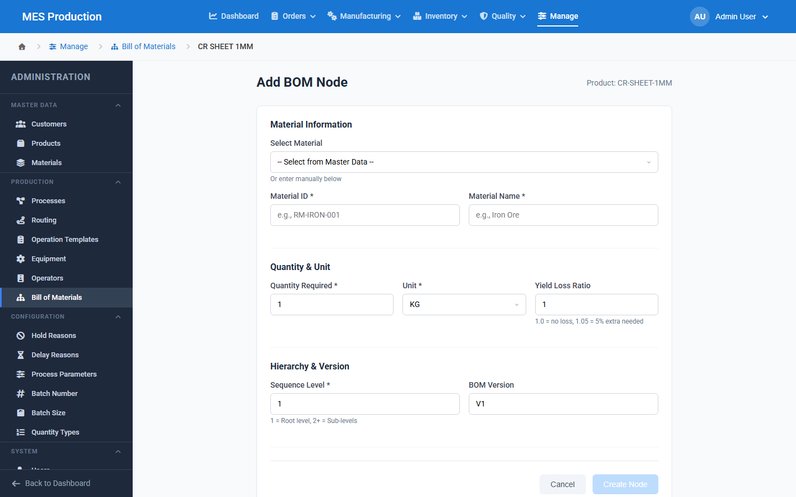

---

## Module: Operators (Admin)

### Screen: Operator List

- **Purpose:** Paginated operator master data
- **Business Logic:** Server-side pagination, status filter
- **APIs Called:** `GET /api/operators/paged`
- **Validation:** Search sanitization
- **Role Access:** Authenticated (Admin layout)
- **Test Coverage:** 11 backend / 13 frontend / 10 E2E

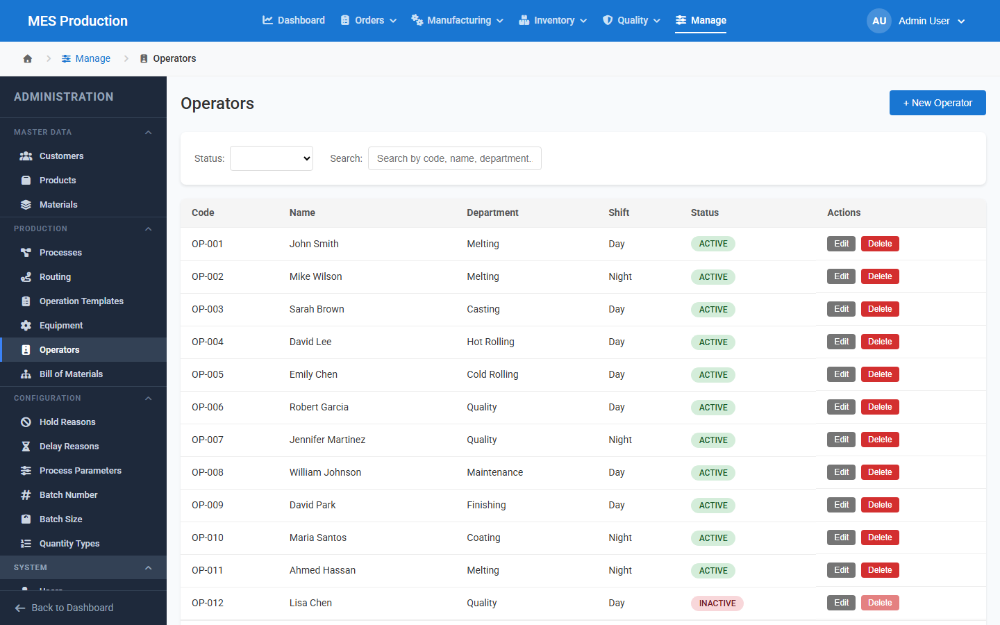

### Screen: Operator Detail

- **Purpose:** Operator record details
- **Business Logic:** Display operator info, department, hire date
- **APIs Called:** `GET /api/operators/{id}`
- **Validation:** N/A (read-only)
- **Role Access:** Authenticated (Admin layout)
- **Test Coverage:** - / 14 frontend / - E2E

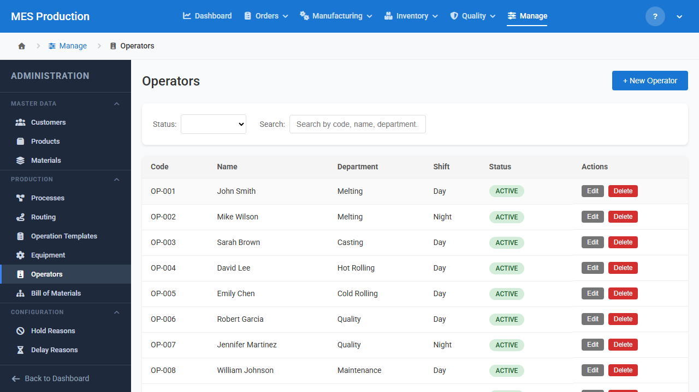

### Screen: Operator Form (Create/Edit)

- **Purpose:** Create or edit operator records
- **Business Logic:** Operator code, name, department entry
- **APIs Called:** `POST /api/operators`, `PUT /api/operators/{id}`
- **Validation:** Code and name required, unique code
- **Role Access:** Authenticated (Admin layout)
- **Test Coverage:** - / 18 frontend / - E2E

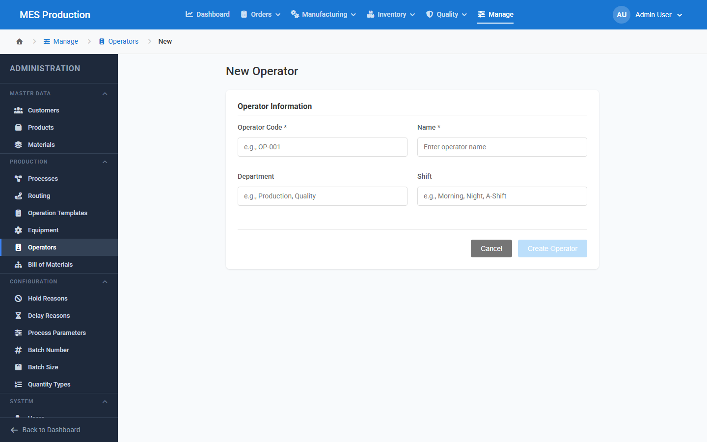

---

## Module: Processes (Admin)

### Screen: Process List

- **Purpose:** Paginated process definitions
- **Business Logic:** Server-side pagination, status filter
- **APIs Called:** `GET /api/processes/paged`
- **Validation:** Status filter sanitization
- **Role Access:** Authenticated (Admin layout)
- **Test Coverage:** 27 backend / 21 frontend / 26 E2E

### Screen: Process Detail

- **Purpose:** Process definition details with linked routings
- **Business Logic:** Display process info, linked routing list
- **APIs Called:** `GET /api/processes/{id}`
- **Validation:** N/A (read-only)
- **Role Access:** Authenticated (Admin layout)
- **Test Coverage:** - / 22 frontend / - E2E

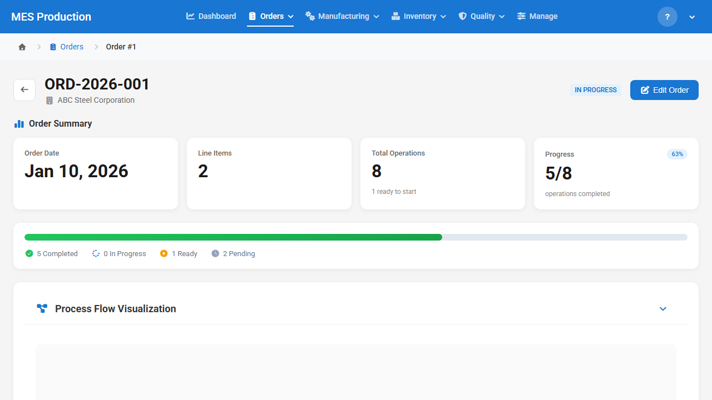

### Screen: Process Form (Create/Edit)

- **Purpose:** Create or edit process definitions
- **Business Logic:** Process name, description entry
- **APIs Called:** `POST /api/processes`, `PUT /api/processes/{id}`
- **Validation:** Name required
- **Role Access:** Authenticated (Admin layout)
- **Test Coverage:** - / 24 frontend / - E2E

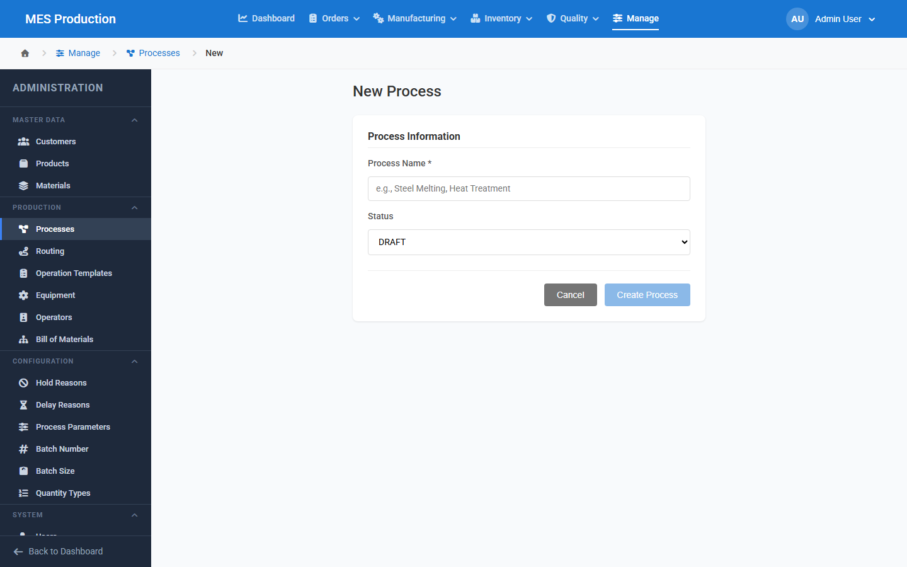

### Screen: Quality Pending

- **Purpose:** Queue of batches pending quality approval
- **Business Logic:** List QUALITY_PENDING batches for approval/rejection
- **APIs Called:** `GET /api/batches/pending-approval`
- **Validation:** N/A (read-only)
- **Role Access:** Authenticated
- **Test Coverage:** - / 3 frontend / - E2E

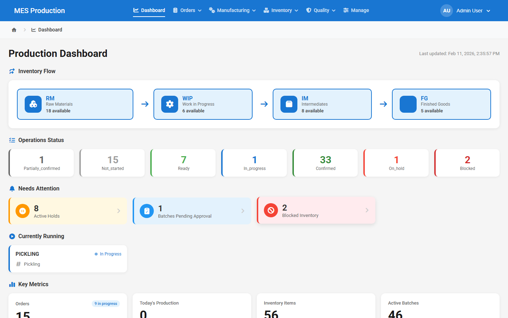

---

## Module: Routing (Admin)

### Screen: Routing List

- **Purpose:** Paginated routing definitions
- **Business Logic:** Server-side pagination, status filter (ACTIVE/INACTIVE/ON_HOLD)
- **APIs Called:** `GET /api/routing/paged`
- **Validation:** Status filter sanitization
- **Role Access:** Authenticated (Admin layout)
- **Test Coverage:** 35 backend / 40 frontend / 14 E2E

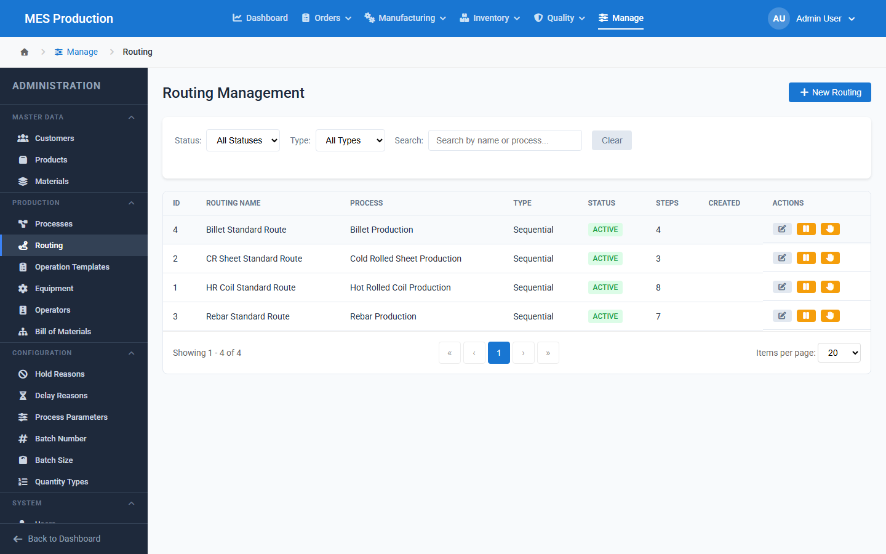

### Screen: Routing Detail

- **Purpose:** Routing details with ordered steps
- **Business Logic:** Display routing info, step sequence, activation controls
- **APIs Called:** `GET /api/routing/{id}`, `GET /api/routing/{id}/steps`
- **Validation:** N/A (read-only)
- **Role Access:** Authenticated (Admin layout)
- **Test Coverage:** - / 25 frontend / - E2E

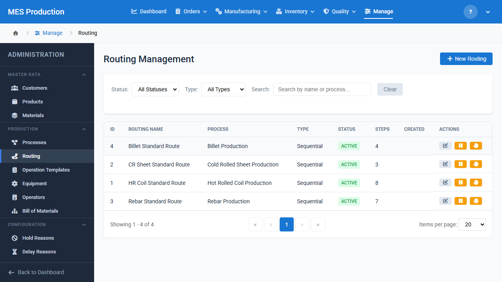

### Screen: Routing Form (Create/Edit)

- **Purpose:** Create or edit routing with step management
- **Business Logic:** Routing name, process link, step CRUD, reordering
- **APIs Called:** `POST /api/routing`, `PUT /api/routing/{id}`, `POST /api/routing/{id}/steps`, `POST /api/routing/{id}/reorder`
- **Validation:** Name required, process required, step sequence validation
- **Role Access:** Authenticated (Admin layout)
- **Test Coverage:** - / 53 frontend / 22 E2E

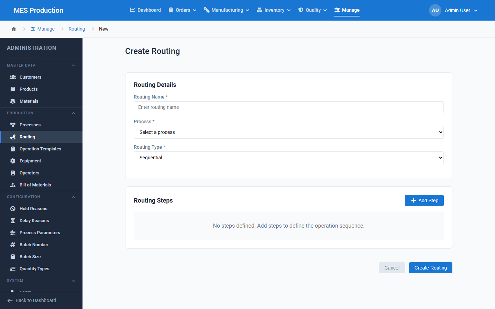

---

## Module: Operation Templates (Admin)

### Screen: Operation Template List

- **Purpose:** Paginated reusable operation blueprints
- **Business Logic:** Server-side list, search
- **APIs Called:** `GET /api/operation-templates`
- **Validation:** Search sanitization
- **Role Access:** Authenticated (Admin layout)
- **Test Coverage:** 12 backend / 4 frontend / 19 E2E

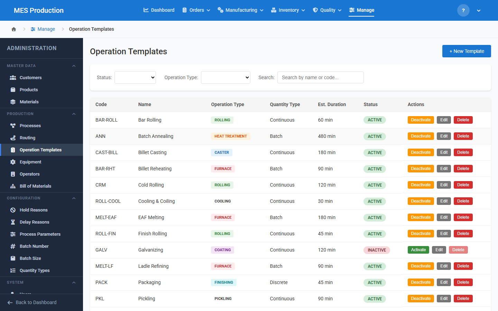

### Screen: Operation Template Detail

- **Purpose:** Template details with usage info
- **Business Logic:** Display template info, linked routing steps
- **APIs Called:** `GET /api/operation-templates/{id}`
- **Validation:** N/A (read-only)
- **Role Access:** Authenticated (Admin layout)
- **Test Coverage:** - / 19 frontend / - E2E

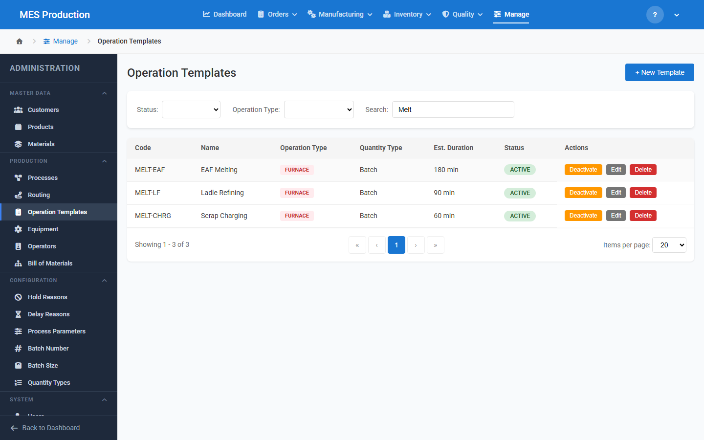

---

## Module: Configuration (Admin)

### Screen: Hold Reasons Config

- **Purpose:** Configure hold reasons available for hold apply
- **Business Logic:** CRUD for hold reason codes/descriptions
- **APIs Called:** `GET /api/config/hold-reasons/paged`, `POST /api/config/hold-reasons`, `PUT /api/config/hold-reasons/{id}`
- **Validation:** Code and description required, unique code
- **Role Access:** Authenticated (Admin layout)
- **Test Coverage:** - / 40 frontend / 34 E2E (shared config tests)

### Screen: Delay Reasons Config

- **Purpose:** Configure delay reasons for production confirmations
- **Business Logic:** CRUD for delay reason codes/descriptions
- **APIs Called:** `GET /api/config/delay-reasons/paged`, `POST /api/config/delay-reasons`, `PUT /api/config/delay-reasons/{id}`
- **Validation:** Code and description required, unique code
- **Role Access:** Authenticated (Admin layout)
- **Test Coverage:** - / 32 frontend / - E2E

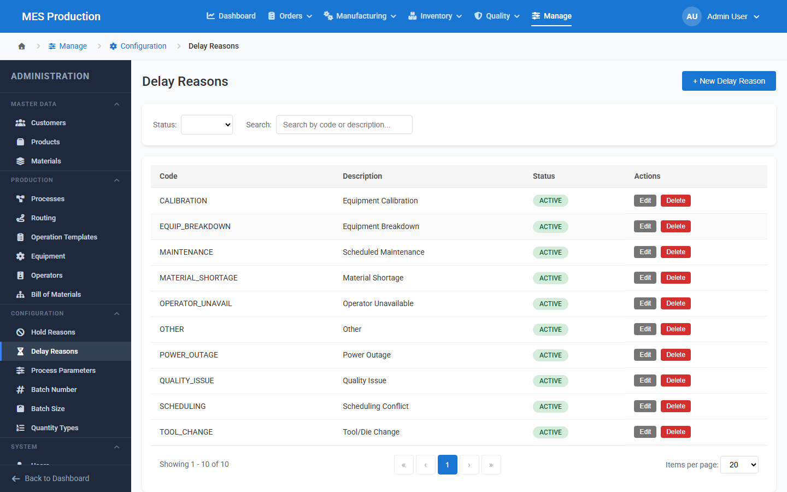

### Screen: Process Parameters Config

- **Purpose:** Configure process parameter min/max/default values per process
- **Business Logic:** Parameter name, type, range, required flag
- **APIs Called:** `GET /api/config/process-parameters/paged`, `POST /api/config/process-parameters`, `PUT /api/config/process-parameters/{id}`
- **Validation:** Name, type required; max >= min
- **Role Access:** Authenticated (Admin layout)
- **Test Coverage:** - / 29 frontend / - E2E

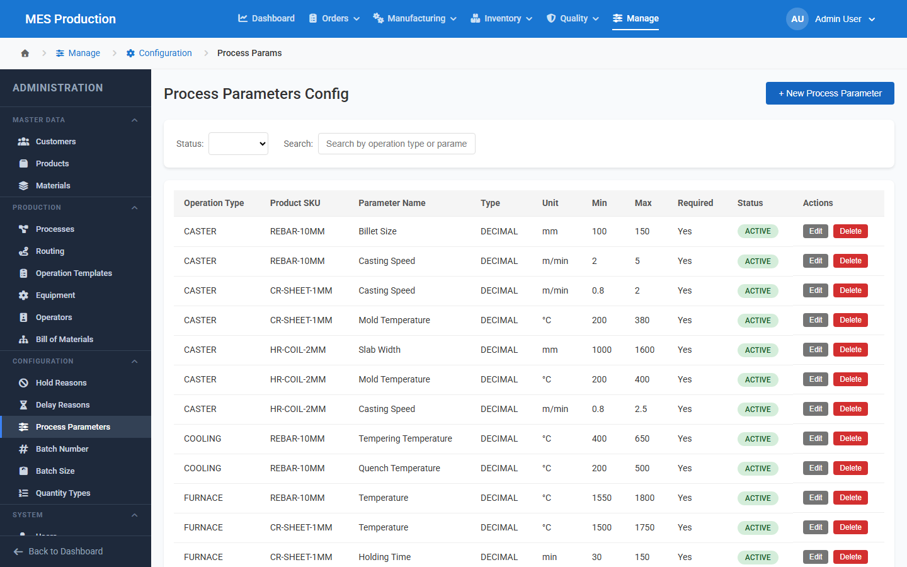

### Screen: Batch Number Config

- **Purpose:** Configure batch number generation patterns
- **Business Logic:** Prefix, date format, sequence, separator, reset options per operation type
- **APIs Called:** `GET /api/batch-number-config/paged`, `POST /api/batch-number-config`, `PUT /api/batch-number-config/{id}`
- **Validation:** Prefix required, format validation
- **Role Access:** Authenticated (Admin layout)
- **Test Coverage:** - / 43 frontend / - E2E

### Screen: Quantity Type Config

- **Purpose:** Configure quantity types and decimal precision
- **Business Logic:** Type code, fractional allowance, decimal places
- **APIs Called:** `GET /api/config/quantity-type/paged`, `POST /api/config/quantity-type`, `PUT /api/config/quantity-type/{id}`
- **Validation:** Code required, decimal places >= 0
- **Role Access:** Authenticated (Admin layout)
- **Test Coverage:** - / 36 frontend / - E2E

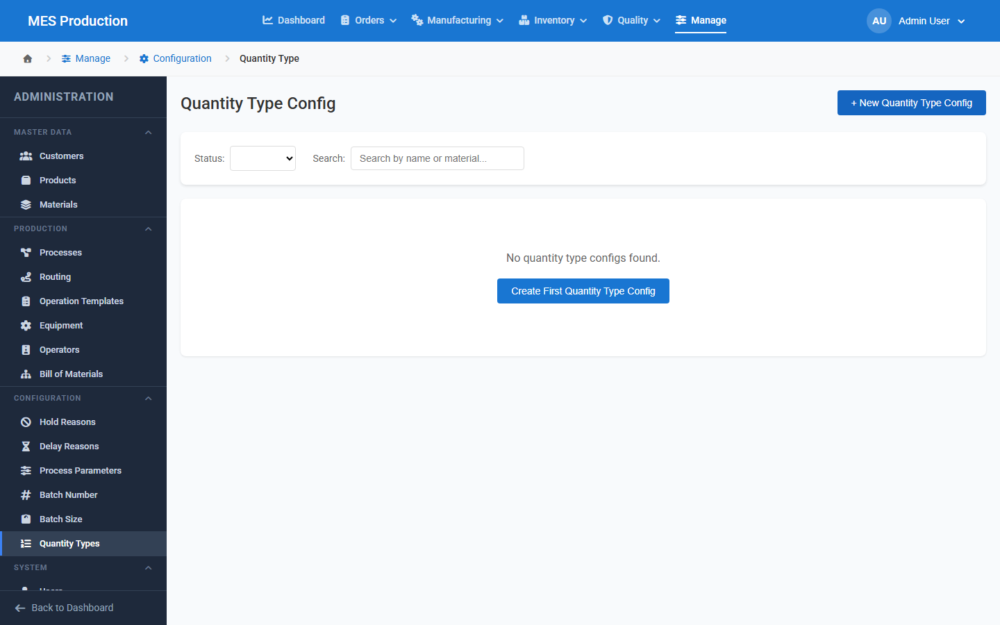

### Screen: Batch Size Config

- **Purpose:** Configure min/max/standard batch sizes per operation type
- **Business Logic:** Operation type, size constraints, unit
- **APIs Called:** `GET /api/batch-size-config/paged`, `POST /api/batch-size-config`, `PUT /api/batch-size-config/{id}`
- **Validation:** Min <= standard <= max, unit required
- **Role Access:** Authenticated (Admin layout)
- **Test Coverage:** - / 39 frontend / - E2E

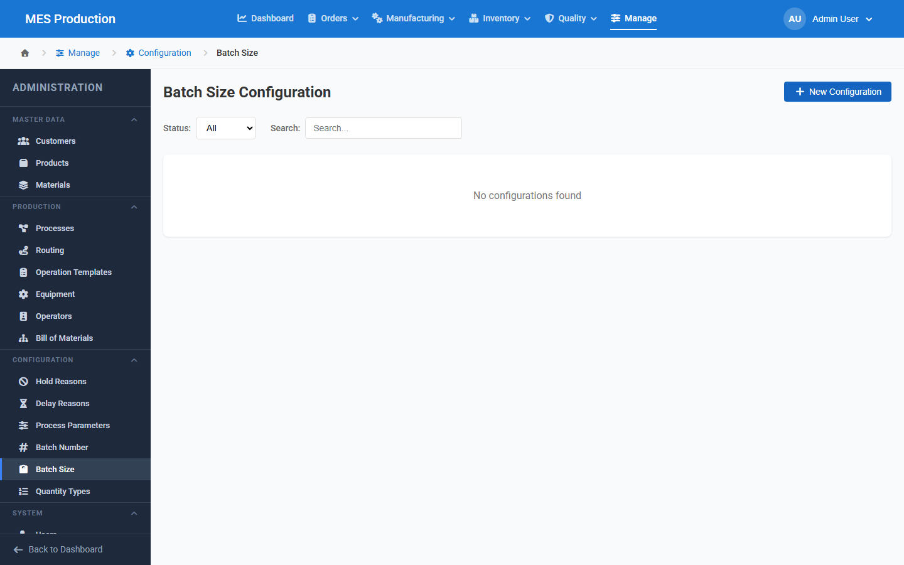

---

## Module: Reports

### Screen: Reports Landing

- **Purpose:** Navigation hub for all report types
- **Business Logic:** Card links to each report type
- **APIs Called:** N/A
- **Validation:** N/A
- **Role Access:** Authenticated
- **Test Coverage:** - / 4 frontend / - E2E

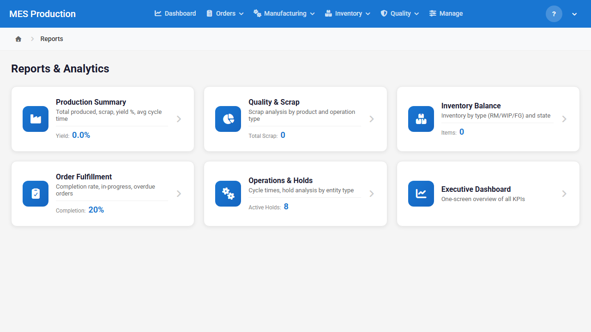

### Screen: Executive Dashboard

- **Purpose:** High-level analytics with charts and KPIs
- **Business Logic:** Aggregated metrics, trend charts, status breakdowns
- **APIs Called:** `GET /api/analytics/executive-dashboard`
- **Validation:** Date range filter
- **Role Access:** Authenticated
- **Test Coverage:** - / 13 frontend / - E2E

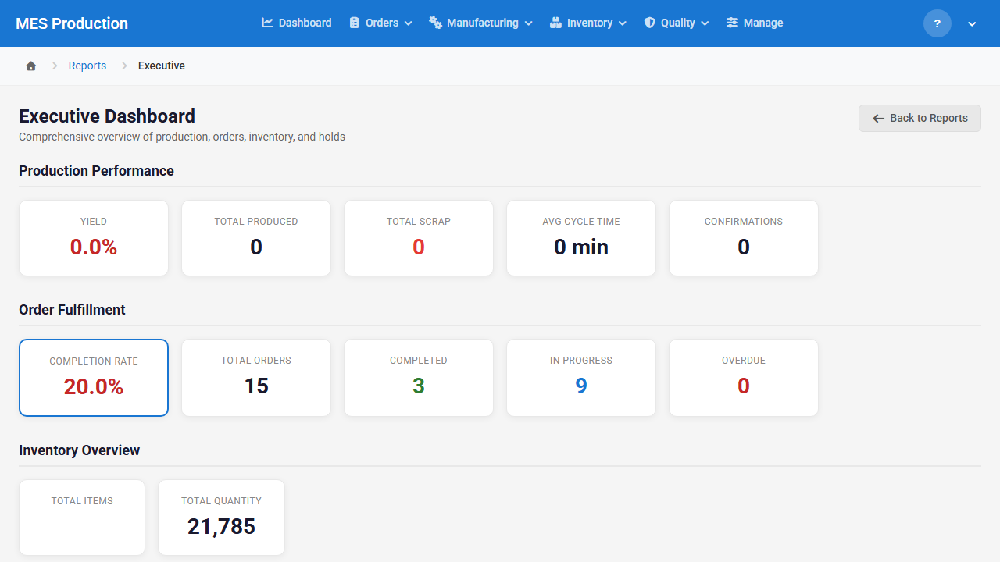

### Screen: Production Summary Report

- **Purpose:** Production output metrics and trends
- **Business Logic:** Production volume, scrap rates, efficiency metrics
- **APIs Called:** `GET /api/reports/production-summary`
- **Validation:** Date range filter
- **Role Access:** Authenticated
- **Test Coverage:** - / 8 frontend / - E2E

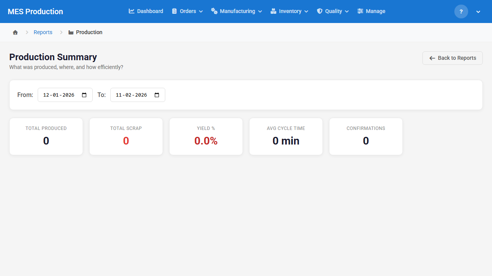

### Screen: Scrap Analysis Report

- **Purpose:** Scrap/waste analysis by operation and material
- **Business Logic:** Scrap rates, top scrap reasons, material waste
- **APIs Called:** `GET /api/analytics/scrap-analysis`
- **Validation:** Date range filter
- **Role Access:** Authenticated
- **Test Coverage:** - / 7 frontend / - E2E

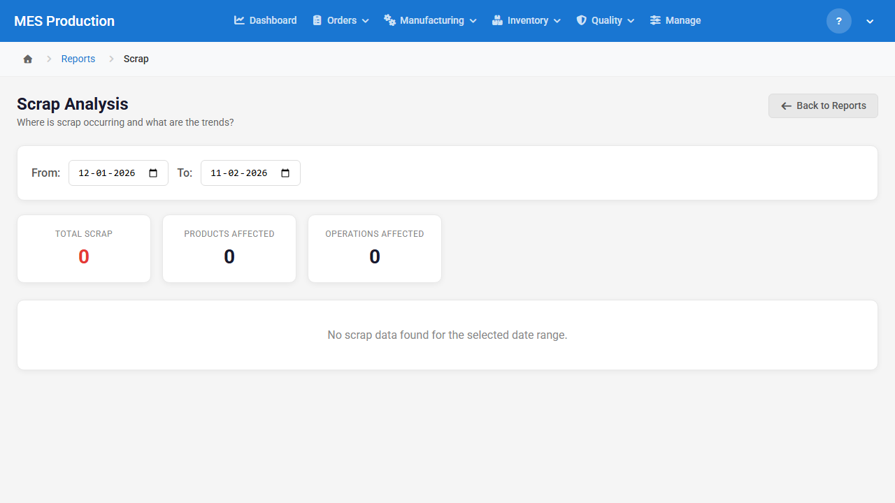

### Screen: Order Fulfillment Report

- **Purpose:** Order completion tracking and delivery metrics
- **Business Logic:** Fulfillment rates, on-time delivery, backlog
- **APIs Called:** `GET /api/reports/order-fulfillment`
- **Validation:** Date range filter
- **Role Access:** Authenticated
- **Test Coverage:** - / 6 frontend / - E2E

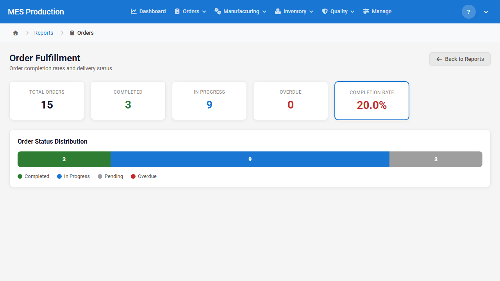

### Screen: Inventory Balance Report

- **Purpose:** Inventory stock levels by material type and state
- **Business Logic:** Stock summaries, aging, state distribution
- **APIs Called:** `GET /api/reports/inventory-balance`
- **Validation:** Type filter
- **Role Access:** Authenticated
- **Test Coverage:** - / 11 frontend / - E2E

### Screen: Operations Report

- **Purpose:** Operation cycle times and efficiency analysis
- **Business Logic:** Average cycle times, bottleneck identification
- **APIs Called:** `GET /api/analytics/operations`
- **Validation:** Date range filter
- **Role Access:** Authenticated
- **Test Coverage:** - / 7 frontend / 24 E2E

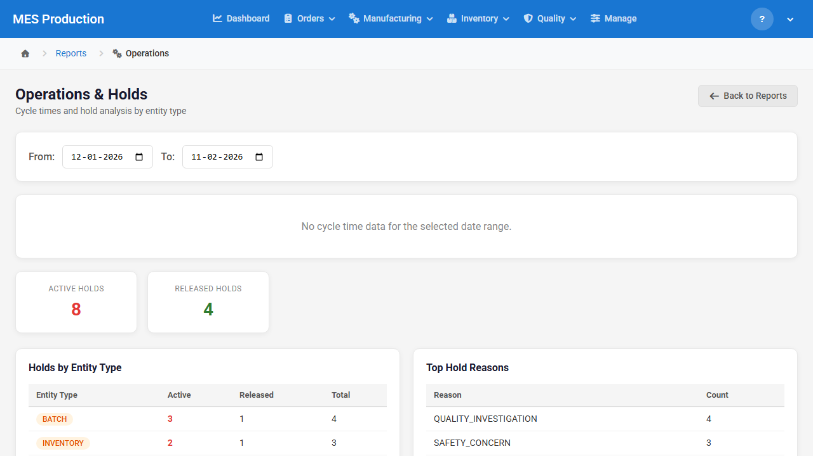

---

## Module: Users (Admin)

### Screen: User List

- **Purpose:** Paginated user management
- **Business Logic:** Server-side pagination, role filter
- **APIs Called:** `GET /api/users/paged`
- **Validation:** Role filter sanitization
- **Role Access:** Authenticated (Admin layout)
- **Test Coverage:** 19 backend / 13 frontend / 14 E2E

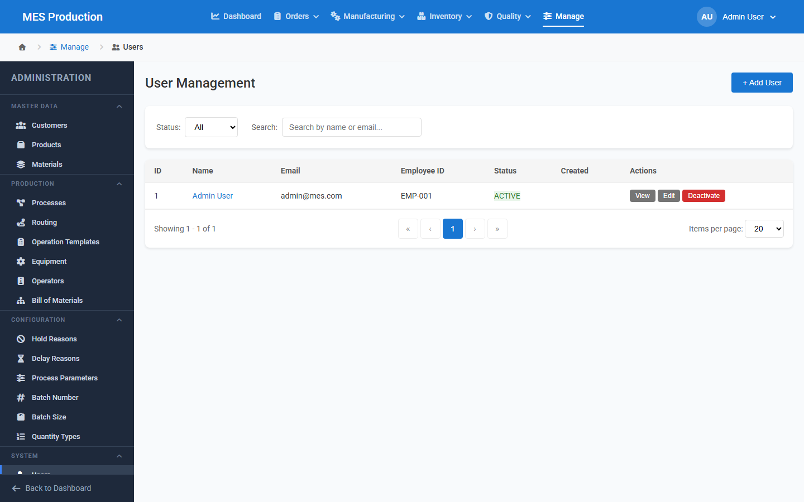

### Screen: User Detail

- **Purpose:** User account details
- **Business Logic:** Display user info, role, last login
- **APIs Called:** `GET /api/users/{id}`
- **Validation:** N/A (read-only)
- **Role Access:** Authenticated (Admin layout)
- **Test Coverage:** - / 13 frontend / - E2E

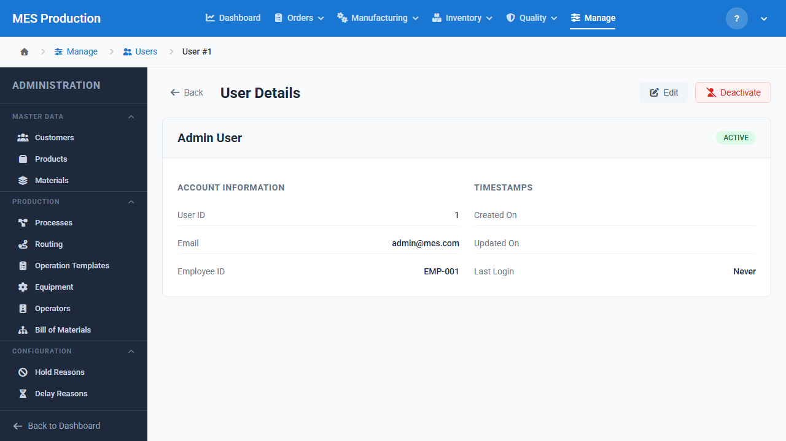

### Screen: User Form (Create/Edit)

- **Purpose:** Create or edit user accounts
- **Business Logic:** Username, email, role, password management
- **APIs Called:** `POST /api/users`, `PUT /api/users/{id}`
- **Validation:** Username, email required; email format; unique email
- **Role Access:** Authenticated (Admin layout)
- **Test Coverage:** - / 13 frontend / - E2E

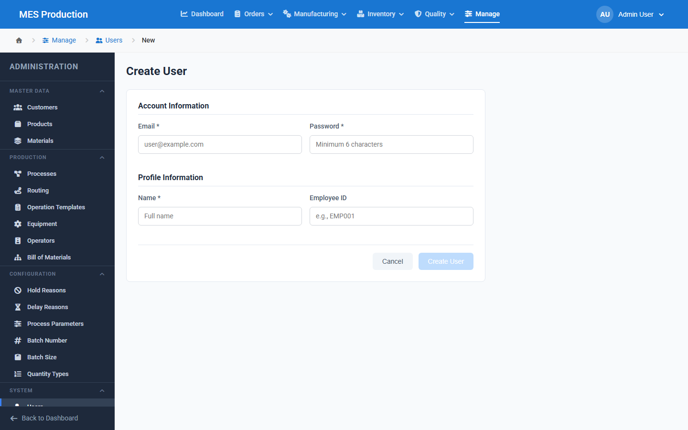

---

## Module: Audit Trail (Admin)

### Screen: Audit List

- **Purpose:** Paginated audit trail with entity/action/date filters
- **Business Logic:** Server-side pagination, entity type filter, action filter, date range, user filter
- **APIs Called:** `GET /api/audit/paged`, `GET /api/audit/entity-types`, `GET /api/audit/action-types`
- **Validation:** Date range, entity type, action type filters
- **Role Access:** Authenticated (Admin layout)
- **Test Coverage:** 17 backend / 25 frontend / 29 E2E

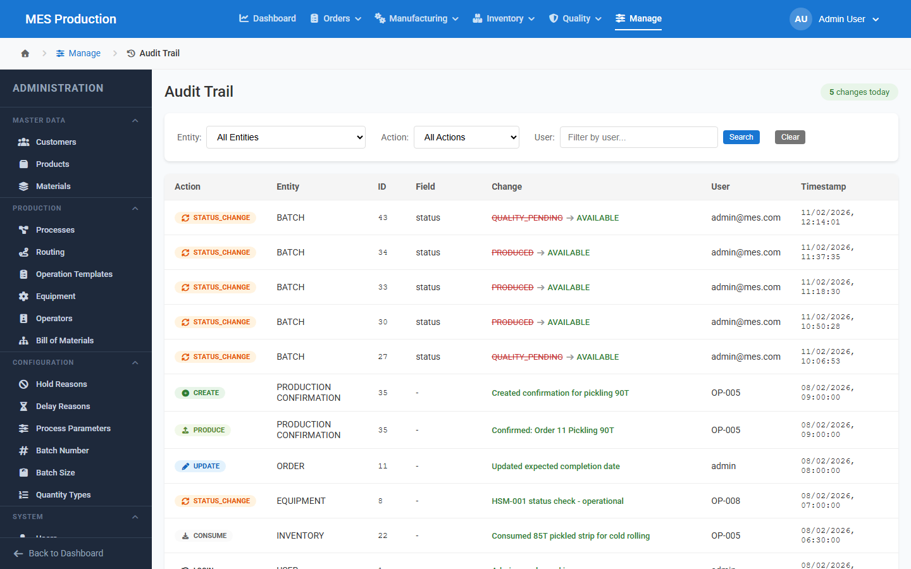

---

## Module: Profile

### Screen: User Profile

- **Purpose:** Display current user profile information
- **Business Logic:** Show user details, role, account info
- **APIs Called:** `GET /api/auth/me`
- **Validation:** N/A (read-only)
- **Role Access:** Authenticated
- **Test Coverage:** - / 9 frontend / - E2E

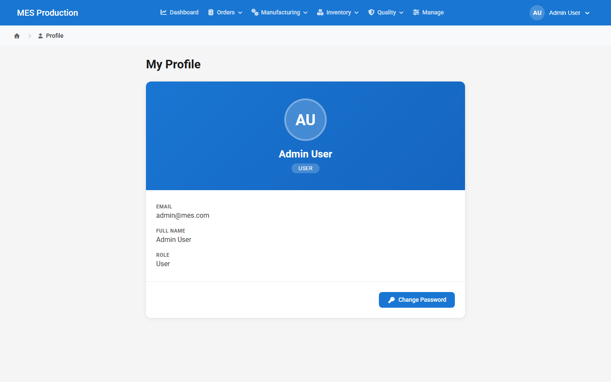

### Screen: Change Password

- **Purpose:** Change current user password
- **Business Logic:** Current password verification, new password entry, confirmation
- **APIs Called:** `POST /api/users/change-password`
- **Validation:** Current password required, new password required, confirmation match
- **Role Access:** Authenticated
- **Test Coverage:** - / 21 frontend / 7 E2E

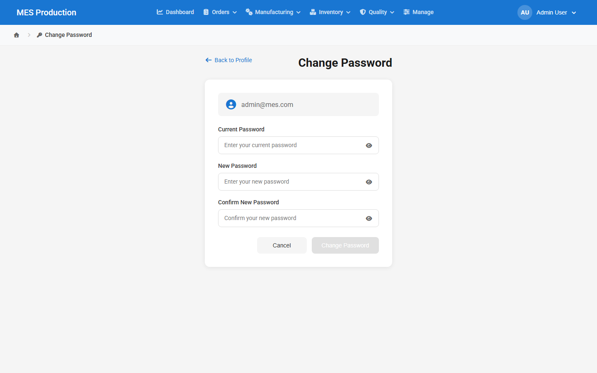

---

## Shared Components

### Component: Material Selection Modal

- **Purpose:** Reusable material/batch picker for production confirmation
- **Business Logic:** Search by batch number/material, type filter, bulk selection, quantity validation
- **APIs Called:** `GET /api/batches/available`
- **Validation:** Quantity <= available, min = 0
- **Role Access:** Authenticated (used within production confirm)
- **Test Coverage:** - / 21 frontend / 1 E2E

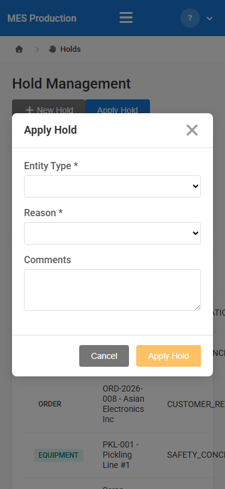

### Component: Apply Hold Modal

- **Purpose:** Quick hold application from any entity context
- **Business Logic:** Load hold reasons, entity info display, reason selection, auto-close on success
- **APIs Called:** `POST /api/holds`, `GET /api/config/hold-reasons`
- **Validation:** Reason required
- **Role Access:** Authenticated
- **Test Coverage:** - / 23 frontend / 1 E2E

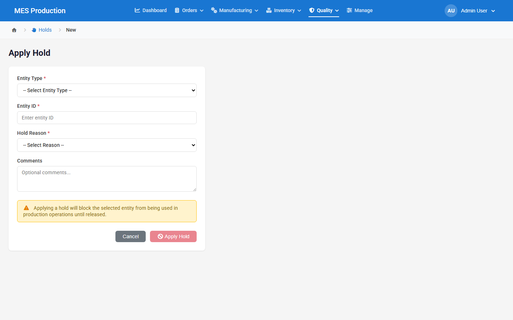

### Component: Pagination

- **Purpose:** Reusable pagination controls for all list pages
- **Business Logic:** Page navigation, page size selector (10/20/50/100), total count display
- **APIs Called:** N/A (emits events to parent)
- **Validation:** Page bounds checking
- **Role Access:** N/A (shared component)
- **Test Coverage:** Included in parent component tests

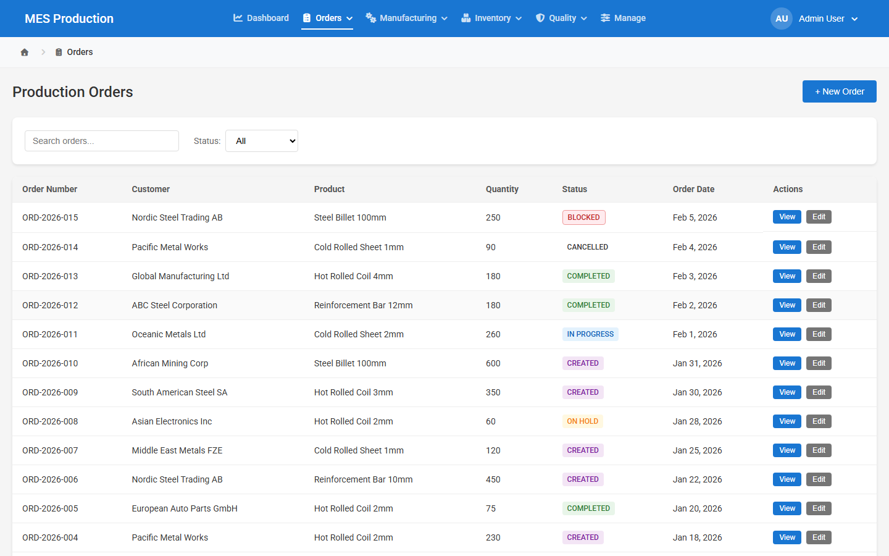

### Component: Header

- **Purpose:** Application header with navigation and user menu
- **Business Logic:** Route links, mobile menu toggle, user dropdown (profile, logout)
- **APIs Called:** N/A
- **Validation:** N/A
- **Role Access:** Authenticated
- **Test Coverage:** - / 8 frontend / - E2E

### Component: Admin Layout

- **Purpose:** Admin section layout with sidebar navigation
- **Business Logic:** Sidebar menu items, breadcrumbs, content area
- **APIs Called:** N/A
- **Validation:** N/A
- **Role Access:** Authenticated (Admin routes)
- **Test Coverage:** - / - frontend / 11 E2E (sidebar tests)

