# MES Production Confirmation POC - Complete User Guide

**Application:** MES Production Confirmation System (Bluemingo POC)
**Version:** POC Build - February 2026
**Industry:** Manufacturing
**URL:** `http://localhost:4200/#/login`

---

## Table of Contents

1. [Application Overview](#1-application-overview)
2. [Login and Authentication](#2-login-and-authentication)
3. [Navigation and Layout](#3-navigation-and-layout)
4. [Dashboard](#4-dashboard)
5. [Orders Management](#5-orders-management)
6. [Order Detail View](#6-order-detail-view)
7. [Order Create and Edit Forms](#7-order-create-and-edit-forms)
8. [Production Module](#8-production-module)
9. [Production Confirmation Form](#9-production-confirmation-form)
10. [Production History](#10-production-history)
11. [Batch Management](#11-batch-management)
12. [Batch Detail and Genealogy](#12-batch-detail-and-genealogy)
13. [Status Color Reference](#13-status-color-reference)
14. [Pagination and Sorting](#14-pagination-and-sorting)
15. [Keyboard Shortcuts and UI Behaviors](#15-keyboard-shortcuts-and-ui-behaviors)
16. [Workflow Reference](#16-workflow-reference)
17. [Validation Rules Reference](#17-validation-rules-reference)
18. [Troubleshooting](#18-troubleshooting)

---

## 1. Application Overview

The MES Production Confirmation system is a Manufacturing Execution System proof-of-concept. It manages production orders, production confirmation with material consumption tracking, and batch traceability with quality approval workflows.

### Key Capabilities

- **Order Management** -- Create, track, and manage customer orders through their complete lifecycle
- **Production Confirmation** -- Confirm production operations with material consumption, equipment, and operator tracking
- **Batch Traceability** -- Track every batch of material through production, with genealogy showing parent-child relationships
- **Batch Quality Approval** -- Approve or reject batches through a quality pending workflow

### Technology

- **Frontend:** Angular 17 single-page application
- **Backend:** Spring Boot 3.2 REST API
- **Database:** PostgreSQL 14+
- **Authentication:** JWT token-based authentication
- **URL Format:** Hash-based routing (all URLs contain `/#/` after the domain)

---

## 2. Login and Authentication

### Login Page

The login page is the entry point for all users. It is displayed at `http://localhost:4200/#/login`.

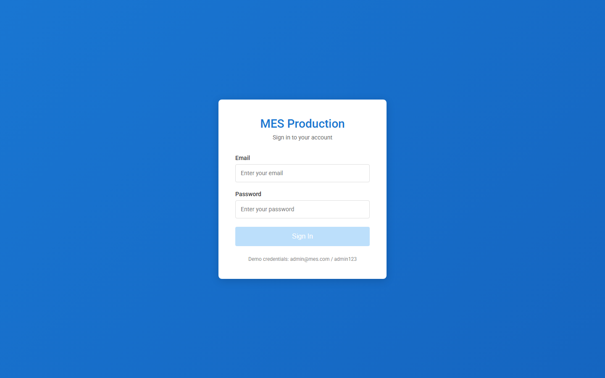

The login page consists of:

- **Application title** -- "MES Production" displayed prominently at the top of the login card
- **Subtitle** -- "Sign in to your account" below the title
- **Email field** -- Text input for the user's email address
- **Password field** -- Masked input for the user's password
- **Sign In button** -- Submits the login form; disabled until both fields are valid
- **Demo credentials footer** -- Displays the POC credentials for quick reference

### Entering Credentials

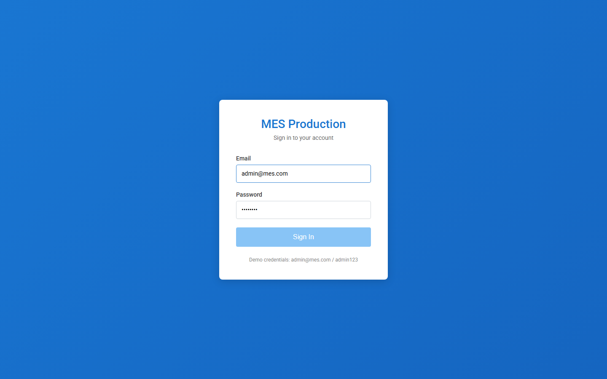

**POC Credentials:**
- **Email:** `admin@mes.com`
- **Password:** `admin123`

### Validation Rules

| Field | Rule | Error Message |
|-------|------|---------------|
| Email | Required | "Email is required" |
| Email | Must be valid email format | "Please enter a valid email" |
| Password | Required | "Password is required" |
| Password | Minimum 6 characters | "Password must be at least 6 characters" |

The **Sign In** button remains disabled (grayed out) until both fields pass validation. If login fails (wrong credentials), a red error alert appears below the form fields reading "Invalid email or password".

### Login Flow

1. Navigate to `http://localhost:4200` -- the application automatically redirects to `/#/login`
2. Enter your email address in the Email field
3. Enter your password in the Password field
4. Click **Sign In** (or press Enter)
5. On success, the system redirects to the Dashboard at `/#/dashboard`


### What Happens on Login

- The backend validates credentials and returns a JWT (JSON Web Token)
- The token is stored in the browser's local storage
- All subsequent API requests include this token in the `Authorization` header
- If the token expires, the user is redirected back to the login page
- If a user is already authenticated and visits `/login`, they are automatically redirected to the dashboard

---

## 3. Navigation and Layout

All authenticated pages use a consistent layout consisting of a top navigation header bar and a content area below it.

### Header Bar


The header contains:

**Left Side -- Logo:**
- **"MES Production"** -- Clicking this text navigates to the Dashboard

**Center -- Navigation Menu:**
Each menu item has an icon and label. The currently active page is highlighted.

| Menu Item | Icon | URL | Description |
|-----------|------|-----|-------------|
| Dashboard | Chart line icon | `/#/dashboard` | Production overview and KPIs |
| Orders | Clipboard list icon | `/#/orders` | Order management |
| Production | Industry/factory icon | `/#/production` | Production confirmation |
| Batches | Cubes icon | `/#/batches` | Batch tracking and traceability |

**Right Side -- User Profile:**


- **User Avatar** -- A circular badge showing the user's initials (e.g., "AD" for Admin)
- **User Name** -- The logged-in user's full name displayed next to the avatar
- **Chevron Arrow** -- A small down arrow indicating a dropdown menu

Clicking the user area opens a **Profile Dropdown Menu** containing:
- **Profile Header** -- Larger avatar with full name, email, and role
- **Divider line**
- **Logout** button -- Signs out the user after a confirmation dialog

The profile dropdown closes when:
- Clicking outside the dropdown
- Pressing the Escape key
- Clicking the Logout button

### Mobile Responsiveness

On screens narrower than 992px:
- The main navigation collapses into a hamburger menu (three horizontal lines icon)
- Clicking the hamburger icon toggles the mobile navigation menu open/closed
- The mobile menu closes automatically when the window is resized above 992px

---

## 4. Dashboard

The Dashboard is the primary landing page after login. It provides a comprehensive overview of the entire manufacturing operation at a glance.

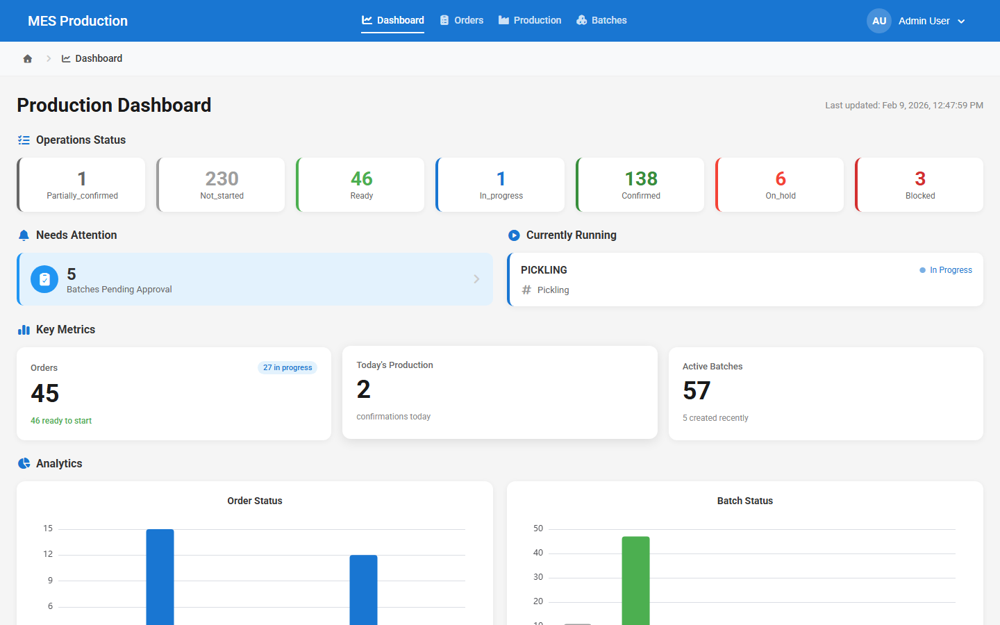

### Page Header

- **Title:** "Production Dashboard"
- **Last Updated Timestamp:** Shows when the data was last refreshed (e.g., "Last updated: Feb 9, 2026, 7:17:42 AM")


### Operations Status Summary

A horizontal row of colored status cards showing the count of operations in each status. Each card has a colored left border matching the status color and is clickable (navigates to Orders page).

| Status | Border Color | Meaning |
|--------|-------------|---------|
| Not Started | Gray (#9e9e9e) | Operations that have not begun |
| Ready | Green (#4caf50) | Operations ready to start production |
| In Progress | Blue (#1976d2) | Operations currently being executed |
| Confirmed | Dark Green (#388e3c) | Completed and confirmed operations |
| On Hold | Red (#f44336) | Operations temporarily paused |
| Blocked | Dark Red (#d32f2f) | Operations blocked from proceeding |

### Needs Attention Panel

Appears only when there are items requiring action. A blue info card showing:
- **Batches Pending Approval** -- Count of batches in QUALITY_PENDING status. Clicking navigates to the Batches page filtered to show only pending batches.

### Currently Running Panel

Shows up to 5 operations that are currently IN_PROGRESS, each displaying:
- Operation type (e.g., "MELTING", "CASTING")
- Operation name or ID
- Equipment name (if assigned)
- Operator name (if assigned)
- A pulsing green indicator dot showing "In Progress"

Clicking any active operation card navigates to the parent order's detail page.

### Key Metrics Section

Three metric cards displayed in a horizontal grid:

**Orders Card (Clickable):**
- Main value: Total number of orders
- Sub-badge: Number of orders in progress
- Footer: Number of operations ready to start
- Clicking navigates to `/#/orders`

**Today's Production Card:**
- Main value: Number of production confirmations completed today
- Footer label: "confirmations today"

**Active Batches Card (Clickable):**
- Main value: Count of batches in AVAILABLE, QUALITY_PENDING, or PRODUCED status
- Footer: Number of recently created batches
- Clicking navigates to `/#/batches`

### Analytics Charts

Two bar charts side by side, built using ECharts:

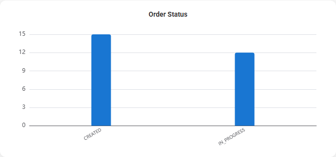

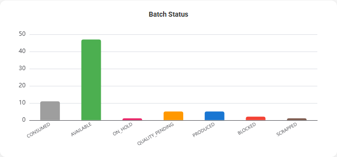

**Order Status Chart:**
- X-axis: Order statuses (CREATED, IN_PROGRESS, COMPLETED, ON_HOLD, CANCELLED)
- Y-axis: Count of orders
- Each bar is color-coded to match the order status color scheme
- Hover tooltip shows exact count

**Batch Status Chart:**
- X-axis: Batch statuses (QUALITY_PENDING, AVAILABLE, PRODUCED, CONSUMED, BLOCKED, SCRAPPED, ON_HOLD)
- Y-axis: Count of batches
- Each bar is color-coded to match the batch status color scheme
- Hover tooltip shows exact count

### Orders Ready for Production Table


A table showing up to 5 orders that have operations in READY status:

| Column | Description |
|--------|-------------|
| Order # | The order number (e.g., "ORD-2026-001") |
| Product | Product name from the first line item |
| Customer | Customer name |
| Status | Status badge (color-coded) |

- **"View All"** link in the header navigates to the full Orders list
- Clicking any row navigates to that order's detail page
- If no orders are ready, an empty state message reads "No orders ready for production"

### Recent Confirmations Panel

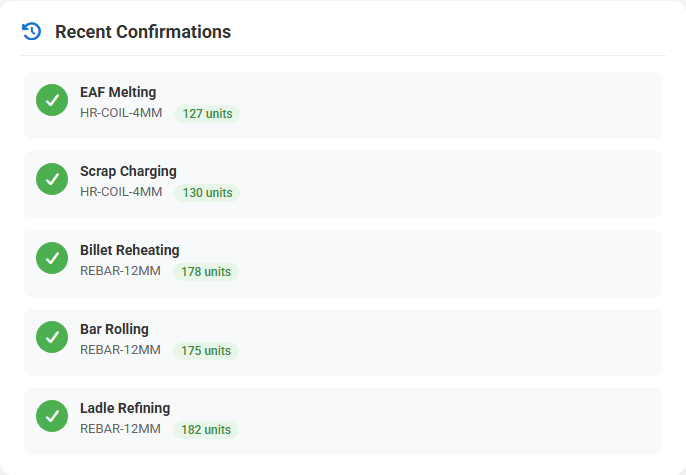

Shows the most recent production confirmations with:
- Green check icon
- Operation name
- Product SKU badge
- Quantity produced (e.g., "100 units")
- Timestamp of confirmation

If no recent activity exists, displays "No recent activity" with a history icon.

### Recent Batches Table


A table showing up to 5 most recently created batches:

| Column | Description |
|--------|-------------|
| Batch # | Batch number (e.g., "MELT-20260209-001") |
| Material | Material name or material ID |
| Quantity | Quantity with unit (e.g., "50 T") |
| Created | Creation date/time |
| Status | Status badge (color-coded) |

- **"View All"** link navigates to the full Batches list
- Clicking any row navigates to that batch's detail page

### Quick Actions

Three action buttons at the bottom of the dashboard:

| Button | Icon | Color | Action |
|--------|------|-------|--------|
| Confirm Production | Factory icon | Primary blue (filled) | Navigate to `/#/production` |
| View Orders | List icon | Default (outlined) | Navigate to `/#/orders` |
| Batch Traceability | Cubes icon | Default (outlined) | Navigate to `/#/batches` |

---

## 5. Orders Management

The Orders page (`/#/orders`) provides a complete list of all manufacturing orders with filtering, searching, and pagination.

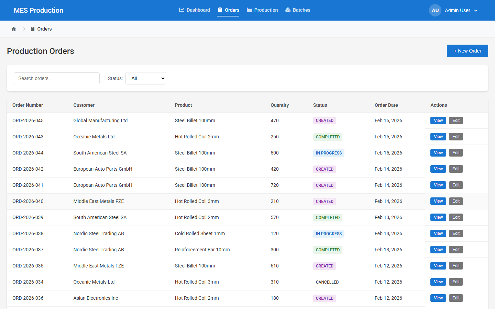

### Page Header

- **Title:** "Orders"
- **"+ New Order" Button:** Blue primary button in the top-right corner. Clicking navigates to `/#/orders/new` to create a new order.

### Filter Area


The filter area contains:

**Search Input:**
- Text field with a search icon placeholder
- Searches across order number, customer name, and product name
- Results update immediately as you type (with debounce)
- Resets to page 1 when a new search term is entered

**Status Filter Dropdown:**
- Options: All, CREATED, IN_PROGRESS, COMPLETED, ON_HOLD
- Selecting a status filters the table to show only orders with that status
- "All" shows orders in all statuses
- Resets to page 1 when filter changes

### Orders Table

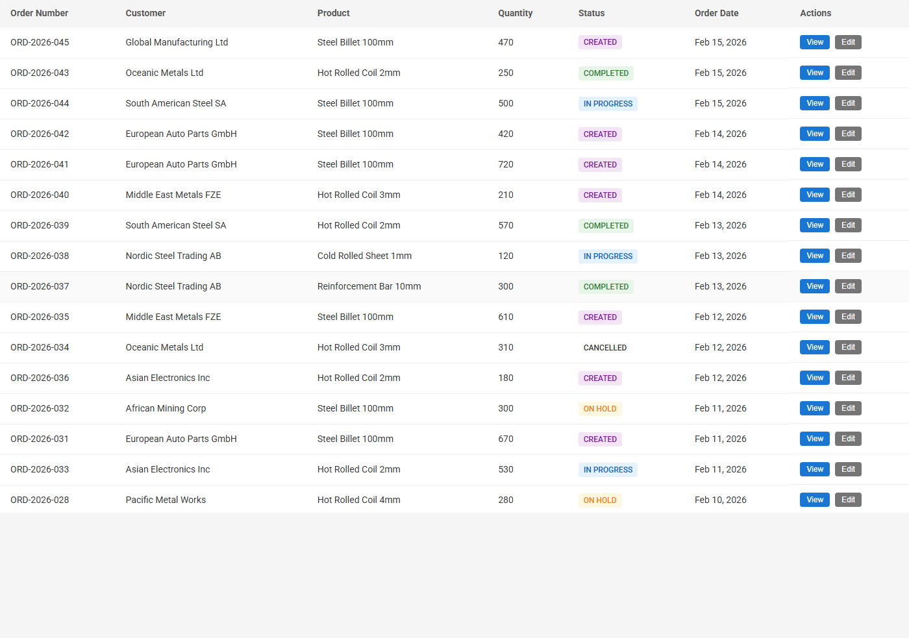

| Column | Description |
|--------|-------------|
| Order # | The unique order number assigned by the system |
| Customer | Customer name from the order |
| Product | Product name from the first line item, or "N/A" if no line items |
| Total Qty | Sum of quantities across all line items |
| Order Date | Date the order was placed |
| Status | Color-coded status badge |
| Actions | "View" link to navigate to the order detail page |

- Clicking the "View" link or the row navigates to `/#/orders/{orderId}`
- Table is sorted by order date in descending order by default (newest first)

### Order Status Badges

Orders use color-coded status badges: **CREATED** (purple), **IN_PROGRESS** (blue), **COMPLETED** (green), **ON_HOLD** (amber), **CANCELLED** (brown). See [Section 13: Status Color Reference](#13-status-color-reference) for exact color values.

### Pagination

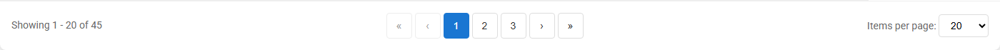

See [Section 14: Pagination and Sorting](#14-pagination-and-sorting) for detailed pagination controls documentation.

---

## 6. Order Detail View

The Order Detail page (`/#/orders/{orderId}`) shows comprehensive information about a single order including its line items, operations, and a visual process flow chart.

### In-Progress Order


### Header Section


The header displays:
- **Back Arrow Button** -- Navigates back to the Orders list
- **Order Number** -- Large heading (e.g., "Order #ORD-2026-001")
- **Status Badge** -- Current order status with color coding
- **"Edit" Button** -- Navigates to the order edit form at `/#/orders/{orderId}/edit`

### Order Summary Statistics

A row of statistic cards showing:
- **Total Operations** -- Count of all operations across all line items
- **Completed** -- Count of CONFIRMED/COMPLETED operations
- **In Progress** -- Count of IN_PROGRESS/PARTIALLY_CONFIRMED operations
- **Ready** -- Count of READY operations
- **Pending** -- Count of NOT_STARTED, ON_HOLD, or BLOCKED operations
- **Completion %** -- Percentage bar showing overall progress

### Line Items Section

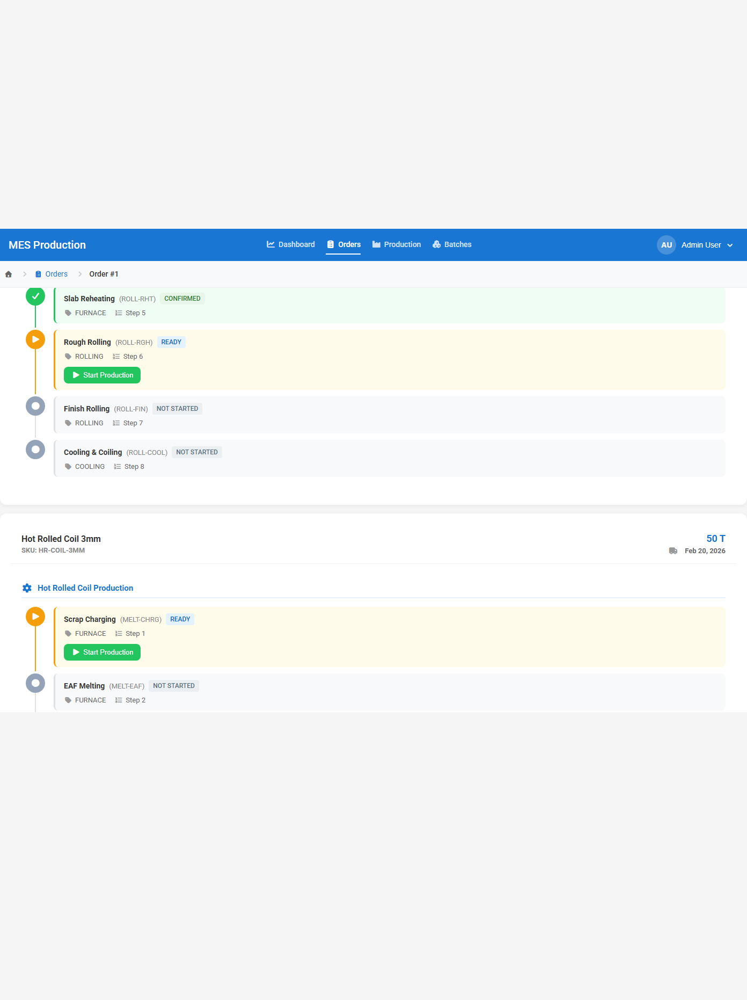

Each line item is displayed as an expandable card showing:
- **Product SKU and Name** (e.g., "HR-COIL-001 -- Hot Rolled Coil")
- **Quantity with unit** (e.g., "100 T")
- **Delivery Date** (if specified)
- **Line Item Status badge**
- **Progress Percentage** bar for the line item
- **Collapse/Expand Toggle** -- Click the chevron to show/hide operations

### Operations Timeline (within each Line Item)

Operations are grouped by their parent Process and displayed as a vertical timeline:

**Process Group Header:**
- Process name (e.g., "Melting", "Casting", "Rolling")
- Operations listed sequentially beneath

**Each Operation shows:**
- **Status Icon:**
  - Check mark (completed/confirmed)
  - Spinning icon (in progress)
  - Play icon (ready)
  - Pause icon (on hold)
  - Ban icon (blocked)
  - Circle icon (not started)
- **Operation Name** (e.g., "Electric Arc Furnace Melting")
- **Operation Status** as text label
- **"Start Production" Button** -- Blue button, only visible when the operation status is READY or IN_PROGRESS. Clicking navigates to `/#/production/confirm/{operationId}`

**Operations List Panel (Cropped):**

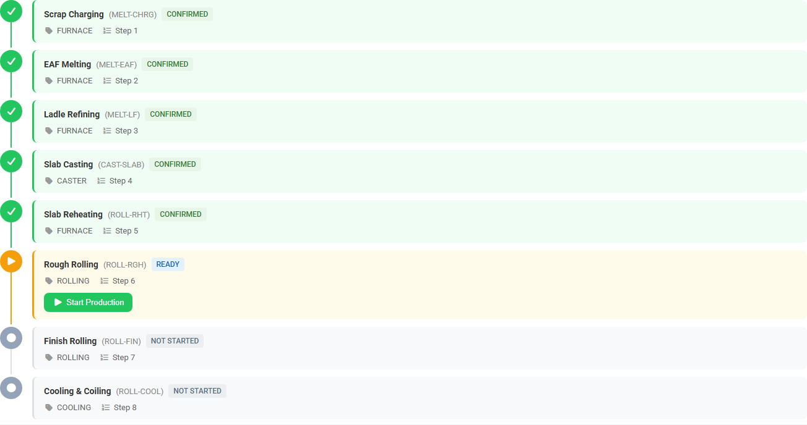

### Process Flow Chart


An interactive ECharts graph visualization showing:

**Process Nodes (left side):**
- Purple gradient rectangular nodes with white text
- Show the process name (e.g., "Melting", "Casting")

**Operation Nodes (right side, connected sequentially):**
- Rounded rectangles with status-dependent colors:
  - Green border + light green background = CONFIRMED/COMPLETED
  - Blue border + light blue background = IN_PROGRESS
  - Amber/yellow border + light yellow background = READY
  - Orange border + light orange background = ON_HOLD
  - Red border + light red background = BLOCKED
  - Gray border + light gray background = NOT_STARTED
- Each node shows the operation name and status text
- Arrows connect operations in sequence order

**Interactive Features:**
- Hover over a node to see tooltip with name and status
- Adjacent nodes are highlighted on hover (focus: adjacency)
- Chart is zoomable and pannable (roam enabled)

**Collapse Toggle:**
- The flow chart section has a toggle button to collapse/expand it

### Completed Order View


When all operations are confirmed, the completion percentage shows 100% and the order status badge shows COMPLETED in green.

### Multi-Stage Process View


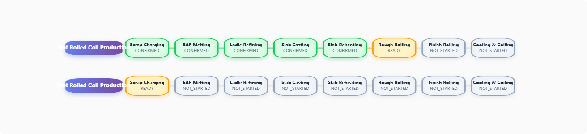

Orders with multiple processes (e.g., Melting, Casting, Rolling, Finishing) display each process group with its operations in the timeline and flow chart. The flow chart dynamically sizes its height based on the number of process rows.

### On-Hold Order View

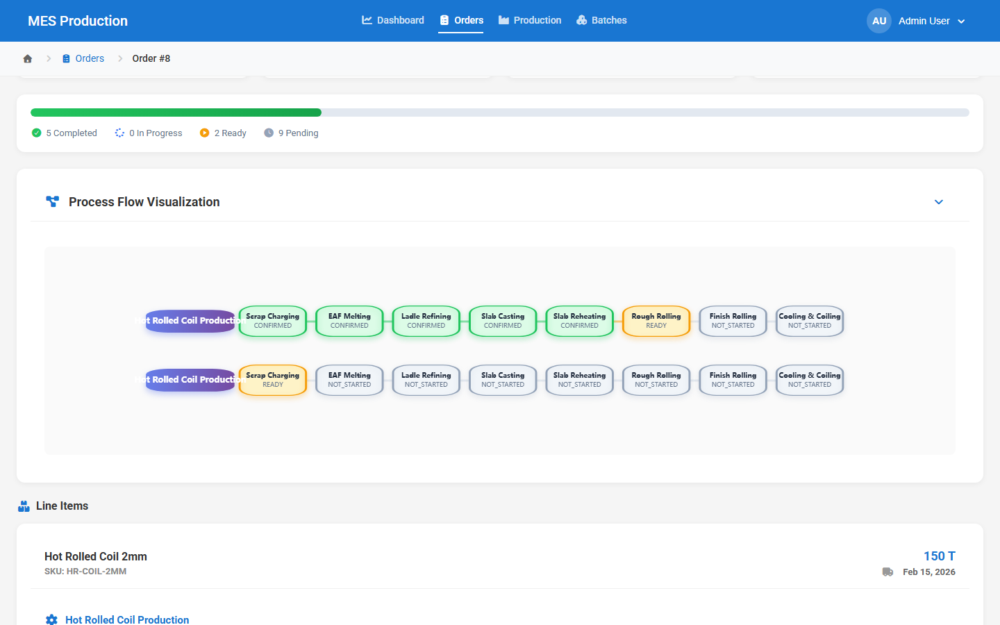

When an order is on hold, the status badge shows ON_HOLD in amber. Operations may show ON_HOLD status with pause icons. The "Start Production" button is hidden for operations that are on hold.

---

## 7. Order Create and Edit Forms

### Create New Order

Navigate to `/#/orders/new` by clicking the **"+ New Order"** button on the Orders list page.

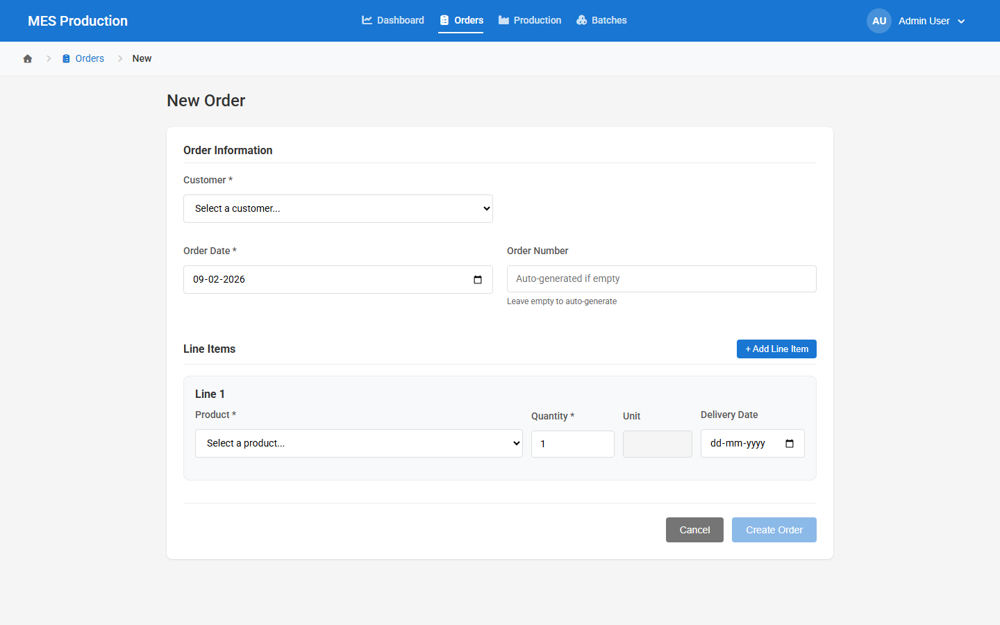

**Form Fields:**

| Field | Type | Required | Validation | Description |
|-------|------|----------|------------|-------------|
| Customer | Dropdown | Yes | Must select a customer | Populated from active customers list. Selecting a customer auto-fills Customer Name. |
| Customer Name | Text (auto-filled) | Yes | Max 200 characters | Auto-filled when customer is selected. Can be manually overridden. |
| Order Date | Date picker | Yes | Must be a valid date | Defaults to today's date |
| Order Number | Text | No | Auto-generated if blank | Optional manual order number. System generates one if left blank. |

**Line Items Section:**

Each line item has these fields:

| Field | Type | Required | Validation | Description |
|-------|------|----------|------------|-------------|
| Product | Dropdown | Yes | Must select a product | Populated from active products list. Selecting auto-fills Product Name and Unit. |
| Product Name | Text (auto-filled) | Yes | Max 200 characters | Auto-filled from product selection |
| SKU | Text (auto-filled) | Yes | Max 50 characters | Auto-filled from product selection |
| Quantity | Number | Yes | Minimum 0.01 | Production quantity |
| Unit | Text (auto-filled) | Yes | Max 20 characters | Unit of measure (e.g., "T" for tons) |
| Delivery Date | Date picker | No | Valid date | Expected delivery date |

**Buttons:**

| Button | Action |
|--------|--------|
| **"+ Add Line Item"** | Adds another line item row to the form |
| **"Remove" (trash icon)** | Removes a line item row (minimum 1 must remain) |
| **"Save Order"** | Validates and submits the form; on success, navigates to Orders list |
| **"Cancel"** | Discards changes and navigates back to Orders list |

**What happens when an order is created (database side effects):**
1. An `Order` record is created with status `CREATED`
2. `OrderLineItem` records are created for each line item
3. The system automatically creates `Process` and `Operation` records based on the product's routing configuration
4. Operations are created in the correct sequence with status `NOT_STARTED`
5. The first operation in the sequence is set to `READY` status
6. An audit trail entry is logged for the order creation

### Edit Order

Navigate to `/#/orders/{orderId}/edit` by clicking the **"Edit"** button on the Order Detail page.

The edit form pre-fills all fields with the existing order data. In edit mode:
- **Line items can only be modified** for orders in `CREATED` status
- Orders in other statuses allow editing only the basic info (customer, date)
- The status field may be shown but is typically managed through workflow actions, not manual editing

**Validation on Submit:**
- All required fields must be filled
- At least one line item must exist
- Quantity must be greater than 0.01
- If validation fails, fields with errors are highlighted in red with error messages displayed below each field

---

## 8. Production Module

### Production Landing Page

The Production page (`/#/production`) serves as the gateway to production confirmation and history.

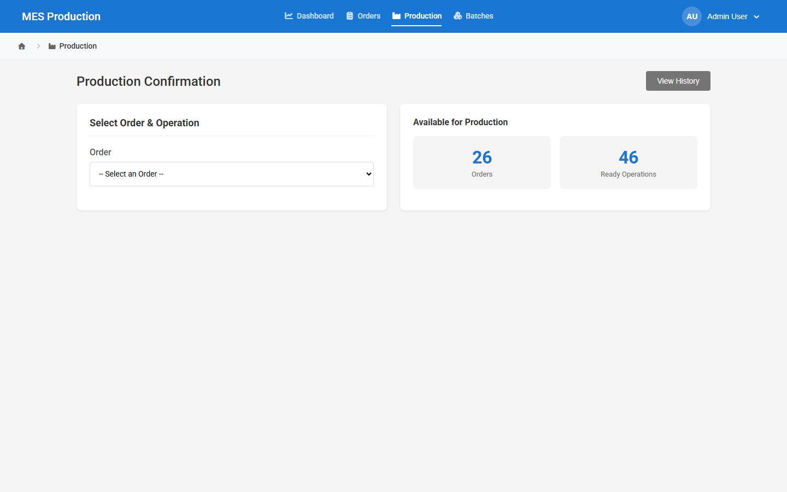

The page shows:

**Summary Information:**
- Total number of READY operations across all available orders
- Count of available orders with READY operations

**Step-by-Step Selection:**

**Step 1 -- Select Order:**
- A dropdown showing all orders that have at least one READY operation
- Each option shows the order number and customer name
- Selecting an order populates the order context panel below

**Order Context Panel** (appears after selecting an order):
- Customer name
- Order date
- Status
- Product name and SKU
- Quantity with unit
- Due date (if available)

**Step 2 -- Select Operation:**
- A dropdown showing all READY operations for the selected order
- Each option shows the process name and operation name (e.g., "Melting - Electric Arc Furnace")
- Operation type and sequence number are displayed

**Step 3 -- Confirm:**
- **"Start Confirmation"** button -- Enabled only when both an order and an operation are selected. Clicking navigates to `/#/production/confirm/{operationId}`

**Additional Button:**
- **"View Production History"** -- Navigates to `/#/production/history`

---

## 9. Production Confirmation Form

The Production Confirmation form (`/#/production/confirm/{operationId}`) captures all data for a production confirmation including time, quantities, materials, equipment, operators, and process parameters.

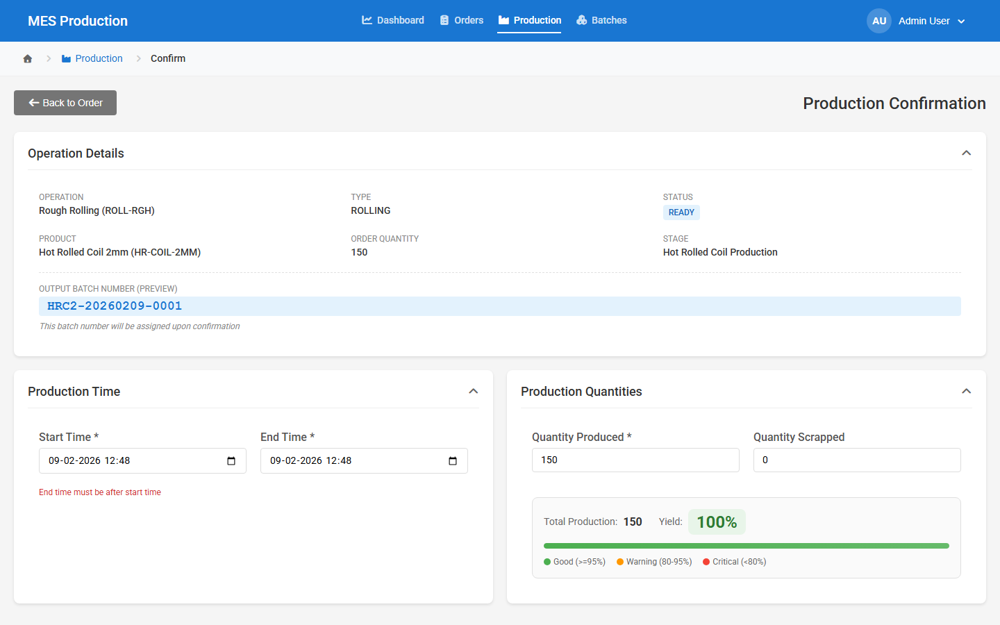

### Operation Information Header


Displays read-only information about the selected operation:
- **Operation Name** (e.g., "Electric Arc Furnace Melting")
- **Operation Type** (e.g., "MELTING")
- **Operation Status** (READY or IN_PROGRESS)
- **Order Number** and order context
- **Product SKU** and product name
- **Target Quantity** from the order line item

### Form Sections (Collapsible)

Each section of the form can be collapsed/expanded by clicking the section header. The toggle icon rotates to indicate state.

#### Section 1: Production Time

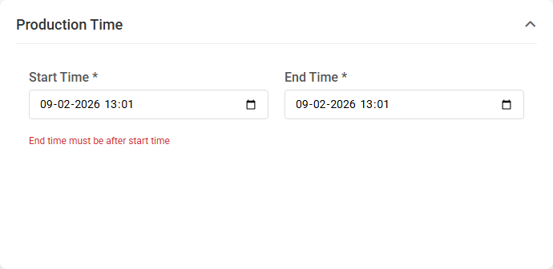

| Field | Type | Required | Validation | Description |
|-------|------|----------|------------|-------------|
| Start Time | DateTime picker | Yes | Must not be in the future | When production started |
| End Time | DateTime picker | Yes | Must be after Start Time | When production ended |

Both fields default to the current date/time.

**Calculated Display:**
- **Duration** -- Automatically calculated and displayed (e.g., "2h 30m")

**Validation Errors:**
- "Start time cannot be in the future" -- if start time is after current time
- "End time must be after start time" -- if end time is before or equal to start time

#### Section 2: Production Quantities

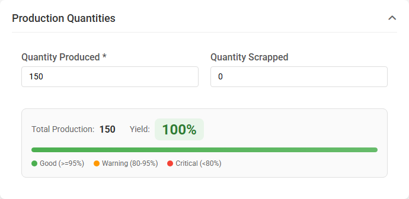

| Field | Type | Required | Validation | Description |
|-------|------|----------|------------|-------------|
| Quantity Produced | Number | Yes | Minimum 1 | Amount of good product produced |
| Quantity Scrapped | Number | No | Minimum 0 | Amount scrapped during production |

**Calculated Displays:**
- **Total Production** = Quantity Produced + Quantity Scrapped
- **Yield Percentage** = (Quantity Produced / Total Production) * 100%
- **Yield Indicator Color:**
  - Green (yield-good): 95% or above
  - Yellow (yield-warning): 80% to 94.99%
  - Red (yield-critical): Below 80%

**Checkbox:**
- **"Save as Partial Confirmation"** -- When checked, the confirmation is saved as partial (PARTIALLY_CONFIRMED status), allowing further confirmations for the same operation

#### Section 3: BOM Suggested Consumption


If a Bill of Materials (BOM) exists for the product, this section shows:
- List of required materials with quantities
- Available stock for each material
- Stock status indicator: **"Sufficient"** (green) or **"Insufficient"** (red)
- Total required quantity

**"Apply Suggestions" Button:**
- Automatically selects inventory items and fills quantities based on BOM requirements
- Pre-fills the material consumption section

#### Section 4: Material Consumption

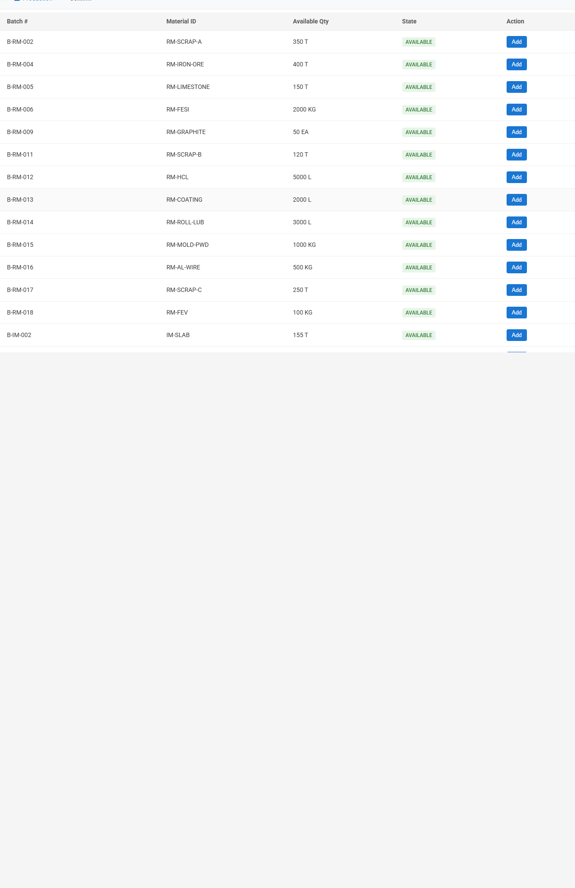

**Available Inventory Table:**
Shows all AVAILABLE inventory items that can be consumed:

| Column | Description |
|--------|-------------|
| Batch # | Batch number of the inventory item |
| Material ID | Material identifier |
| Available Qty | Quantity available for consumption |
| Unit | Unit of measure |
| Location | Storage location |
| Action | "Add" button to select this material |

**"Open Material Picker" Button:**
Opens the Material Selection Modal (see below) for a more advanced selection interface with search and filtering.

**Selected Materials Table:**
Once materials are added, they appear in a selected materials table:

| Column | Description |
|--------|-------------|
| Batch # | Selected batch number |
| Material ID | Material identifier |
| Available | Maximum quantity available |
| Consume Qty | Editable number input -- how much to consume |
| Action | "Remove" button to deselect |

**Quantity validation:** The consume quantity cannot exceed the available quantity and must be >= 0.

**BOM Validation:**
If BOM requirements exist, the system validates consumption against requirements and shows:
- Green checkmark for requirements met
- Yellow warning for partially met
- Red cross for missing requirements

#### Section 5: Batch Number Preview


Shows a preview of the output batch number that will be generated based on the configured batch numbering pattern:
- **Preview Batch Number** (e.g., "MELT-20260209-001")
- This is a preview only -- the actual number is generated on submit
- The pattern depends on configuration (operation type, product SKU, date format, sequence)

#### Section 6: Equipment & Operator Selection

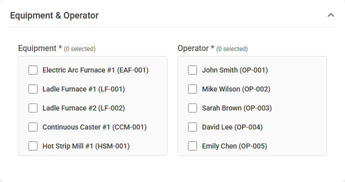

**Equipment Selection:**
Checkboxes for each available equipment item:
- Equipment code and name
- Checkbox to select/deselect
- Count of selected equipment displayed

**Operator Selection:**
Checkboxes for each active operator:
- Operator code and name
- Checkbox to select/deselect
- Count of selected operators displayed

**Validation:** At least one equipment and at least one operator must be selected.

#### Section 7: Delay Tracking

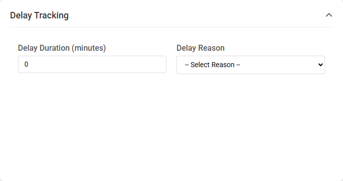

| Field | Type | Required | Validation | Description |
|-------|------|----------|------------|-------------|
| Delay Duration | Number (minutes) | No | Minimum 0 | Total delay time in minutes |
| Delay Reason | Dropdown | Conditionally | Required if delay > 0 | Populated from configured delay reasons |

**Validation:** If delay minutes is greater than 0, a delay reason must be selected.

#### Section 8: Process Parameters

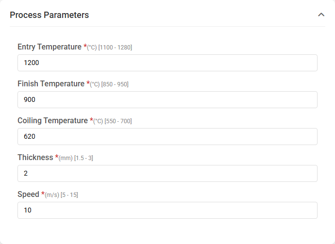

Dynamic form fields based on the operation type configuration:

| Attribute | Description |
|-----------|-------------|
| Parameter Name | Display label (e.g., "Temperature", "Pressure") |
| Value Input | Number or text input |
| Min/Max Range | Shown if configured -- validation enforced |
| Required | Some parameters are mandatory |

**Validation:**
- Required parameters must have a value
- Values must be within configured min/max range
- Warning displayed for values close to limits (within 10% of min or max)

#### Section 9: Notes

| Field | Type | Required | Description |
|-------|------|----------|-------------|
| Notes | Textarea | No | Free-text notes about the production run |

### Submit Button


**"Confirm Production" Button:**
- Blue primary button at the bottom of the form
- Disabled while submitting (shows loading spinner)
- Validates all required fields before submitting

**Error Messages on Submit:**
- "Please fill in all required fields correctly."
- "Please select at least one equipment."
- "Please select at least one operator."
- "Please select a delay reason when delay duration is greater than 0."

### Submission Success

On successful submission, a success panel replaces the form showing:
- **Confirmation ID** -- The unique ID of the production confirmation
- **Output Batch Information:**
  - Batch number
  - Material ID
  - Quantity produced
  - Unit
  - Link to view the batch detail
- **Next Operation Information** (if applicable):
  - Next operation name and status
  - Process name
- **Multiple Output Batches** -- If the quantity was split, all output batches are listed
- **Partial Confirmation Info** -- If saved as partial:
  - Remaining quantity to complete
  - Progress percentage bar
  - "Continue Confirmation" button to submit another confirmation for the same operation

**What happens in the database when production is confirmed:**
1. A `ProductionConfirmation` record is created with status CONFIRMED (or PARTIALLY_CONFIRMED)
2. The operation status changes to CONFIRMED (or PARTIALLY_CONFIRMED)
3. Input material inventory states change to CONSUMED
4. Input batch statuses change to CONSUMED
5. A new output `Batch` record is created with status PRODUCED
6. A new `Inventory` record is created for the output with state PRODUCED
7. `BatchRelation` records are created linking input batches to the output batch (type: CONSUME)
8. If all operations for a line item are confirmed, the next operation becomes READY
9. Equipment status changes to IN_USE during production and back to AVAILABLE after
10. Audit trail entries are logged for all changes
11. If all operations in the order are confirmed, the order status changes to COMPLETED

### Material Selection Modal

The Material Selection Modal provides an advanced interface for selecting input materials:

**Features:**
- **Search field** -- Search by batch number, material ID, or material name
- **Material Type Filter** -- Dropdown to filter by material type prefix (RM, IM, FG, WIP)
- **Select All / Clear All buttons** -- Bulk selection operations
- **Selection Table:**
  - Checkbox for each inventory item
  - Batch number, material ID, material name
  - Available quantity and unit
  - Location
  - Quantity input field (appears when item is selected)
- **Selection Summary:**
  - Count of selected items
  - Total quantity to consume
- **"Confirm Selection" Button** -- Applies selections and closes modal
- **"Cancel" Button** -- Discards changes and closes modal
- **Backdrop Click** -- Clicking outside the modal also cancels

---

## 10. Production History

The Production History page (`/#/production/history`) shows all past production confirmations.

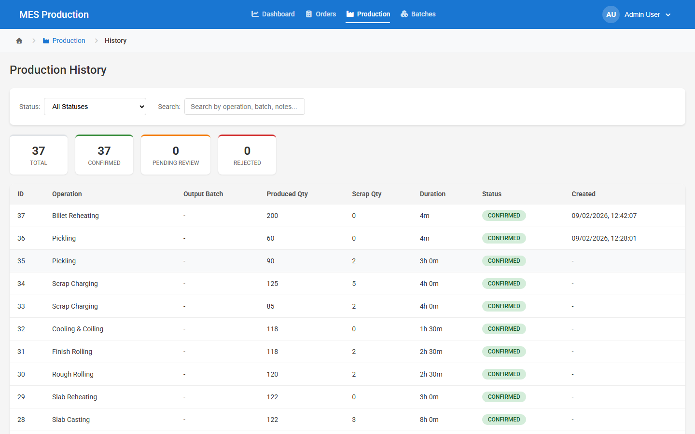

### Status Summary Cards

A row of cards showing counts by confirmation status:
- **CONFIRMED** -- Successfully completed confirmations
- **PENDING_REVIEW** -- Confirmations awaiting review
- **PARTIALLY_CONFIRMED** -- Partial confirmations (more production needed)
- **REJECTED** -- Rejected confirmations

### Filters

**Status Filter Dropdown:**
- Options: All, CONFIRMED, PENDING_REVIEW, PARTIALLY_CONFIRMED, REJECTED

**Search Input:**
- Searches across operation name, output batch number, confirmation ID, and notes

### Confirmations Table

| Column | Description |
|--------|-------------|
| ID | Confirmation ID number |
| Operation | Operation name |
| Qty Produced | Good quantity produced |
| Qty Scrapped | Scrapped quantity |
| Start Time | Production start date/time |
| End Time | Production end date/time |
| Duration | Calculated duration (e.g., "2h 30m") |
| Status | Color-coded status badge |

**Row Click:** Clicking a row toggles the detail panel for that confirmation.

### Detail Panel (Expandable)

Clicking a row expands an inline detail panel showing:
- Output batch information (batch number, material, quantity)
- Equipment used
- Operators involved
- Materials consumed (batch numbers and quantities)
- Process parameters recorded
- Delay information (if any)
- Notes

---

## 11. Batch Management

The Batches page (`/#/batches`) provides a list of all material batches in the system.

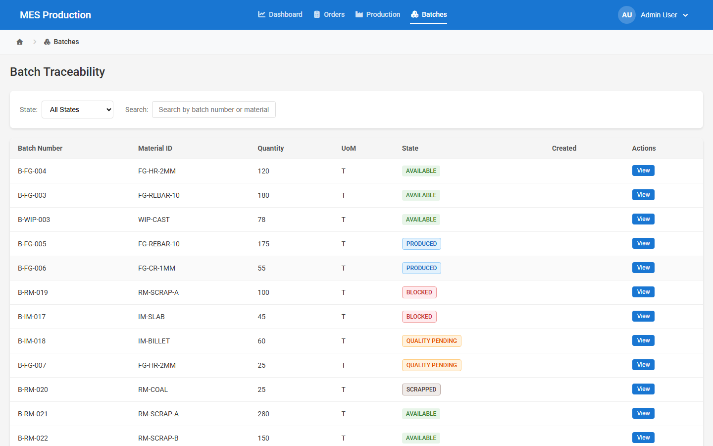

### Filter Area


- **Search Input** -- Search by batch number, material ID, or material name
- **Status Filter** -- Dropdown: All, QUALITY_PENDING, AVAILABLE, PRODUCED, CONSUMED, BLOCKED, SCRAPPED

**URL Parameter Support:**
The page accepts a `?status=` query parameter to pre-filter. For example, clicking "Batches Pending Approval" on the Dashboard navigates to `/#/batches?status=QUALITY_PENDING`.

### Batches Table

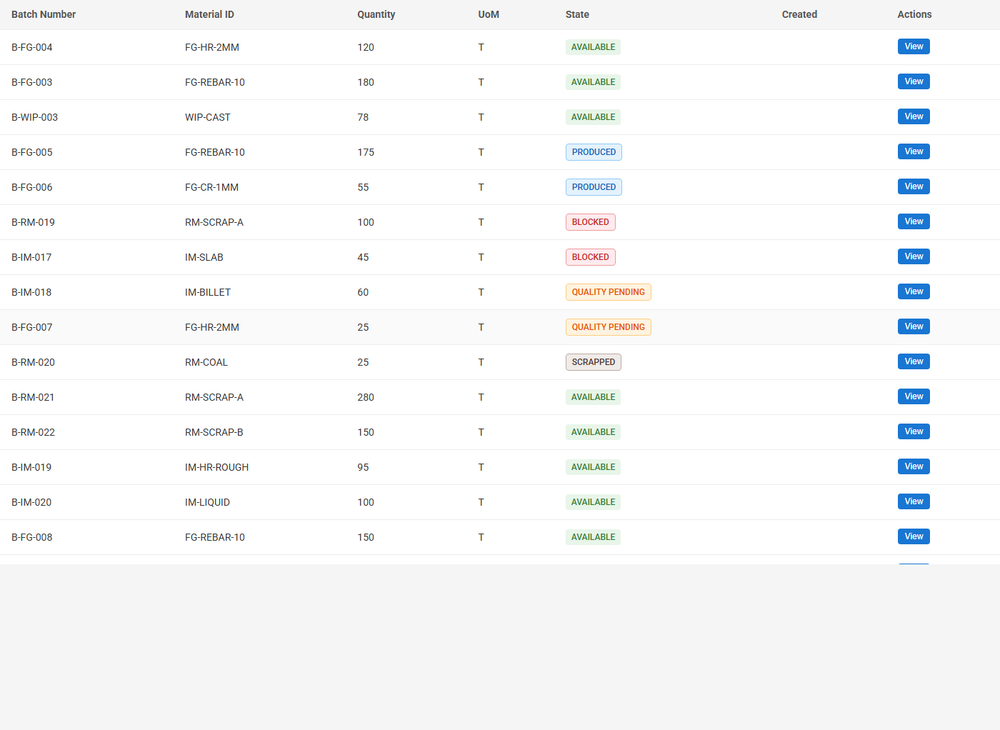

| Column | Description |
|--------|-------------|
| Batch # | Unique batch number (clickable -- navigates to detail) |
| Material ID | Material identifier |
| Material Name | Human-readable material name |
| Quantity | Current batch quantity |
| Unit | Unit of measure |
| Created On | Date/time the batch was created |
| Status | Color-coded status badge |

### Batch Status Badges

Batches use color-coded status badges: **QUALITY_PENDING** (orange), **AVAILABLE** (green), **PRODUCED** (blue), **CONSUMED** (pink), **BLOCKED** (red), **SCRAPPED** (brown), **MERGED** (purple), **SPLIT** (orange). See [Section 13: Status Color Reference](#13-status-color-reference) for exact color values.

---

## 12. Batch Detail and Genealogy

The Batch Detail page (`/#/batches/{batchId}`) shows comprehensive information about a single batch including its genealogy (traceability tree).


### Batch Information Header

- **Back Button** -- Navigate back to Batches list
- **Batch Number** (large heading)
- **Status Badge** -- Current batch status
- **Created Via Badge** -- How the batch was created:
  - Production Confirmation (factory icon)
  - Batch Split (branch icon)
  - Batch Merge (merge icon)
  - Manual Entry (pen icon)
  - System Generated (robot icon)
  - Goods Receipt (truck icon)

### Batch Details Panel

| Field | Description |
|-------|-------------|
| Material ID | Material identifier |
| Material Name | Material description |
| Quantity | Current quantity with unit |
| Created On | Creation date/time |
| Created Via | Source of the batch (PRODUCTION, SPLIT, MERGE, MANUAL, SYSTEM, RECEIPT) |
| Source Operation | Link to the operation that created this batch (for PRODUCTION batches) |
| Supplier Batch # | External supplier batch number (for RM batches via goods receipt) |
| Supplier ID | Supplier identifier (for RM batches) |
| Approved By | Who approved the batch (for quality-approved batches) |
| Approved On | When the batch was approved |

### Quality Approval Section

For batches in `QUALITY_PENDING` status, action buttons are displayed:
- **"Approve" Button** -- Changes batch status from QUALITY_PENDING to AVAILABLE
- **"Reject" Button** -- Prompts for a rejection reason, changes batch status to BLOCKED

### Allocation Section

Shows how the batch is allocated across orders:

**Batch Availability Summary:**
- Total quantity
- Allocated quantity
- Available quantity
- Whether fully allocated (yes/no)

**Active Allocations Table:**
| Column | Description |
|--------|-------------|
| Order # | Order number |
| Product | Product name |
| Allocated Qty | Quantity allocated to this order |
| Timestamp | When the allocation was made |
| Status | ALLOCATED or RELEASED |
| Action | "Release" button (for active allocations) |

**"Allocate to Order" Button:**
Opens an allocation modal:
1. Select an order line from dropdown (shows orders with READY operations)
2. Enter allocation quantity (max = available quantity)
3. Click "Allocate" to confirm

### Genealogy Tree

**Batch Genealogy Panel (Cropped):**


An interactive ECharts graph showing the batch's material traceability:

**Three Levels:**
1. **Parent Batches (top row)** -- Blue bordered rectangles showing:
   - Batch number
   - Material ID
   - Quantity consumed
   - Unit
   - Arrows flowing downward to the current batch
   - Relation type label on the edge (e.g., "CONSUME")

2. **Current Batch (center)** -- Large blue filled rectangle showing:
   - Batch number (white text, bold)
   - Material ID
   - Current quantity with unit

3. **Child Batches (bottom row)** -- Green bordered rectangles showing:
   - Batch number
   - Material ID
   - Quantity
   - Unit
   - Arrows flowing downward from the current batch
   - Relation type label on the edge

**Interactive Features:**
- **Click** any parent or child node to navigate to that batch's detail page
- **Hover** to see tooltip with batch information
- **Zoom and Pan** -- Chart supports mouse wheel zoom and drag to pan
- Adjacent nodes are highlighted on hover

### Finished Goods Batch View

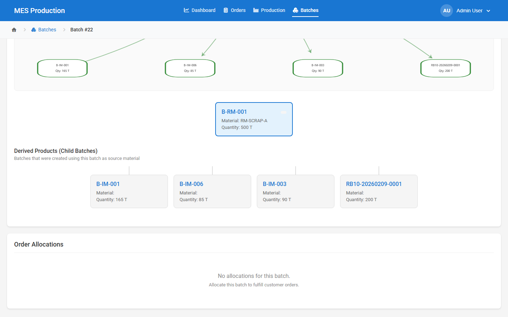

Finished goods batches typically show parent batches (the materials consumed to produce them) and may have no children (end of the production chain).

---

## 13. Status Color Reference

This section provides a complete reference of all status colors used throughout the application. Each status is rendered as a **badge** (small rounded label) with a distinct background and text color. The CSS is defined in `StatusBadgeComponent` which converts status strings to CSS classes (e.g., `IN_PROGRESS` becomes `badge-in-progress`).

### Color Palette Overview

The application uses the **Material Design** color palette at the **50-level** (lightest) for badge backgrounds and **900-level** (darkest) for badge text:

| Color Family | Badge Background (50) | Badge Text (900) | Used For |
|-------------|----------------------|-----------------|----------|
| Green | `#e8f5e9` | `#2e7d32` | COMPLETED, AVAILABLE, CONFIRMED, ACTIVE |
| Blue | `#e3f2fd` | `#1565c0` | IN_PROGRESS, IN_USE, READY, PRODUCED |
| Amber/Yellow | `#fff8e1` | `#f57f17` | ON_HOLD |
| Red | `#ffebee` | `#c62828` | BLOCKED, REJECTED |
| Pink | `#fce4ec` | `#c62828` | CONSUMED |
| Purple | `#f3e5f5` | `#7b1fa2` | CREATED, PLANNED, MERGED |
| Orange | `#fff3e0` | `#e65100` | PENDING, QUALITY_PENDING, SPLIT |
| Blue-Grey | `#eceff1` | `#546e7a` | NOT_STARTED |
| Brown | `#efebe9` | `#4e342e` / `#5d4037` | SCRAPPED, CANCELLED |

### Order Statuses

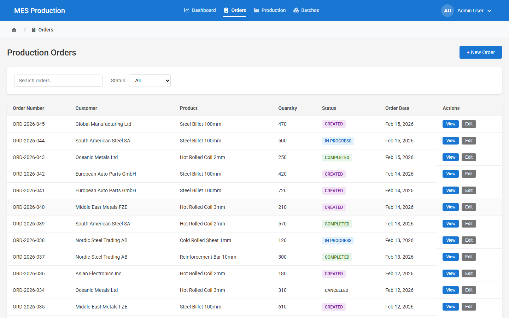

| Status | Badge Appearance | Background | Text Color | Chart Bar Color |
|--------|-----------------|------------|------------|-----------------|
| CREATED | Purple text on light purple bg | `#f3e5f5` | `#7b1fa2` | `#9e9e9e` (gray) |
| IN_PROGRESS | Blue text on light blue bg | `#e3f2fd` | `#1565c0` | `#1976d2` (blue) |
| COMPLETED | Green text on light green bg | `#e8f5e9` | `#2e7d32` | `#388e3c` (dark green) |
| ON_HOLD | Amber text on light yellow bg | `#fff8e1` | `#f57f17` | `#f44336` (red) |
| CANCELLED | Brown text on light brown bg | `#efebe9` | `#5d4037` | `#d32f2f` (dark red) |

### Operation Statuses

| Status | Badge Appearance | Background | Text Color | Flow Chart Node |
|--------|-----------------|------------|------------|-----------------|
| NOT_STARTED | Gray text on blue-grey bg | `#eceff1` | `#546e7a` | Gray border `#94a3b8`, light gray fill |
| READY | Blue text on light blue bg | `#e3f2fd` | `#1565c0` | Amber border `#f59e0b`, light yellow fill |
| IN_PROGRESS | Blue text on light blue bg | `#e3f2fd` | `#1565c0` | Blue border `#3b82f6`, light blue fill |
| PARTIALLY_CONFIRMED | Orange text on light orange bg | `#fff3e0` | `#ef6c00` | Blue border `#3b82f6`, light blue fill |
| CONFIRMED | Green text on light green bg | `#e8f5e9` | `#2e7d32` | Green border `#22c55e`, light green fill |
| ON_HOLD | Amber text on light yellow bg | `#fff8e1` | `#f57f17` | Orange border `#f97316`, light orange fill |
| BLOCKED | Red text on light red bg | `#ffebee` | `#c62828` | Red border `#ef4444`, light red fill |

### Batch Statuses

| Status | Badge Appearance | Background | Text Color | Chart Bar Color |
|--------|-----------------|------------|------------|-----------------|
| QUALITY_PENDING | Orange text on light orange bg | `#fff3e0` | `#e65100` | `#ff9800` |
| AVAILABLE | Green text on light green bg | `#e8f5e9` | `#2e7d32` | `#4caf50` |
| PRODUCED | Blue text on light blue bg | `#e3f2fd` | `#1565c0` | `#1976d2` |
| CONSUMED | Red text on light pink bg | `#fce4ec` | `#c62828` | `#9e9e9e` |
| BLOCKED | Red text on light red bg | `#ffebee` | `#c62828` | `#f44336` |
| SCRAPPED | Brown text on light brown bg | `#efebe9` | `#4e342e` | `#795548` |
| MERGED | Purple text on light purple bg | `#f3e5f5` | `#7b1fa2` | N/A |
| SPLIT | Orange text on light orange bg | `#fff3e0` | `#e65100` | N/A |

### Production Confirmation Statuses

| Status | Badge Appearance | Background | Text Color | Description |
|--------|-----------------|------------|------------|-------------|
| CONFIRMED | Green text on light green bg | `#e8f5e9` | `#2e7d32` | Successfully completed |
| PENDING_REVIEW | Orange text on light orange bg | `#fff3e0` | `#e65100` | Awaiting review |
| PARTIALLY_CONFIRMED | Orange text on light orange bg | `#fff3e0` | `#e65100` | Partially complete, more production needed |
| REJECTED | Red text on light red bg | `#ffebee` | `#c62828` | Rejected by reviewer |

### Dashboard Card Border Colors

The dashboard Operations Status Summary cards use a distinct left border color:

| Status | Left Border Color | RGB Value |
|--------|------------------|-----------|
| Not Started | Gray | `#9e9e9e` |
| Ready | Green | `#4caf50` |
| In Progress | Blue | `#1976d2` |
| Confirmed | Dark Green | `#388e3c` |
| On Hold | Red | `#f44336` |
| Blocked | Dark Red | `#d32f2f` |

### Yield Indicator Colors (Production Confirmation)

| Range | Color | CSS Class | Meaning |
|-------|-------|-----------|---------|
| >= 95% | Green `#2e7d32` | yield-good | Excellent yield |
| 80% - 94.99% | Yellow/Amber `#f57f17` | yield-warning | Acceptable but below target |
| < 80% | Red `#c62828` | yield-critical | Below acceptable threshold |

### Process Flow Chart Node Colors

| Status | Border Color | Fill Color | Text Color |
|--------|-------------|------------|------------|
| NOT_STARTED | `#94a3b8` (slate gray) | `#f1f5f9` (light slate) | `#475569` (dark slate) |
| READY | `#f59e0b` (amber) | `#fef3c7` (light amber) | `#92400e` (dark amber) |
| IN_PROGRESS | `#3b82f6` (blue) | `#dbeafe` (light blue) | `#1e40af` (dark blue) |
| CONFIRMED | `#22c55e` (green) | `#dcfce7` (light green) | `#166534` (dark green) |
| ON_HOLD | `#f97316` (orange) | `#ffedd5` (light orange) | `#9a3412` (dark orange) |
| BLOCKED | `#ef4444` (red) | `#fee2e2` (light red) | `#991b1b` (dark red) |
| Process Node | `#7c3aed` (purple gradient) | `#5b21b6` to `#7c3aed` | `#ffffff` (white) |

---

## 14. Pagination and Sorting

All list pages use server-side pagination with a consistent control layout.

### Pagination Controls

The pagination bar appears below every data table and includes:

**Left Side -- Record Count:**
"Showing X to Y of Z records" (e.g., "Showing 1 to 20 of 47 records")

**Center -- Page Navigation:**
| Control | Icon/Label | Action |
|---------|------------|--------|
| First Page | Double left arrow | Jump to page 1 (disabled if already on first page) |
| Previous Page | Single left arrow | Go to previous page (disabled if on first page) |
| Page Numbers | Numbered buttons (e.g., 1, 2, 3, 4, 5) | Jump to specific page. Up to 5 visible page numbers are shown. Current page is highlighted. |
| Next Page | Single right arrow | Go to next page (disabled if on last page) |
| Last Page | Double right arrow | Jump to last page (disabled if already on last page) |

**Right Side -- Page Size:**
"Items per page" dropdown with options: **10, 20, 50, 100**
Default: 20 items per page

### Sorting

- Tables are sorted by a default field (usually date descending)
- The sort field and direction are sent to the server with each request
- Changing filters or search resets to page 1

### Combined Filtering

Filters, search, and pagination work together:
1. Setting a filter resets to page 1
2. Entering a search term resets to page 1
3. Changing page size resets to page 1
4. All parameters are sent to the server simultaneously

---

## 15. Keyboard Shortcuts and UI Behaviors

### Global Behaviors

| Action | Trigger | Behavior |
|--------|---------|----------|
| Close Dropdown | Escape key | Closes the user profile dropdown menu |
| Close Mobile Menu | Escape key | Closes the mobile navigation menu |
| Close Mobile Menu | Window resize > 992px | Automatically closes mobile menu |
| Close Dropdown | Click outside | Clicking anywhere outside the dropdown closes it |

### Modal Behaviors

| Action | Trigger | Behavior |
|--------|---------|----------|
| Close Modal | Click backdrop | Clicking the dark overlay behind a modal closes it |
| Close Modal | Escape key | Pressing Escape closes the modal |
| Cancel Modal | Cancel button | Reverts any changes and closes the modal |

### Form Behaviors

| Action | Trigger | Behavior |
|--------|---------|----------|
| Submit Form | Enter key | Submits the form if the focused element is an input |
| Validation | On touch/blur | Field validation errors appear when a field is touched and then loses focus |
| Submit Validation | On submit | All fields are marked as touched, showing all validation errors at once |

### Loading States

All pages show a loading spinner with a message while data is being fetched:
- "Loading dashboard..."
- "Loading orders..."
- "Loading operation details..."

Buttons show a spinner and become disabled while an action is being processed to prevent double-submission.

---

## 16. Workflow Reference

### Workflow 1: End-to-End Order Fulfillment

```
Prerequisites: Customer, Product, BOM, and Routing must be configured in the system.

1. Create Order (Orders > + New Order)
   -> Operations are auto-created based on routing
   -> First operation set to READY
2. Navigate to Production > Select Order > Select READY Operation
3. Fill Production Confirmation Form
   -> Select input materials
   -> Select equipment and operators
   -> Enter quantities and parameters
4. Submit Confirmation
   -> Input materials CONSUMED
   -> Output batch PRODUCED
   -> Next operation becomes READY
5. Repeat steps 2-4 for each operation
6. When all operations confirmed -> Order status = COMPLETED
```

### Workflow 2: Batch Quality Approval

```
1. Navigate to Batches page (Batches menu)
2. Filter by status: QUALITY_PENDING
3. Click on a batch to view detail
4. Review batch information (material, quantity, source)
5. Click "Approve" -> Batch status changes to AVAILABLE
   -> OR Click "Reject" -> Enter reason -> Batch status changes to BLOCKED
6. Approved batches become available for production consumption
```

### Workflow 3: Batch Split

```
1. Navigate to batch detail (Batches > Click batch row)
2. Click "Split Batch" button
3. Enter split portions:
   - Portion 1: quantity, optional suffix
   - Portion 2: quantity, optional suffix
   - (Add more portions as needed)
4. Enter optional reason
5. Submit split
   -> Original batch quantity is reduced
   -> New batches are created for each portion
   -> BatchRelation records created (type: SPLIT)
   -> Genealogy tree shows parent-child relationships
```

### Workflow 4: Batch Merge

```
1. Navigate to batch detail
2. Click "Merge Batches" button
3. Select source batches to merge (must be same material)
4. Enter optional target batch number
5. Enter optional reason
6. Submit merge
   -> Source batches status changed to MERGED
   -> New merged batch created with combined quantity
   -> BatchRelation records created (type: MERGE)
   -> Genealogy tree shows multiple parents flowing into merged batch
```

### Workflow 5: Batch Allocation to Order

```
1. Navigate to a batch detail (Batches > Click batch)
2. Check "Batch Availability" section for available quantity
3. Click "Allocate to Order" button
4. Select an order line from the dropdown
5. Enter allocation quantity (cannot exceed available)
6. Click "Allocate"
   -> Allocation record created (status: ALLOCATED)
   -> Available quantity decreases
7. To release an allocation:
   -> Click "Release" on the allocation row
   -> Confirm release
   -> Available quantity increases back
```

---

## 17. Validation Rules Reference

### Login Form

| Field | Rules |
|-------|-------|
| Email | Required, valid email format |
| Password | Required, minimum 6 characters |

### Order Form

| Field | Rules |
|-------|-------|
| Customer | Required (must select from dropdown) |
| Customer Name | Required, max 200 characters |
| Order Date | Required, valid date |
| Order Number | Optional (auto-generated if blank) |
| Line Item Product SKU | Required, max 50 characters |
| Line Item Product Name | Required, max 200 characters |
| Line Item Quantity | Required, minimum 0.01 |
| Line Item Unit | Required, max 20 characters |
| Line Item Delivery Date | Optional, valid date |

**Business Rules:**
- At least one line item must exist
- Line items can only be modified for orders in CREATED status
- Cannot delete the last remaining line item

### Production Confirmation Form

| Field | Rules |
|-------|-------|
| Start Time | Required, cannot be in the future |
| End Time | Required, must be after start time |
| Quantity Produced | Required, minimum 1 |
| Quantity Scrapped | Optional, minimum 0 |
| Equipment | At least one must be selected |
| Operators | At least one must be selected |
| Delay Reason | Required when delay minutes > 0 |
| Process Parameters | Required parameters must have values within min/max range |
| Material Quantity | Cannot exceed available quantity, minimum 0 |

### Batch Form

| Field | Rules |
|-------|-------|
| Batch Number | Required, max 100 characters |
| Material ID | Required, max 100 characters |
| Material Name | Optional, max 200 characters |
| Unit | Optional, max 20 characters |
| Quantity | Read-only in edit mode (use adjustment) |

---

## 18. Troubleshooting

### Common Issues

**Issue: Page shows "Loading..." indefinitely**
- **Cause:** Backend server is not running or not reachable
- **Solution:** Ensure the backend is running on `http://localhost:8080`. Check the browser console (F12) for network errors.

**Issue: Login fails with "Invalid email or password"**
- **Cause:** Wrong credentials or the user account does not exist
- **Solution:** Use the POC credentials: `admin@mes.com` / `admin123`. Verify the backend demo data has been loaded.

**Issue: Redirected to login page unexpectedly**
- **Cause:** JWT token has expired
- **Solution:** Log in again. Token expiration is configured in the backend.

**Issue: Empty tables with no data**
- **Cause:** The backend is running but demo data has not been loaded
- **Solution:** Ensure the backend is started with the demo profile: `./gradlew bootRun --args='--spring.profiles.active=demo'`

**Issue: Production confirmation fails with "Failed to confirm production"**
- **Cause:** Various validation failures on the backend
- **Solution:** Check the error message for specifics. Common causes:
  - Operation is not in READY or IN_PROGRESS status
  - Selected inventory items are no longer AVAILABLE
  - Equipment or operator is not in AVAILABLE status
  - Process parameter values are outside configured min/max range

**Issue: Cannot edit line items on an order**
- **Cause:** Line item editing is restricted to CREATED orders
- **Solution:** Line items cannot be modified once the order has progressed beyond CREATED status.

**Issue: "No orders ready for production" on Production page**
- **Cause:** No orders have operations in READY status
- **Solution:** Check Orders page for orders. If orders exist but no operations are READY, check if operations are in NOT_STARTED, ON_HOLD, or BLOCKED status.

**Issue: Batch genealogy chart shows blank**
- **Cause:** The batch has no parent or child relationships
- **Solution:** This is expected for newly received raw material batches. Genealogy data is created during production confirmation and batch split/merge operations.

**Issue: Charts on Dashboard appear blank**
- **Cause:** No data loaded or ECharts library issue
- **Solution:** Refresh the page. The charts require at least one order and one batch to render.

### Browser Requirements

- **Recommended:** Chrome (latest), Firefox (latest), Edge (latest)
- **Minimum:** Any browser supporting ES2017+ JavaScript
- **JavaScript:** Must be enabled
- **Cookies:** Must be enabled (for JWT token storage in localStorage)

### Server Requirements

- **Backend:** `http://localhost:8080` -- Spring Boot application
- **Frontend:** `http://localhost:4200` -- Angular development server
- **Database:** PostgreSQL 14+ running on default port 5432

### Network Ports

| Port | Service | Description |
|------|---------|-------------|
| 4200 | Frontend | Angular development server |
| 8080 | Backend | Spring Boot REST API |
| 5432 | PostgreSQL | Database server |

---

## Appendix A: URL Reference

All URLs use hash-based routing (contain `/#/` after the domain).

### Main Application Pages

| URL | Page |
|-----|------|
| `/#/login` | Login page |
| `/#/dashboard` | Dashboard |
| `/#/orders` | Orders list |
| `/#/orders/new` | Create new order |
| `/#/orders/{id}` | Order detail |
| `/#/orders/{id}/edit` | Edit order |
| `/#/production` | Production landing |
| `/#/production/confirm/{operationId}` | Production confirmation form |
| `/#/production/history` | Production history |
| `/#/batches` | Batches list |
| `/#/batches/{id}` | Batch detail with genealogy |

---

## Appendix B: API Endpoint Reference (for Developers)

### Authentication

| Method | Endpoint | Description |
|--------|----------|-------------|
| POST | `/api/auth/login` | Authenticate and receive JWT token |

### Orders

| Method | Endpoint | Description |
|--------|----------|-------------|
| GET | `/api/orders` | List all orders |
| GET | `/api/orders/paged` | Paginated orders with filters |
| GET | `/api/orders/available` | Orders with READY operations |
| GET | `/api/orders/{id}` | Get order by ID |
| POST | `/api/orders` | Create new order |
| PUT | `/api/orders/{id}` | Update order |
| DELETE | `/api/orders/{id}` | Cancel order (soft delete) |

### Production

| Method | Endpoint | Description |
|--------|----------|-------------|
| POST | `/api/production/confirm` | Submit production confirmation |
| GET | `/api/production/confirmations` | List all confirmations |

### Batches

| Method | Endpoint | Description |
|--------|----------|-------------|
| GET | `/api/batches` | List all batches |
| GET | `/api/batches/paged` | Paginated batches with filters |
| GET | `/api/batches/{id}` | Get batch by ID |
| GET | `/api/batches/{id}/genealogy` | Batch genealogy tree |
| POST | `/api/batches/{id}/split` | Split a batch |
| POST | `/api/batches/merge` | Merge multiple batches |
| POST | `/api/batches/{id}/approve` | Approve batch (quality) |
| POST | `/api/batches/{id}/reject` | Reject batch (quality) |

---

## Appendix C: Glossary

| Term | Definition |
|------|------------|
| **Batch** | A trackable unit of material with a unique batch number. Created during goods receipt, production, split, or merge operations. |
| **BOM** | Bill of Materials -- Defines the hierarchical material structure needed to produce a product. |
| **Confirmation** | The act of recording a completed production operation with all associated data (materials, quantities, parameters). |
| **Equipment** | A physical machine or device used in production (e.g., Electric Arc Furnace, Continuous Caster). |
| **FG** | Finished Goods -- Final products ready for shipment to customers. |
| **Genealogy** | The parent-child traceability tree showing how batches are related through production, split, and merge operations. |
| **Hold** | A temporary block placed on an entity (order, operation, batch, inventory, equipment) to prevent it from being used. |
| **IM** | Intermediate Material -- Semi-finished materials between production stages. |
| **Inventory** | A record of material at a specific location with a quantity and state. |
| **JWT** | JSON Web Token -- The authentication mechanism used by the application. |
| **Line Item** | A product within an order, specifying the SKU, quantity, and delivery date. |
| **MES** | Manufacturing Execution System -- Software that manages and monitors work-in-progress on the factory floor. |
| **Operation** | A specific production step within a process (e.g., "EAF Melting" within the "Melting" process). |
| **Operator** | A person who performs production operations on the factory floor. |
| **Process** | A design-time entity representing a production stage (e.g., Melting, Casting, Rolling). |
| **RM** | Raw Material -- Incoming materials from suppliers. |
| **Routing** | The sequence of process steps that define how a product is manufactured. |
| **SKU** | Stock Keeping Unit -- A unique identifier for a product. |
| **WIP** | Work In Progress -- Materials currently being processed in production. |
| **Yield** | The ratio of good product output to total production output (good + scrap). |

---

*This user guide was generated for the MES Production Confirmation POC (Bluemingo POC) application. All screenshots referenced are located in `e2e/output/user-guide-screenshots/2026-02-09T07-17-42/`.*
